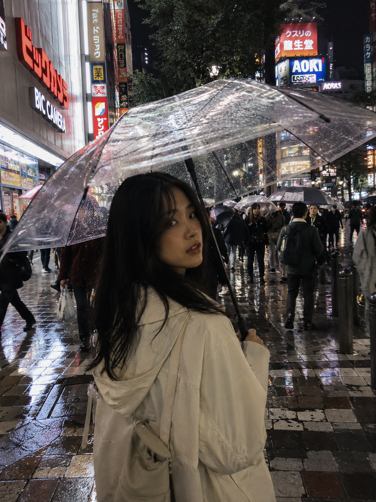
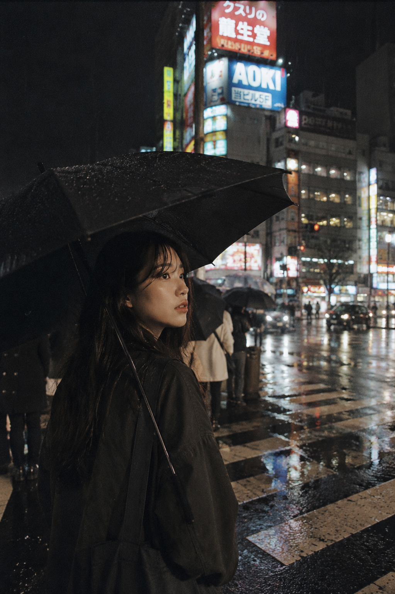
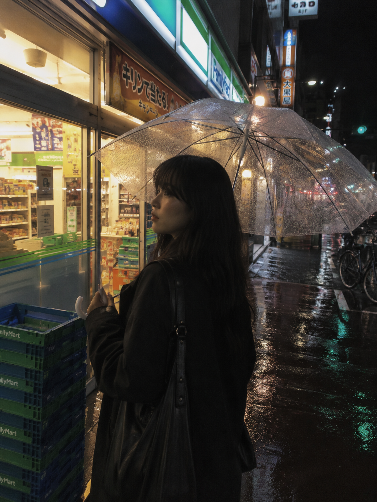

# TRAVEL-001 | 东京雨天撑伞走在新宿街头

# 东京雨天｜新宿街头这组胶片感 Prompt，真的很像真实旅拍

> **备选标题：**

1. GPT Image 2 提示词｜东京街头系列 Vol.001：新宿雨夜
2. 这组「东京雨天新宿」照片，真的很像胶片旅拍随手抓
3. 东京街头系列 Vol.001｜雨天撑伞走在新宿
4. 建议收藏：一组东京雨夜街头真实旅拍风 Prompt

---

这是「城市旅游 · 东京街头系列」第 001 期。

今天这组是**新宿雨夜**，适合生成那种一个人撑伞走在东京街头、霓虹灯光倒映在湿润路面上的真实旅拍氛围。

不是那种摆拍游客照，也不是精修写真——更像是旅途中某个安静的夜晚，有人恰好按下了快门。

---


**场景一：新宿雨夜背影**

亚洲女生，透明雨伞，背对镜头走在新宿街头。湿润路面把霓虹灯光反射成一片模糊的彩色光晕，周围人群虚化。画面有一种只属于东京雨夜的孤独感。

```Plaintext
亚洲女生撑透明雨伞走在新宿雨夜街头，背影视角，湿润路面反射霓虹灯光，人群模糊，35mm 胶片风格，自然旅拍，电影感构图，真实皮肤质感，避免写真感。
```

---



**场景二：十字路口等红灯**

新宿十字路口，深色雨伞，雨水打湿了刘海，视线望向远处的霓虹招牌。夜间路灯和人工光混合，像是一张没有滤镜的真实旅行照。

```Plaintext
亚洲女生站在新宿十字路口等红灯，深色雨伞，雨水打湿刘海，视线望向远处霓虹招牌，夜间路灯混合人工光，街头随手抓拍，真实生活感，胶片颗粒质感。
```

---



**场景三：便利店门口**

雨夜便利店，手举雨伞站在门口，橙黄色的便利店灯光从背后打出来，地面是湿的。这个构图在东京随处可见，却总是拍不厌。

```Plaintext
男友第一人称视角，亚洲女生雨夜新宿便利店门口驻足，手举雨伞侧对镜头，橙黄色便利店灯光从背后打出，湿漉漉的地面，自然旅行拍摄，非游客照风格，避免 AI 美女脸。
```



---

**使用建议**

1. 想更真实：保留「35mm 胶片风格」「胶片颗粒质感」「避免写真感」这几个词，是控制真实感的关键。
2. 想换城市：把「新宿」换成「涩谷」「银座」「难波」，其余不变，风格一致。
3. 想做系列：固定「亚洲女生 + 旅拍风格 + 胶片质感」，只替换城市、天气和时间段即可批量出图。

---

建议收藏这组 Prompt。

后续只需要替换城市地点、天气和构图视角，就能继续生成同系列的真实街头旅拍感照片。

---

**相关推荐**

- 东京街头系列 Vol.002：涩谷路口等绿灯的背影
- 东京街头系列 Vol.003：便利店门口吃关东煮
- 首尔咖啡馆系列 Vol.001：弘大街边咖啡馆靠窗发呆

---

如果你也喜欢这种真实电影感城市旅拍，可以点个赞。

东京街头系列会持续更新，后面还有涩谷、银座、居酒屋等场景，关注不迷路。

---

#GPTImage2 #生图提示词 #Prompt #东京旅拍 #城市旅游 #街头摄影 #胶片风 #亚洲女生 #AI生图 #真实旅拍
