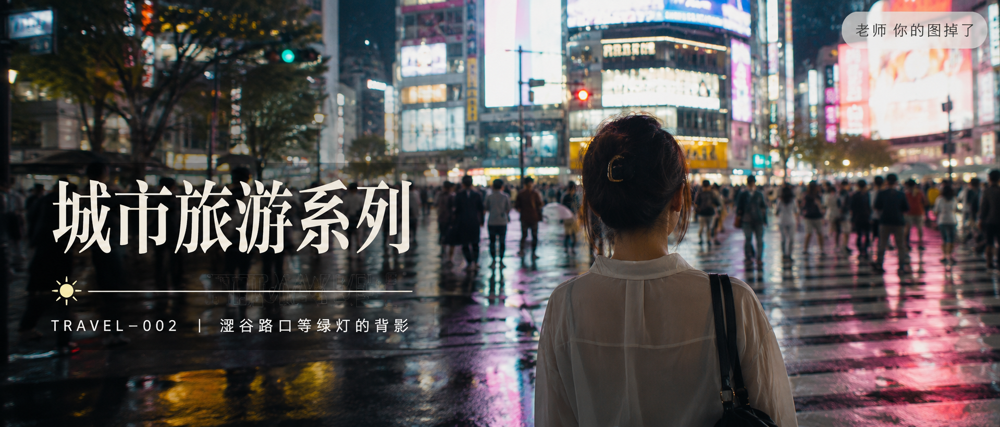
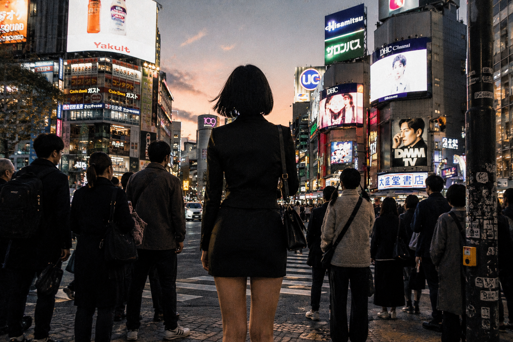
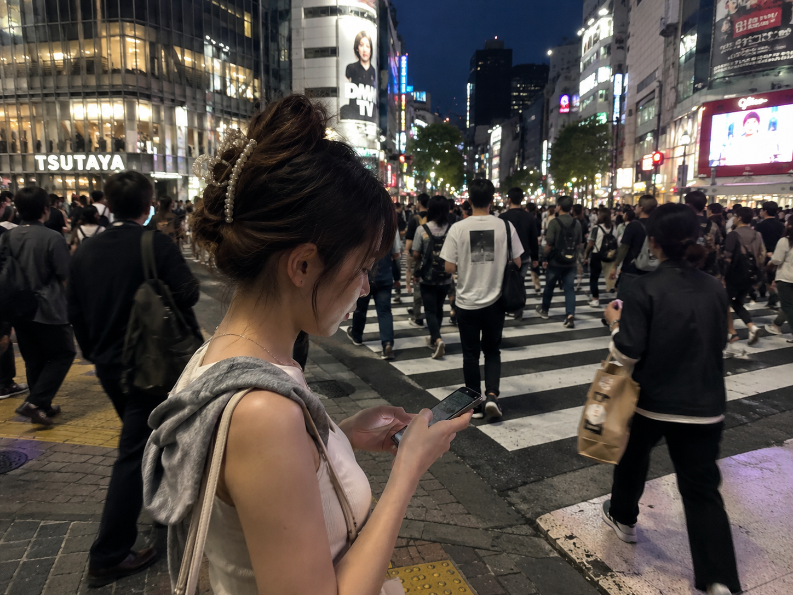

# TRAVEL-002 | 涩谷路口等绿灯的背影

# GPT Image 2 生图提示词｜涩谷路口等绿灯的背影，胶片街头旅拍，城市旅游系列 TRAVEL-002

这是「城市旅游系列」第 TRAVEL-002 期，持续更新中。

---

今天这组是「涩谷路口等绿灯的背影」。

涩谷十字路口是东京最密集的人潮交汇点。绿灯一亮，四面八方的人同时涌入斑马线，广告屏幕在暮色里闪烁，湿润的地面倒映霓虹色调。

这组 Prompt 不是在模拟游客打卡照，而是试图还原一个真实旅行里随手抓拍的瞬间——你在人群里，她在人群里，彼此都在走，也都在停。

**场景说明：**

亚洲女生，便装，站在涩谷全向路口等绿灯。日暮时分，霓虹广告牌开始亮起，四周是密集的行人轮廓。背对镜头或侧身，神情自然，不摆拍。35mm 胶片颗粒感，真实城市旅行质感。

**生图提示词：**

正文配图1：亚洲女生站在涩谷十字路口等绿灯，背对镜头，黑色短发，深色外套，周围是密集等待的人群，霓虹广告牌在日暮光线中亮起，35mm胶片颗粒感，街头旅拍，真实皮肤质感，避免写真感和网红感。

正文配图2：男友第一人称视角，25岁亚洲女生侧身站在涩谷路口人群中，低头看手机，前方是著名斑马线，行人开始涌动，夜幕降临霓虹灯光混合人工照明，便装自然状态，iPhone随手抓拍，真实生活感，避免摆拍和AI美女脸。

正文配图3：35mm胶片风格，亚洲女生背影在涩谷全向路口绿灯亮起瞬间迈步向前，四面八方人潮交汇，广告屏幕在夜色中闪烁，侧逆光勾勒轮廓，自然旅拍抓拍，电影感构图，避免写真感和过度精修。

**使用建议：**

1. 想更真实：保留胶片颗粒感描述、背对/侧身构图、自然皮肤纹理，不要加「完美五官」「精致妆容」。
2. 想换城市：把「涩谷十字路口」替换成「明洞街头」「铜锣湾夜市」「外滩路口」，其余结构保留即可。
3. 想做系列：固定「亚洲女生 + 35mm胶片 + 城市街头 + 自然状态」，只替换城市、时间和人群密度。

---

建议收藏这组 Prompt。

东京街头系列后续还有「便利店门口吃关东煮」「地铁站出口抬头看路牌」「居酒屋玻璃窗边独自小酌」，结构都是同一套，换场景就能继续用。

**相关推荐：**

- TRAVEL-001｜东京雨天撑伞走在新宿街头
- TRAVEL-003｜便利店门口吃关东煮（下期预告）
- TRAVEL-004｜地铁站出口抬头看路牌（即将更新）

---

如果你也喜欢这种真实城市旅行感 AI 摄影，可以点个赞。  
城市旅游系列会持续更新，后续会覆盖东京、首尔、香港、京都、上海等城市的完整街头场景库。

关注账号，不错过每一期。

---

#GPTImage2 #生图提示词 #Prompt #城市旅游 #东京街头 #涩谷 #旅行摄影 #亚洲女生 #胶片感 #AI生图
