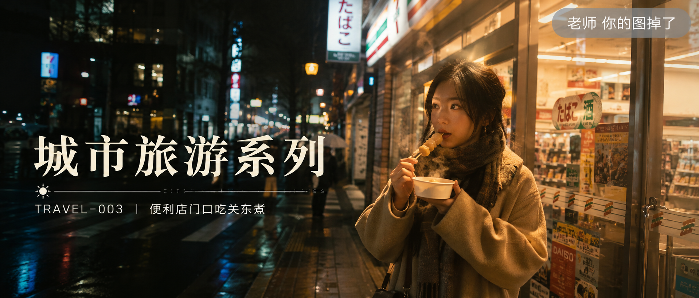
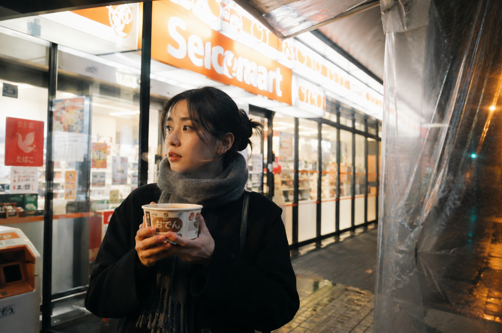
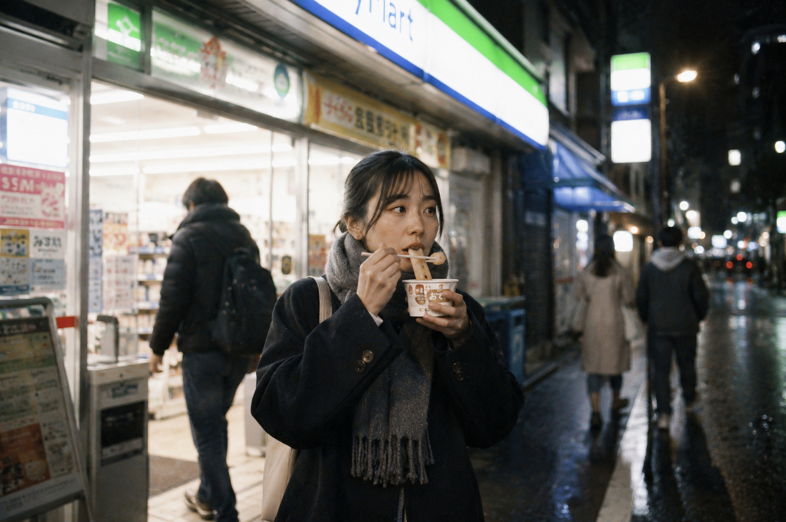

# TRAVEL-003 | 便利店门口吃关东煮

---

## author: "老师 你的图掉了"

这是「城市旅游系列」的第 TRAVEL-003 期。

今天这组主题是「便利店门口吃关东煮」，想做的是东京夜里那种很短暂、很日常、但一眼就能记住的停留感。

它不是游客打卡照，也不是摆拍写真，而是走到街角便利店门口，捧着一杯热气腾腾的关东煮，灯光、夜色和一点冷空气一起落在画面里的真实生活瞬间。

这组 Prompt 很适合继续扩展东京夜游、冬季街头、便利店生活感这类场景，后面只要替换动作、机位和街区就能继续复用。

场景说明

25岁亚洲女生，深色呢大衣和灰色围巾，冬夜停在东京街角便利店门口，手里拿着刚买好的关东煮。便利店的橙黄色灯光把脸部和衣料边缘照亮，门外空气偏冷，地面有一点湿润反光，画面重点是旅途中短暂停下来的松弛感和真实生活气息。

提示词 1

25岁亚洲女生站在东京便利店门口捧着热气腾腾的关东煮纸碗，深色呢大衣和灰色围巾，夜晚橙黄色店招照亮侧脸，门口塑料雨棚下地面微湿，35mm胶片街头旅拍，真实生活感，避免写真感和网红感。

效果图 1  
[配图1：见文末图片 img1.png]

提示词 2

男友第一人称视角，25岁亚洲女生靠在便利店玻璃窗边低头吹热关东煮，短发被夜风轻微吹乱，手里拿着一次性竹签，东京街角路灯和便利店冷暖混合光，iPhone随手抓拍，自然旅行抓拍，真实皮肤纹理，避免AI美女脸。

效果图 2  
[配图2：见文末图片 img2.png]

提示词 3

25岁亚洲女生从便利店门口走出，手里端着关东煮小杯边走边吃，身后是发光的便利店橱窗和经过的行人，冬夜街道安静，50mm自然抓拍，非游客摆拍，胶片颗粒质感，真实城市旅拍。

效果图 3  
[配图3：见文末图片 img3.png]

使用建议

1. 想让画面更真实，可以保留便利店混合光、热气、微湿地面这些生活细节，不要把人物修成商业旅拍模样。
2. 想继续扩写同系列，只要固定这套穿搭和东京夜街头基调，再替换成饭团、咖啡、热饮或站在自动贩卖机前，也能保持统一气质。
3. 想让镜头更有代入感，可以在同一人物设定下切换背影、男友视角和平视跟拍，系列感会更强。

建议收藏这组 Prompt。核心结构是「东京便利店夜景 + 热食动作 + 冬夜灯光」，后面还能延伸出很多同类型旅行日常场景。如果你也喜欢这种真实生活感照片，可以点个赞，我会继续更新同系列场景。

#GPTImage2 #生图提示词 #Prompt #城市旅游系列 #东京街头系列 #便利店门口吃关东煮

**城市旅游系列 · 目录**  
上一期：TRAVEL-002｜涩谷路口等绿灯的背影  
下一期：TRAVEL-004｜地铁站出口抬头看路牌  
系列入口：继续补齐东京、首尔、香港、欧洲和上海的城市生活旅拍场景。

