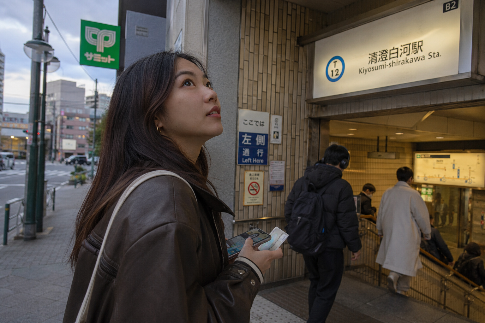
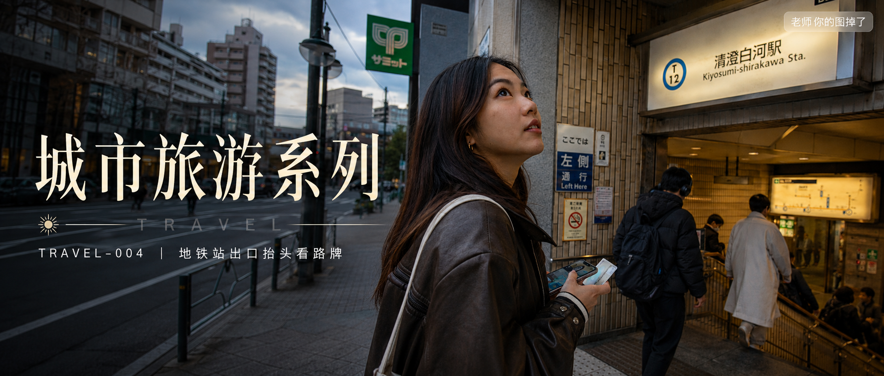

# TRAVEL-004 | 地铁站出口抬头看路牌

---

## title: "GPT Image2 提示词｜城市旅游系列 TRAVEL-004：地铁站出口抬头看路牌，胶片街头旅拍"  
author: "老师 你的图掉了"

这是「城市旅游系列」第 TRAVEL-004 期。

今天这组是「地铁站出口抬头看路牌」。适合生成那种刚从东京地铁站走出来、还在确认方向的真实旅行瞬间。

画面重点不是摆拍，而是站口灯光、路牌、通勤人流和一点点迷路感。收藏这组 Prompt，后续换成别的城市站口、路牌或街角，也能继续延展同类型旅拍。

场景说明

一个 25 岁亚洲女生从东京地铁站出口走到街面，抬头看路牌确认方向。她穿深色短外套和米色围巾，手里拿着手机或交通卡，身后是通勤人群和地下通道灯光，画面像旅行中被随手拍下的一秒。

提示词 1

25岁亚洲女生从东京地铁站出口走上台阶，抬头看蓝白色路牌和出口编号，深色短外套和米色围巾，清晨灰蓝天光混合站口灯光，35mm胶片街头旅拍，真实生活抓拍，避免写真感和网红感。

效果图 1  
[配图1：见文末图片 img1.png]

提示词 2

男友第一人称视角，25岁亚洲女生站在东京地铁站出口旁抬头确认路牌，手里握着交通卡和手机，身后是通勤人群和地下通道灯光，iPhone随手抓拍，自然旅行状态，真实皮肤纹理，避免AI美女脸。

效果图 2  
[配图2：见文末图片 img2.png]

提示词 3

35mm胶片风格，亚洲女生侧身站在地铁站出口的楼梯顶端，风吹起短发和围巾，抬头看街角方向指示牌，午后浅阳光落在建筑立面和路牌上，东京街头自然旅拍，非游客摆拍，真实城市生活感。

效果图 3  
[配图3：见文末图片 img3.png]

使用建议

1. 想更真实：保留地铁出口、路牌、通勤人群和自然皮肤纹理，不要把画面做成商业旅拍。
2. 想换氛围：可以替换成雨天、黄昏或夜间站口，但保留“抬头看路牌”的动作核心。
3. 想做系列：固定人物气质和胶片街头质感，只替换城市、出口标识和路边建筑。

建议收藏这组 Prompt。后续只需要换城市和站口细节，就能继续生成真实生活感城市旅拍。

#GPTImage2 #生图提示词 #Prompt #城市旅游系列 #东京街头系列 #地铁站出口 #胶片街头旅拍 #真实女友感

**东京街头系列 · 目录**  
上一期：TRAVEL-003｜便利店门口吃关东煮  
本期：TRAVEL-004｜地铁站出口抬头看路牌  
下一期：TRAVEL-005｜居酒屋玻璃窗边独自小酌

