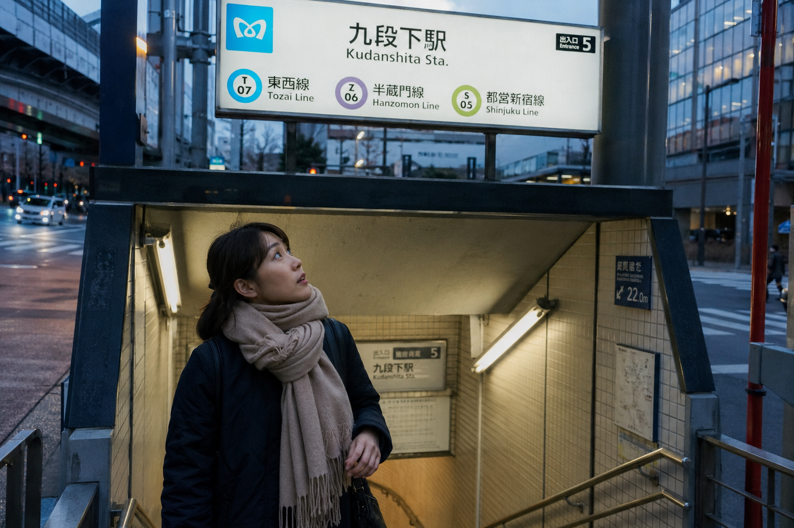

# TRAVEL-004-地铁站出口抬头看路牌 封面

## 封面提示词

25岁亚洲女生站在东京地铁站出口抬头看路牌，地铁出口楼梯、蓝白路牌、街角建筑和通勤人流构成真实东京街头氛围，清晨灰蓝天光与站口灯光交织，35mm胶片城市旅拍，真实皮肤纹理，2.35:1电影横构图。画面左侧垂直居中偏下叠加文字排版：超大号衬线字体米白色主文案「城市旅游系列」，主文案正下方一条细横线左端带太阳图标☀横线中央有透明英文水印，横线下方等宽白色字体副文案「TRAVEL-004 ｜ 地铁站出口抬头看路牌」；右上角浅色半透明圆角底衬配小号文字「老师 你的图掉了」；无整体蒙层，文字直接压图，避免写真感和网红感。

## 封面图片

