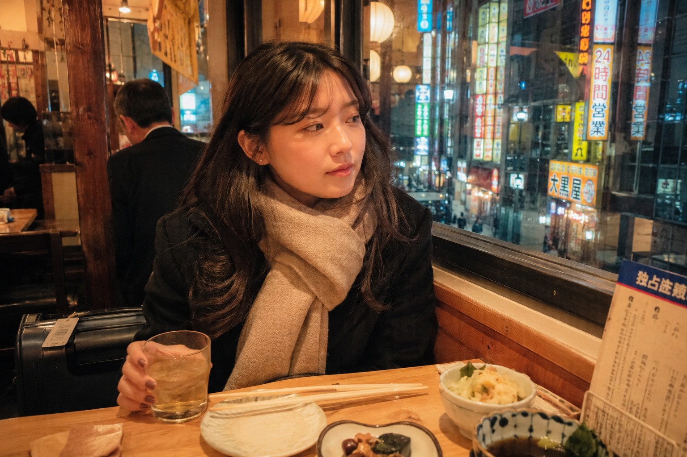
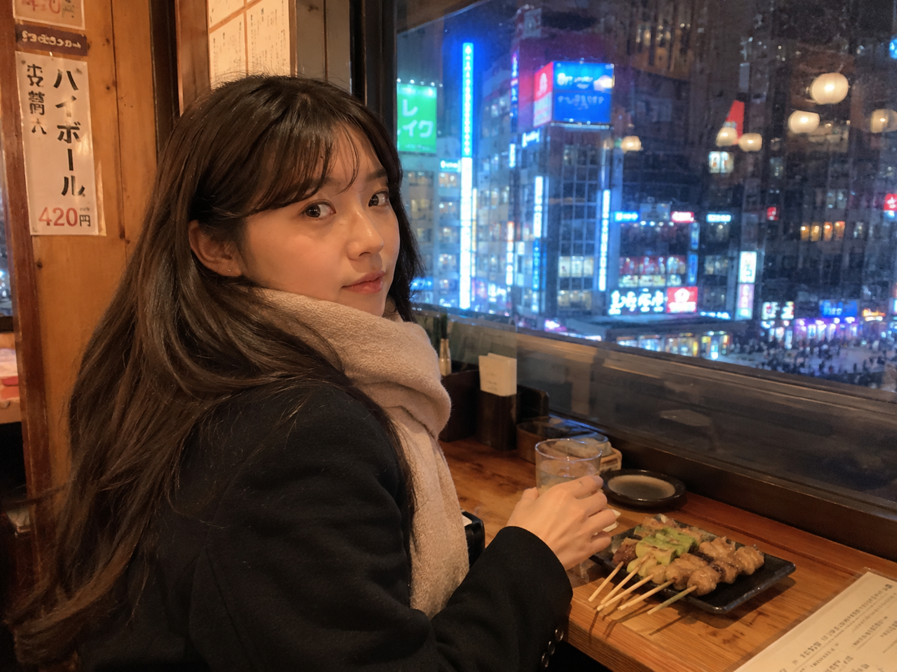
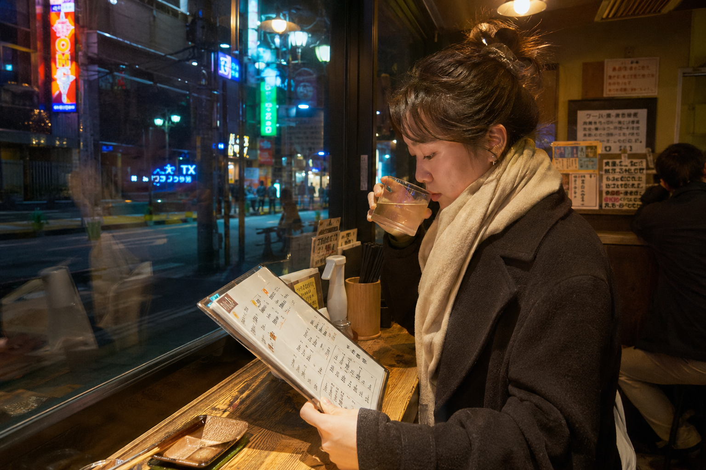

# TRAVEL-005 | 居酒屋玻璃窗边独自小酌

---

author: "老师 你的图掉了"  
topics:

- GPT Image 2
- 豆包
- 千问
- 生图提示词
- Prompt

---

这是「城市旅游系列」第 TRAVEL-005 期。

今天这组是「居酒屋玻璃窗边独自小酌」。适合生成那种旅行夜晚走进东京小店，坐在靠窗位置，一个人慢慢喝一杯、看窗外灯牌和路人的真实瞬间。

这期画面可以更鲜艳明亮一点：保留胶片街头感，但把暖黄色店灯、蓝绿红招牌、玻璃反光和干净肤色做出来，不要走暗沉夜景路线。

这组提示词主要按 GPT Image 2 的中文自然语言写法整理，也可以在豆包、千问及其他支持中文提示词的生图工具上尝试。不同工具出图会有差异，可以微调画幅、镜头、灯牌颜色和桌面细节。

场景说明

一个 25 岁亚洲女生旅行夜晚坐在东京居酒屋靠窗位置，穿深色短外套和米色围巾，桌上有一杯浅色饮品、木筷和简单小菜。窗外是明亮街灯、彩色招牌和行人倒影，画面像旅途中短暂停下来休息的一刻。

提示词 1

25岁亚洲女生坐在东京居酒屋玻璃窗边独自小酌，深色短外套和米色围巾，桌上有梅酒杯、木筷和小菜，窗外彩色灯牌与街灯映在玻璃上，暖黄色店灯明亮干净，35mm胶片街头旅拍，真实旅行抓拍，避免写真感和网红感。

效果图 1  
[配图1：见下方图片 img1.png]

提示词 2

男友第一人称视角，25岁亚洲女生坐在居酒屋靠窗吧台前回头看镜头，手边是一杯浅色饮品和刚上的烤串，深色短外套和米色围巾，东京夜街蓝绿红招牌透过玻璃形成鲜艳反光，iPhone随手抓拍，真实皮肤纹理，避免AI美女脸。

效果图 2  
[配图2：见下方图片 img2.png]

提示词 3

35mm胶片风格，25岁亚洲女生侧身坐在东京小居酒屋玻璃窗旁，低头看菜单并端起饮品，木质桌面被暖黄色店灯照亮，窗外彩色灯牌和路人倒影清晰明亮，街头旅行生活感，非游客摆拍，真实城市夜游照片。

效果图 3  
[配图3：见下方图片 img3.png]

使用建议

1. 想更真实：保留靠窗座位、玻璃反光、桌面小物和自然皮肤纹理，不要把人物修成商业餐厅广告。
2. 想更明亮：可以强化暖黄色店灯、彩色街边招牌和干净肤色，但不要加过重滤镜。
3. 想换场景：把东京居酒屋替换成首尔小酒馆、香港茶餐厅或上海路边小馆，也能延展同类夜游旅拍。

建议收藏这组 Prompt。核心结构是「城市夜游 + 靠窗小酌 + 明亮玻璃反光」，后续只需要替换城市、小店类型和桌面食物，就能继续生成同类型真实旅行照片。

感兴趣的朋友们，欢迎收藏、关注，也可以在评论区留言你喜欢的城市或场景，我会继续补更多同类型旅拍 Prompt。

#GPTImage2 #豆包 #千问 #生图提示词 #Prompt #东京街头系列 #城市旅游系列 #居酒屋 #明亮胶片旅拍 #真实女友感

**东京街头系列 · 目录**  
上一期：TRAVEL-004｜地铁站出口抬头看路牌  
本期：TRAVEL-005｜居酒屋玻璃窗边独自小酌  
下一期：TRAVEL-006｜清晨酒店窗边整理相机和车票

