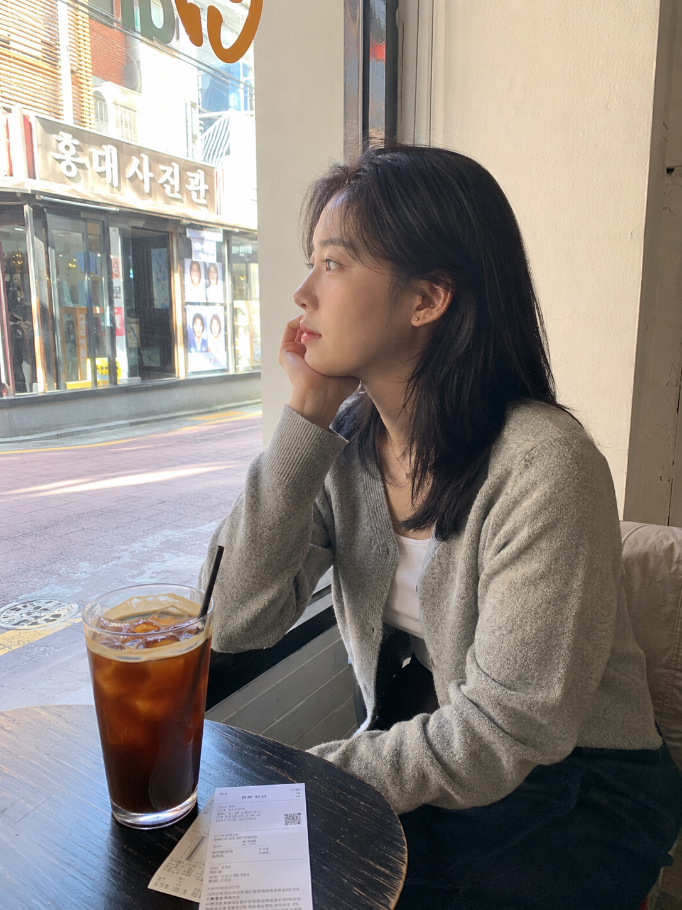
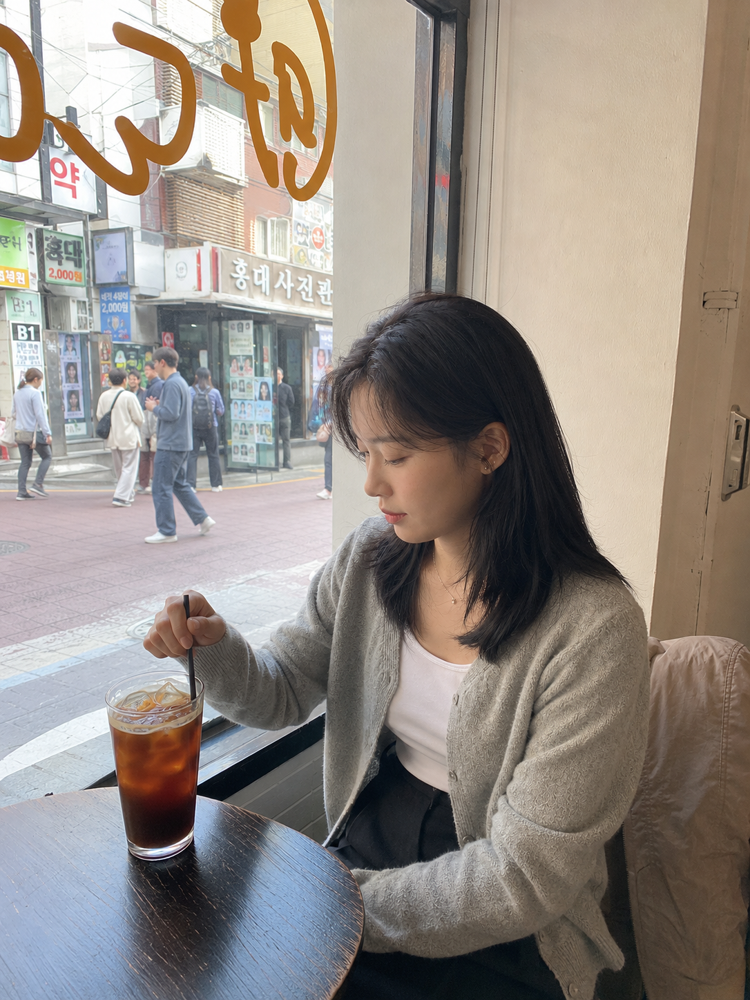
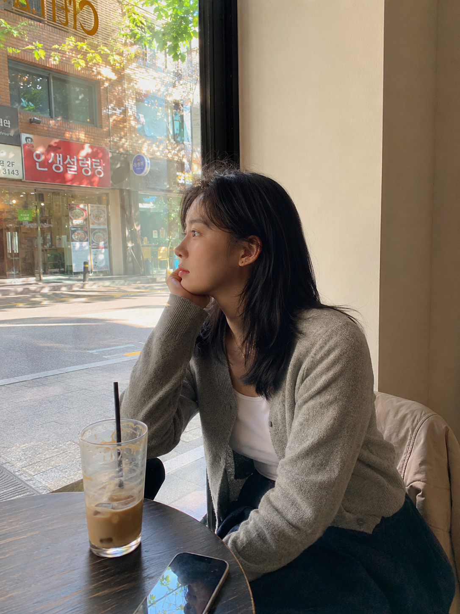

# TRAVEL-006 | 弘大街边咖啡馆靠窗坐着发呆

---

title: "GPT Image2 提示词｜城市旅游系列 TRAVEL-006：弘大咖啡馆窗边发呆，白天生活旅拍"  
author: "老师 你的图掉了"  
topics:

- GPT Image 2
- 豆包
- 千问
- 生图提示词
- Prompt
- 城市旅游系列
- 首尔咖啡馆系列

---

这是「城市旅游系列」第 TRAVEL-006 期。

今天这组是「弘大街边咖啡馆靠窗坐着发呆」，适合生成白天首尔旅行里的咖啡馆生活照。画面重点不是游客打卡，而是一个人在城市里停下来、靠窗发呆的安静瞬间。

这组提示词主要按 GPT Image 2 的中文自然语言写法整理，也可以在豆包、千问及其他支持中文提示词的生图工具上尝试。不同工具出图会有差异，可以微调画幅、镜头和细节。

场景说明

本期场景放在白天的首尔弘大街边咖啡馆。人物坐在靠窗座位，窗外有行人、韩文店招和明亮街景，室内是冰美式、旅行小票、手机和玻璃反光。整体方向是好看但不网红、松弛但不摆拍的真实旅行照片。

提示词 1

男友第一人称视角，25岁亚洲女生白天坐在首尔弘大街边咖啡馆靠窗座位发呆，浅灰针织开衫、白色内搭、深色半身裙，黑色自然中长发，清透淡妆，五官好看但不网红，桌上有冰美式和旅行小票，上午柔和窗光照在侧脸，iPhone 原相机随手抓拍，真实皮肤纹理，生活感旅拍，避免 AI 美女脸、写真感、网红感、过度精修。

效果图 1  
[配图1：见下方图片 img1.png]

提示词 2

25岁亚洲女生白天坐在弘大街边咖啡馆玻璃窗旁低头搅动冰美式，浅灰针织开衫、白色内搭、深色半身裙，窗外是经过的行人、韩文店招和浅色街景，午后自然光穿过玻璃，35mm 胶片街头旅拍，表情安静自然，五官清秀好看但不网红，真实皮肤质感，避免商业写真和摆拍感。

效果图 2  
[配图2：见下方图片 img2.png]

提示词 3

男友第一人称视角，25岁亚洲女生白天下午靠在弘大咖啡馆窗边望向街道，手边放着喝了一半的冰咖啡和手机，浅灰针织开衫、白色内搭、深色半身裙，窗玻璃映出街边树影和韩文招牌，50mm 半身自然抓拍，松弛旅行状态，五官耐看但不网红，真实生活摄影，避免过度精修和网红滤镜。

效果图 3  
[配图3：见下方图片 img3.png]

使用建议

1. 想更真实：保留 iPhone 原相机、自然皮肤纹理、咖啡馆杂物和窗外行人，不要把脸修成统一的 AI 美女脸。
2. 想让白天时间线更清楚：第一张用上午柔和窗光，第二张用午后玻璃透光，第三张用下午街边树影和窗面反射。
3. 想换工具：GPT Image 2、豆包、千问及其他生图工具都可以尝试，按平台效果微调画幅、镜头、人物距离和咖啡馆细节。

感兴趣的朋友们，欢迎收藏、关注，也可以在评论区留言你喜欢的系列或话题，我会继续补更多同类型场景。

#GPTImage2 #豆包 #千问 #生图提示词 #Prompt #城市旅游系列 #首尔咖啡馆系列 #弘大咖啡馆 #真实生活摄影

**首尔咖啡馆系列 · 目录**  
上一期：东京街头系列已完成 5 期  
本期：TRAVEL-006｜弘大街边咖啡馆靠窗坐着发呆  
下一期：TRAVEL-007｜景福宫附近韩屋咖啡厅拍照

## 封面图提示词

25岁亚洲女生白天坐在首尔弘大街边咖啡馆靠窗发呆，浅灰针织开衫、白色内搭、深色半身裙，黑色自然中长发，清透淡妆，五官好看但不网红，窗外有韩文店招、行人和明亮街景，上午到午后的柔和自然光，真实城市旅行咖啡馆氛围，35mm 胶片生活旅拍，2.35:1 电影横构图。画面左侧垂直居中偏下叠加文字排版：超大号衬线字体米白色主文案「城市旅游系列」，主文案正下方一条细横线左端带太阳图标☀横线中央有透明英文水印 TRAVEL，横线下方等宽白色字体副文案「TRAVEL-006 ｜ 弘大街边咖啡馆靠窗坐着发呆」；右上角浅色半透明圆角底衬配小号文字「老师 你的图掉了」；无整体蒙层，文字直接压图，避免 AI 美女脸、写真感、网红感、过度精修。

