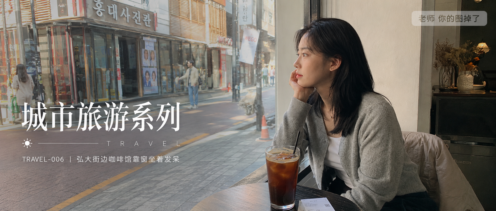

# TRAVEL-006-弘大街边咖啡馆靠窗坐着发呆 封面

## 封面提示词

25岁亚洲女生白天坐在首尔弘大街边咖啡馆靠窗发呆，浅灰针织开衫、白色内搭、深色半身裙，黑色自然中长发，清透淡妆，五官好看但不网红，窗外有韩文店招、行人和明亮街景，上午到午后的柔和自然光，真实城市旅行咖啡馆氛围，35mm 胶片生活旅拍，2.35:1 电影横构图。画面左侧垂直居中偏下叠加文字排版：超大号衬线字体米白色主文案「城市旅游系列」，主文案正下方一条细横线左端带太阳图标☀横线中央有透明英文水印 TRAVEL，横线下方等宽白色字体副文案「TRAVEL-006 ｜ 弘大街边咖啡馆靠窗坐着发呆」；右上角浅色半透明圆角底衬配小号文字「老师 你的图掉了」；无整体蒙层，文字直接压图，避免 AI 美女脸、写真感、网红感、过度精修。

## 封面图片

