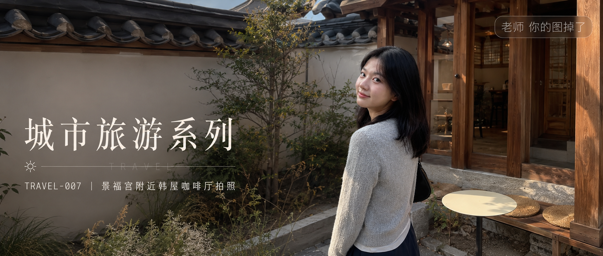
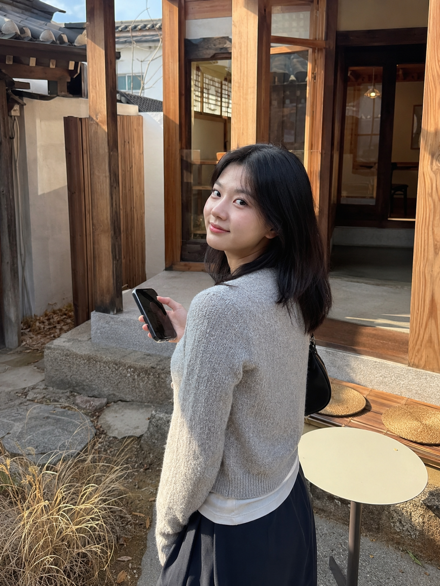
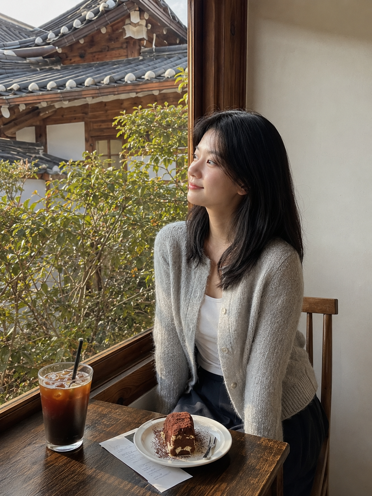
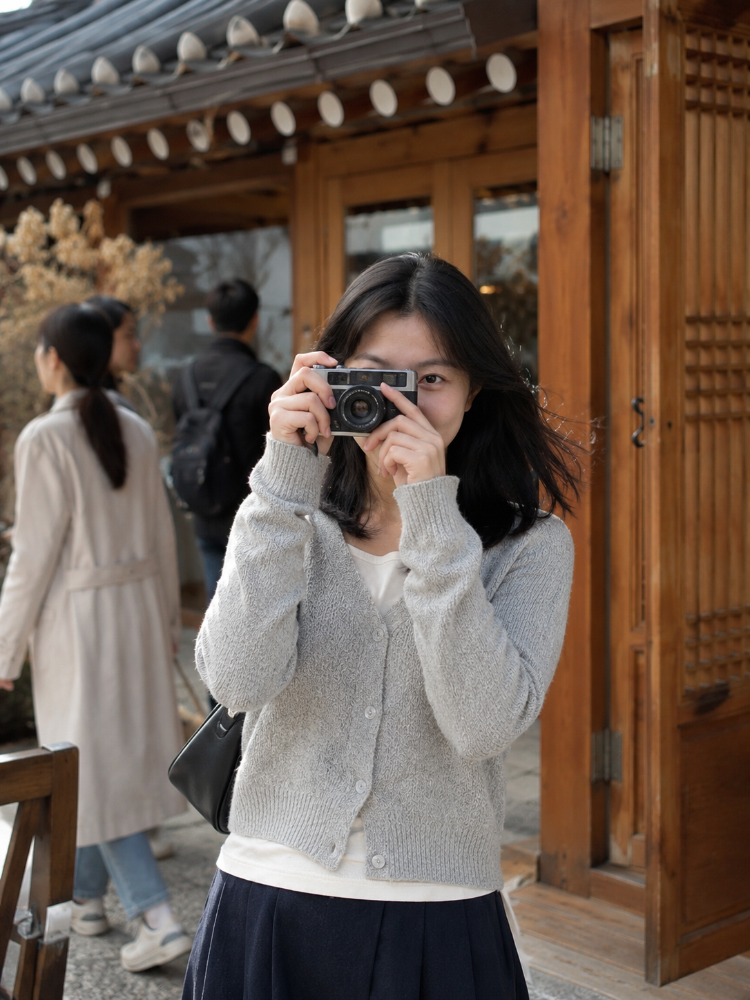

# TRAVEL-007 | 景福宫附近韩屋咖啡厅拍照

---

title: "GPT Image 2 生图提示词｜城市旅游系列 TRAVEL-007：景福宫附近韩屋咖啡厅拍照"  
author: "老师 你的图掉了"  
topics:

- GPT Image 2
- 豆包
- 千问
- 生图提示词
- Prompt
- 城市旅游系列
- 首尔咖啡馆

---

图友们大家好，今天这一期是「景福宫附近韩屋咖啡厅拍照」。这一组适合生成首尔旅行里比较松弛的咖啡馆照片，画面重点是韩屋屋檐、木质门框、庭院绿植和真实旅拍感。

这期仍然放在「城市旅游系列」里，人物延续前一组首尔咖啡馆的自然穿搭和生活状态，不做游客照，也不做精修写真。

提示词主要按 GPT Image 2 的中文自然语言写法整理，也可以在豆包、千问及其他支持中文提示词的生图工具里尝试。不同工具出图会有差异，可以按需要微调画幅、镜头和细节。

场景说明

这一期的画面放在景福宫附近的韩屋咖啡厅。人物不是刻意摆拍，而是在庭院、窗边和门口自然拍照、喝咖啡、回头看镜头，适合做首尔旅行、韩屋街区、咖啡馆生活感这类主题。

提示词 1

男友第一人称视角，25岁亚洲女生白天站在景福宫附近韩屋咖啡厅庭院里拍照，浅灰针织开衫、白色内搭、深色半身裙，黑色自然中长发，清透淡妆，手里拿着手机回头看镜头，身后是木质韩屋门框、低矮石阶和小圆桌，午后柔和自然光，iPhone 原相机随手抓拍，真实旅行生活感，避免 AI 美女脸、写真感、网红感、过度精修。

效果图 1

[配图1：见下方图片 img1.png]

提示词 2

25岁亚洲女生坐在景福宫附近韩屋咖啡厅窗边木椅上，浅灰针织开衫、白色内搭、深色半身裙，桌上有冰美式、甜点盘和旅行小票，窗外能看到韩屋屋檐和庭院绿植，下午干净自然光照在侧脸，35mm 胶片生活旅拍，五官好看但不网红，真实皮肤纹理，避免商业写真和摆拍感。

效果图 2

[配图2：见下方图片 img2.png]

提示词 3

男友第一人称视角，25岁亚洲女生在韩屋咖啡厅门口举起相机拍照，浅灰针织开衫、白色内搭、深色半身裙，黑色自然中长发被微风轻轻吹起，背景是传统木门、瓦片屋檐和路过的游客虚影，50mm 半身自然抓拍，首尔旅行咖啡馆氛围，健康自然肤色，避免过度精修和网红滤镜。

效果图 3

[配图3：见下方图片 img3.png]

使用建议

1. 想更真实：保留 iPhone 原相机、35mm 胶片、自然皮肤纹理这几个关键词，不要把人物写成商业模特或精修写真。
2. 想加强首尔氛围：可以替换韩屋屋檐、木质门框、庭院绿植、韩文店招、咖啡桌这些环境细节。
3. 想换工具：GPT Image 2、豆包、千问及其他生图工具都可以尝试，按平台效果微调画幅、焦段、人物距离和背景元素。

感兴趣的朋友们，欢迎收藏、关注，也可以在评论区留言你喜欢的系列或话题，我会继续补更多同类型场景。

#GPTImage2 #豆包 #千问 #生图提示词 #Prompt #城市旅游系列 #首尔咖啡馆 #景福宫 #韩屋咖啡厅

**首尔咖啡馆系列 · 目录**  
上一期：TRAVEL-006｜弘大街边咖啡馆靠窗坐着发呆  
本期：TRAVEL-007｜景福宫附近韩屋咖啡厅拍照  
下一期：TRAVEL-008｜延南洞路边咖啡杯举起对着镜头

