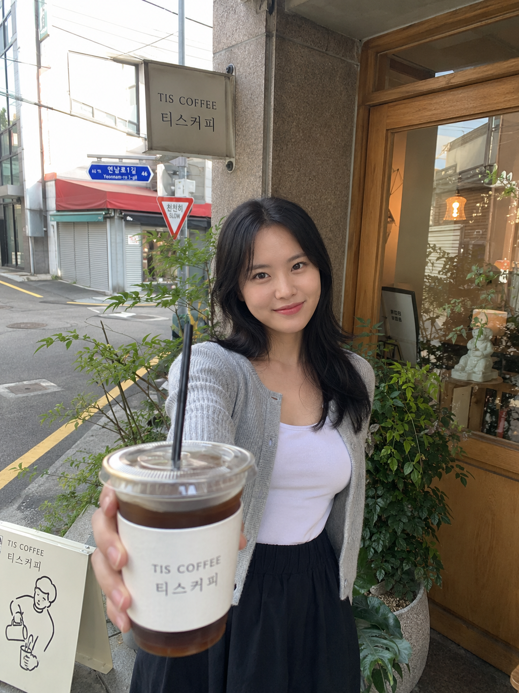
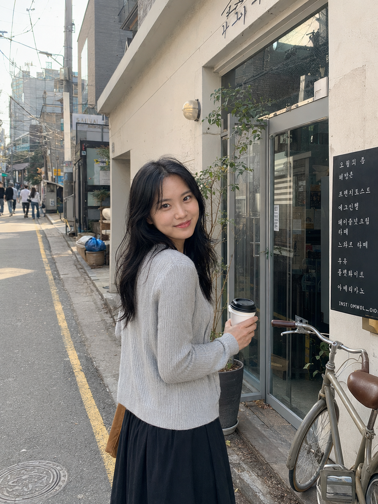
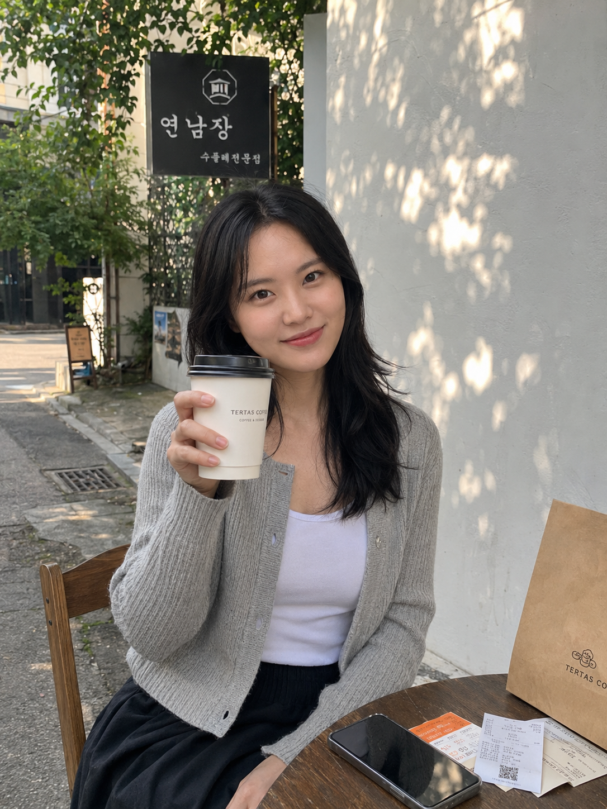
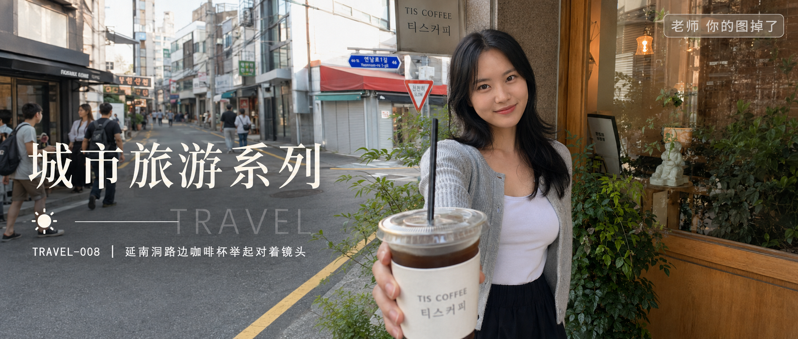

# TRAVEL-008 | 延南洞路边咖啡杯举起对着镜头

---

title: "GPT Image 2 生图提示词｜城市旅游系列 TRAVEL-008：延南洞路边咖啡杯举起对着镜头"  
author: "老师 你的图掉了"  
topics:

- GPT Image 2
- 豆包
- 千问
- 生图提示词
- Prompt
- 城市旅游系列
- 首尔咖啡馆

---

图友们大家好，今天这一期是「延南洞路边咖啡杯举起对着镜头」。这一组适合生成首尔旅行里很生活化的街边咖啡照片，画面重点是手里的外带咖啡杯、延南洞小街、韩文店招和自然旅拍感。

这期仍然放在「城市旅游系列」里，人物延续首尔咖啡馆小分支的浅灰针织开衫、白色内搭和深色半身裙，不做游客照，也不做精修写真。

提示词主要按 GPT Image 2 的中文自然语言写法整理，也可以在豆包、千问及其他支持中文提示词的生图工具里尝试。不同工具出图会有差异，可以按需要微调画幅、镜头和细节。

场景说明

这一期的画面放在白天的首尔延南洞路边。人物刚从街边咖啡店买完外带咖啡，举起杯子对着镜头，背景有低矮店铺、韩文招牌、绿植和路过行人，适合做首尔旅行、街边咖啡、男友视角生活抓拍这类主题。

提示词 1

男友第一人称视角，25岁亚洲女生白天站在首尔延南洞路边咖啡店门口，把一杯外带冰咖啡举到镜头前，浅灰针织开衫、白色内搭、深色半身裙，黑色自然中长发，清透淡妆，身后是低矮街边店铺、韩文招牌和绿色盆栽，上午柔和自然光，iPhone 原相机随手抓拍，五官自然清秀，健康自然肤色，真实旅行生活感，避免 AI 美女脸、写真感、网红感、过度精修。

效果图 1  

提示词 2

25岁亚洲女生白天走在首尔延南洞安静小街上，手里拿着外带咖啡杯侧身回头看镜头，浅灰针织开衫、白色内搭、深色半身裙，街边有小咖啡馆玻璃门、韩文菜单牌、自行车和路过行人虚影，午后干净自然光，35mm 胶片街头旅拍，表情松弛自然，真实皮肤纹理，避免商业写真和摆拍感。

效果图 2  

提示词 3

男友第一人称视角，25岁亚洲女生坐在延南洞路边咖啡店外的小木椅上，把咖啡杯轻轻举到胸前对镜头微笑，浅灰针织开衫、白色内搭、深色半身裙，桌上有手机、纸袋和旅行小票，背景是街边树影、韩文店招和浅色墙面，50mm 半身自然抓拍，画面温和耐看，干净自然肤质，避免过度精修和网红滤镜。

效果图 3  

使用建议

1. 想更真实：保留 iPhone 原相机、外带咖啡杯、旅行小票和路过行人这些生活细节，不要把人物写成商业模特。
2. 想加强延南洞氛围：可以替换韩文店招、低矮店铺、绿植、自行车、小木椅、玻璃门等街边元素。
3. 想换工具：GPT Image 2、豆包、千问及其他生图工具都可以尝试，按平台效果微调画幅、焦段、人物距离和街景细节。

感兴趣的朋友们，欢迎收藏、关注，也可以在评论区留言你喜欢的系列或话题，我会继续补更多同类型场景。

#GPTImage2 #豆包 #千问 #生图提示词 #Prompt #城市旅游系列 #首尔咖啡馆 #延南洞 #街边咖啡

**首尔咖啡馆系列 · 目录**  
上一期：TRAVEL-007｜景福宫附近韩屋咖啡厅拍照  
本期：TRAVEL-008｜延南洞路边咖啡杯举起对着镜头  
下一期：TRAVEL-009｜首尔清晨空街道独自散步

## 封面图提示词

25岁亚洲女生白天站在首尔延南洞路边咖啡店门口，把一杯外带冰咖啡举到镜头前，浅灰针织开衫、白色内搭、深色半身裙，黑色自然中长发，清透淡妆，身后有低矮街边店铺、韩文招牌、绿色盆栽和路过行人，上午到午后的柔和自然光，真实首尔旅行街边咖啡氛围，35mm 胶片生活旅拍，2.35:1 电影横构图。画面左侧垂直居中偏下叠加文字排版：超大号衬线字体米白色主文案「城市旅游系列」，主文案正下方一条细横线左端带太阳图标☀横线中央有透明英文水印 TRAVEL，横线下方等宽白色字体副文案「TRAVEL-008 ｜ 延南洞路边咖啡杯举起对着镜头」；右上角浅色半透明圆角底衬配小号文字「老师 你的图掉了」；无整体蒙层，文字直接压图，避免 AI 美女脸、写真感、网红感、过度精修。

