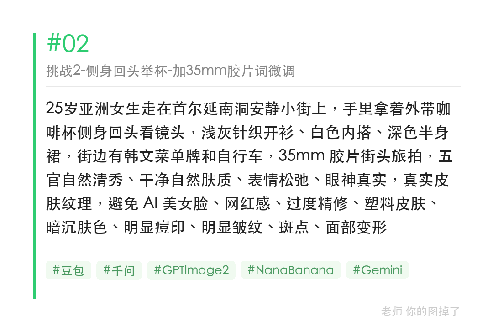
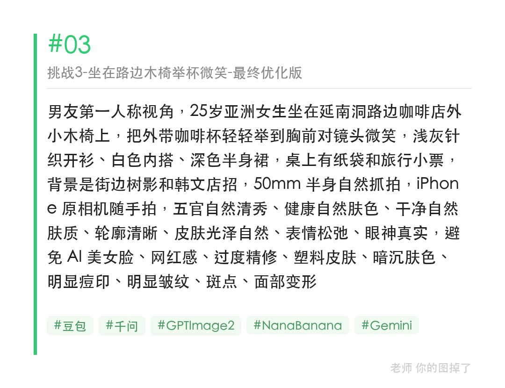

延南洞举咖啡杯场景，三步递进实测：只写场景→加胶片风格词→加机位+道具，每次加一个维度，出图差距一目了然。

提示词（最终优化版）：
男友第一人称视角，25岁亚洲女生坐在延南洞路边咖啡店外小木椅上，把外带咖啡杯轻轻举到胸前对镜头微笑，浅灰针织开衫、白色内搭、深色半身裙，桌上有纸袋和旅行小票，背景是街边树影和韩文店招，50mm 半身自然抓拍，iPhone 原相机随手拍

#GPTImage2 #千问 #生图提示词 #Prompt #城市旅游系列 #首尔旅拍

