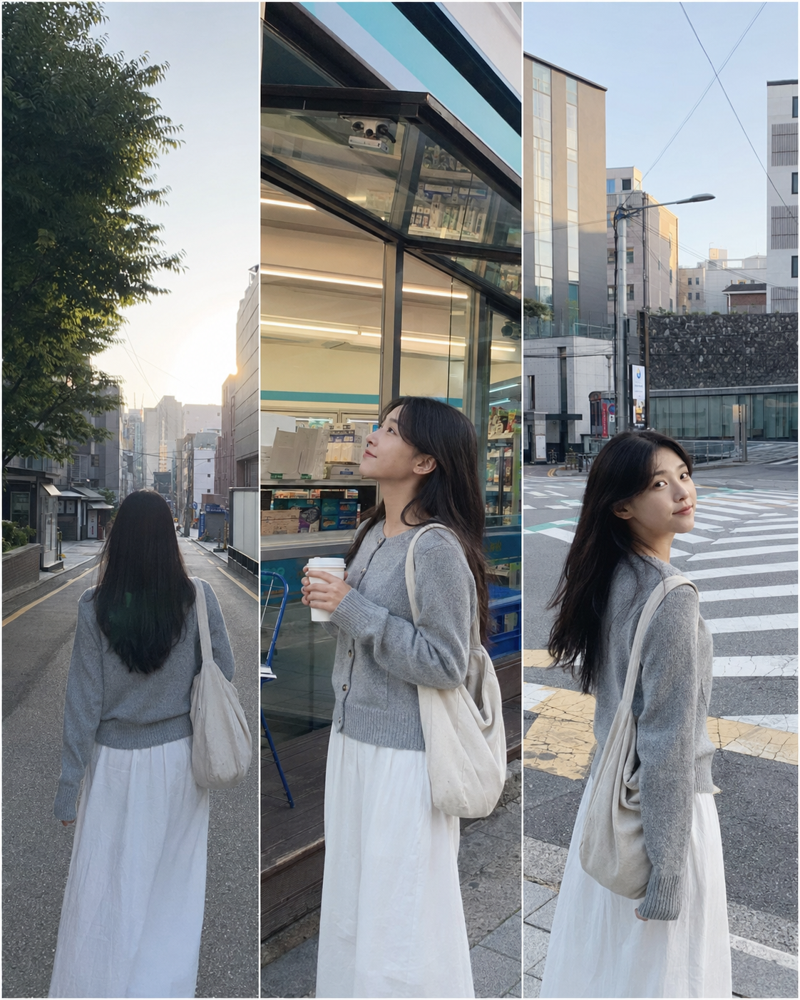
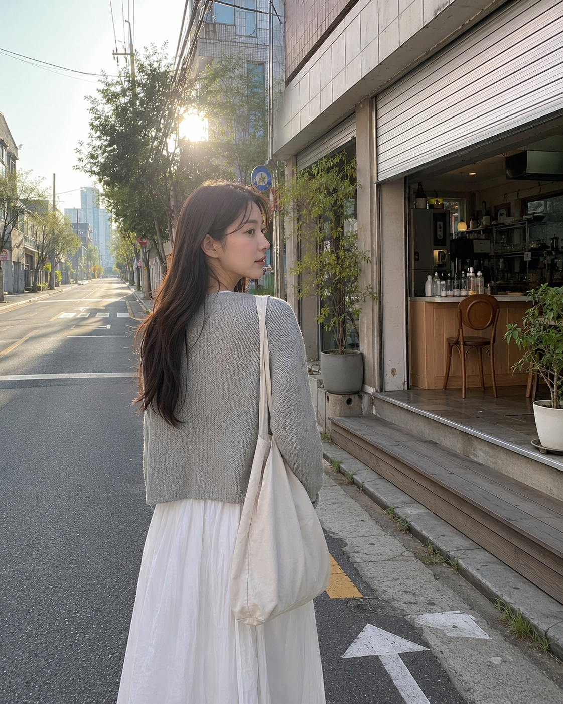
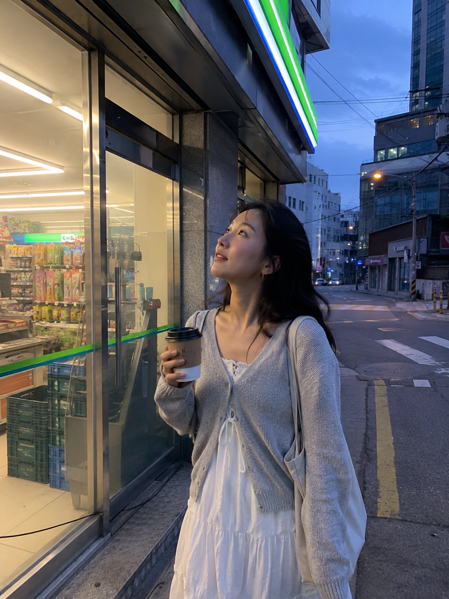
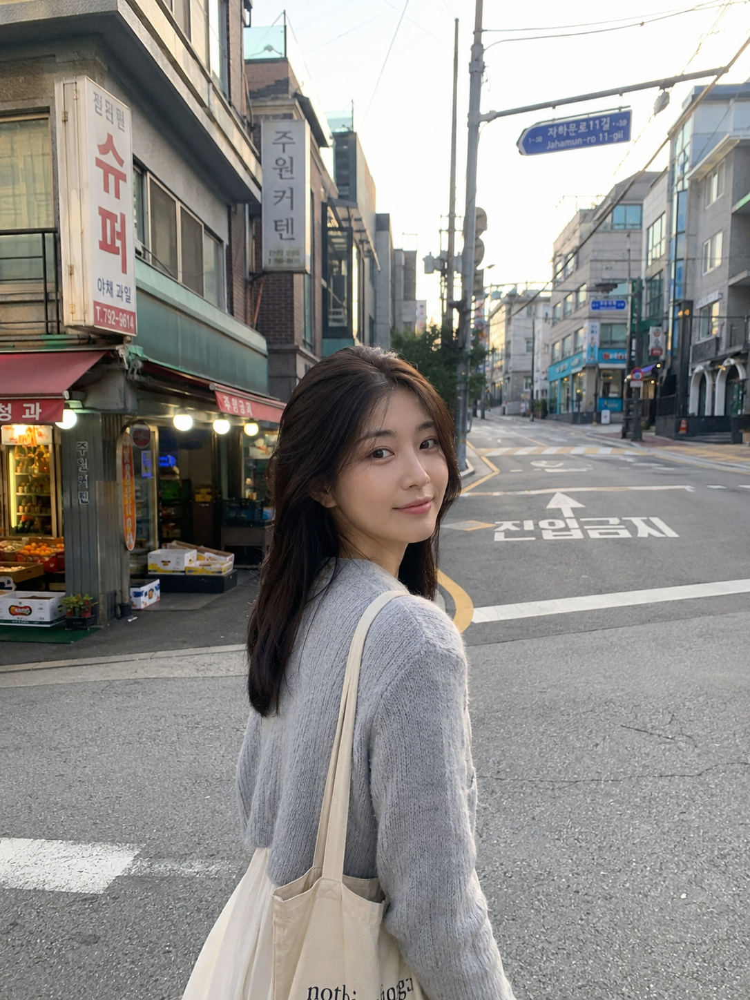

# 首尔清晨旅行照不用飞，豆包生成朋友圈都信

图友们大家好，今天这一期是「首尔清晨空街道独自散步」。

这组适合生成那种“像真的早起去首尔旅行”的清晨街拍：路上人很少，店铺刚开门，空气有一点冷，照片看起来安静、松弛，又很适合发朋友圈和小红书。

提示词主要按 GPT Image 2 的中文自然语言写法整理，也可以直接拿去豆包、千问及其他支持中文提示词的生图工具里尝试。生成图片时，也可以参考你自己的照片，再结合下面的提示词去生成，这样人物相似度、穿搭和真实感会更稳。

下面这张三列布局图，可以先快速看完整组画面的方向：清晨街道、便利店门口、空路口回头。

## 场景说明

这一期的重点不是游客打卡照，而是首尔清晨还没完全醒来的街区感。人物自然独自散步，镜头像同行的人随手拍下，不用夸张姿势，只靠街道、冷空气、晨光和生活细节撑住氛围。

## 清晨空街道的背影散步

适用场景：想生成首尔旅行感、朋友圈旅拍、清晨街头背影照时，可以直接复制这段。

提示词：

<section style="background:#f3fbf4;border-radius:8px;padding:14px 16px;margin:10px 0 16px;">
男友第一人称视角，24 岁亚洲女生清晨独自走在首尔延南洞附近的空街道，浅灰针织开衫、白色长裙、帆布包，背影微微侧过头，街边咖啡店铁门半开，路面干净安静，柔和晨光从楼缝照进来，五官自然清秀，健康自然肤色，干净自然肤质，画面像 iPhone 原相机随手抓拍，真实生活旅拍感，避免 AI 美女脸、网红感、过度精修、塑料皮肤、暗沉肤色、明显痘印、明显皱纹、斑点、面部变形。
</section>

拆解：这条重点是“背影 + 空街道 + 半开店门”，很容易生成旅行途中被抓拍的真实感。如果换城市，只要替换街区和店铺细节即可。

## 便利店门口抬头看天空

适用场景：想要更生活化的旅行照，或者想做小红书“一个人在首尔”氛围图，可以用这一条。

提示词：

<section style="background:#f3fbf4;border-radius:8px;padding:14px 16px;margin:10px 0 16px;">
男友第一人称视角，24 岁亚洲女生清晨站在首尔街角便利店门口，手里拿着热咖啡，抬头看向浅蓝色天空，浅灰针织开衫、白色长裙、帆布包，头发自然披散，便利店灯光还亮着，玻璃门映出安静街道，冷调晨光和室内暖光混在一起，表情松弛，眼神真实，健康自然肤色，干净自然肤质，35mm 生活摄影，轻微皮肤纹理，避免 AI 美女脸、写真感、网红感、过度精修、塑料皮肤、暗沉肤色、明显痘印、明显皱纹、斑点、面部变形。
</section>

拆解：便利店灯光能补出一点温度，和清晨街道的冷光形成对比，画面会比纯街景更有故事。

## 路口回头看向镜头

适用场景：想生成更适合做封面、头像、朋友圈首图的半身旅行照，可以用这段。

提示词：

<section style="background:#f3fbf4;border-radius:8px;padding:14px 16px;margin:10px 0 16px;">
男友第一人称视角，24 岁亚洲女生走到首尔清晨安静路口时回头看向镜头，浅灰针织开衫、白色长裙、帆布包，身后是韩文路牌、低矮楼房和刚亮起的街边小店，远处街道几乎没有行人，柔和晨光照在侧脸，五官自然清秀，面部干净，健康自然肤色，笑容很轻，像真实旅行相册里的随手照片，iPhone 原相机质感，避免 AI 美女脸、网红感、过度精修、塑料皮肤、暗沉肤色、明显痘印、明显皱纹、斑点、面部变形。
</section>

拆解：这一条把人物正脸、路牌和街道同时放进去，更适合做“我真的去过这里”的社交平台封面图。

## 使用建议

1. 想更像本人：生成时可以上传或参考你自己的照片，再保留“健康自然肤色、干净自然肤质、iPhone 原相机随手抓拍”这类真实感描述。
2. 想更有旅行感：不要只写城市名，尽量补充街区、店铺、路牌、路面、光线和当天时间。
3. 想控制画面不过度精修：保留“避免 AI 美女脸、网红感、过度精修、塑料皮肤”，并减少“精致写真、大片、完美五官”这类词。

建议先收藏这组 Prompt。后续只要替换城市、街区和手里拿的物件，就能继续延伸出一整套真实旅行照。

## 往期回顾

- [延南洞路边咖啡杯举起对着镜头](../TRAVEL-008-延南洞路边咖啡杯举起对着镜头/TRAVEL-008-延南洞路边咖啡杯举起对着镜头.md)
- [弘大街边咖啡馆靠窗坐着发呆](../TRAVEL-006-弘大街边咖啡馆靠窗坐着发呆/TRAVEL-006-弘大街边咖啡馆靠窗坐着发呆.md)
- [居酒屋玻璃窗边独自小酌](../TRAVEL-005-居酒屋玻璃窗边独自小酌/TRAVEL-005-居酒屋玻璃窗边独自小酌.md)

#GPTImage2 #豆包 #千问 #生图提示词 #Prompt #城市旅游系列 #首尔清晨 #旅行照 #朋友圈
