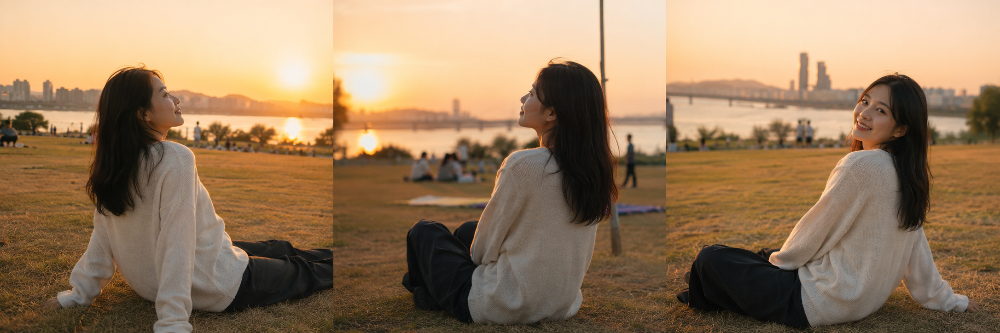
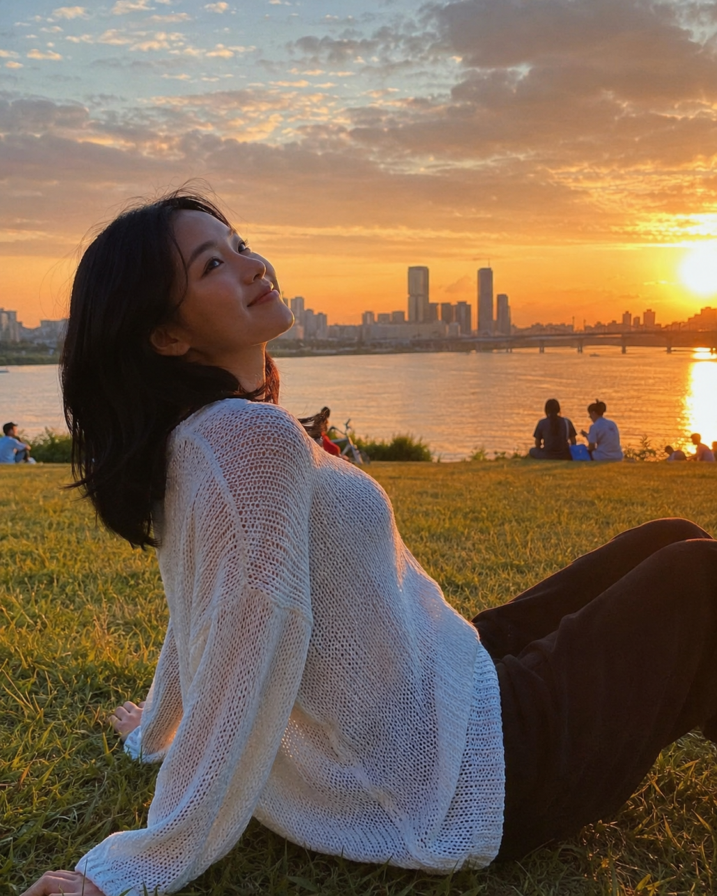
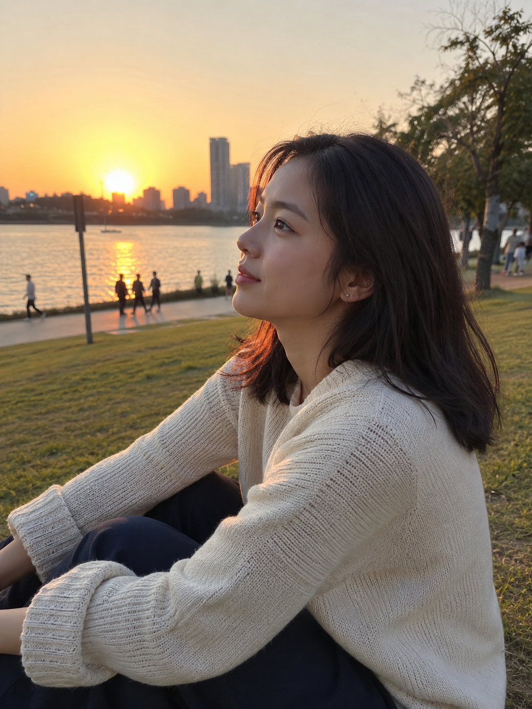
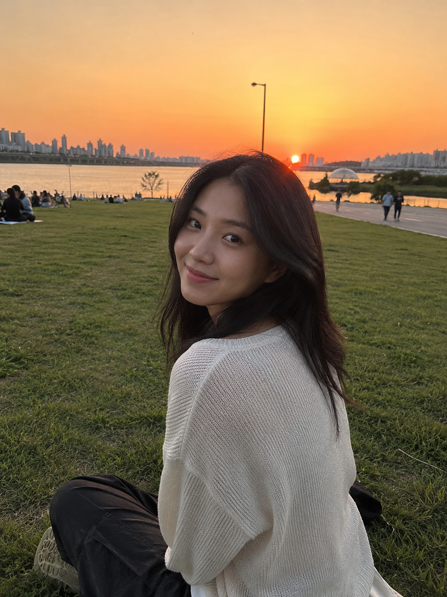

# 汉江公园草地，豆包直接生成夕阳女友感照片，提示词复制就能用

图友们大家好，今天这一期是「汉江公园草地上看夕阳」。黄昏橙金色夕阳、草地逆光、汉江水面波光，这一组专门做首尔汉江公园的旅行生活感照片，不是精修写真，是那种朋友圈会点赞的真实旅拍质感。

这是城市旅游系列第 10 期，持续补充不同城市和场景，感兴趣的朋友收藏关注，不迷路。

> 💡 **小技巧**：豆包、千问等生图工具支持上传参考图。你可以把自己的一张日常照片上传作为人物参考，再结合本期提示词，生成的照片会更贴合你自己的气质和面貌，效果比纯文字提示词更自然。

---

## 草地坐望夕阳

适合场景：双手撑地、仰头望向夕阳，草地被暖光染金，整体偏暖橙色调。

提示词：

25岁亚洲女生黄昏坐在汉江公园草地上，米白色宽松针织毛衣、深色休闲长裤，黑色自然中长发披落，双手撑在身后微微仰头，远处是汉江水面和橙红色夕阳，草地被暖光染成金色，五官自然清秀，健康自然肤色，35mm 胶片旅拍感，真实旅行生活感，避免 AI 美女脸、网红感、过度精修、暗沉肤色、明显痘印、面部变形。

---

## 侧脸逆光

适合场景：侧对夕阳方向，橙金色逆光勾勒发丝，背景汉江岸线虚化。

提示词：

男友第一人称视角，25岁亚洲女生黄昏在汉江公园草地上侧坐，米白色宽松针织毛衣、深色休闲长裤，黑色自然中长发，侧脸对着夕阳方向，橙金色逆光勾勒发丝轮廓，背景汉江岸线和对岸楼群虚化，50mm 浅景深自然抓拍，五官自然清秀，健康自然肤色，干净自然肤质，真实旅行生活感，避免 AI 美女脸、网红感、摆拍感、过度精修、明显痘印。

---

## 回头对镜微笑

适合场景：盘腿坐在草地，回头对镜头自然微笑，夕阳余晖打在脸上。

提示词：

男友第一人称视角，25岁亚洲女生在汉江公园草地上盘腿坐着回头看镜头，米白色宽松针织毛衣、深色休闲长裤，黑色自然中长发，嘴角自然微笑，夕阳余晖打在脸上，草地绿色和天空橙色形成暖色调，iPhone 原相机随手抓拍，五官自然清秀，健康自然肤色，干净自然肤质，生活化旅行感，避免 AI 美女脸、网红感、商业写真感、过度精修、明显痘印、面部变形。

---

## 使用建议

1. **真实感控制**：保留「35mm 胶片旅拍感」「iPhone 原相机随手抓拍」「干净自然肤质」这几个关键词，能有效避免模型生成过度精修的写真感。
2. **加入参考图效果更好**：把自己一张日常照片上传作为人物参考，生成的图像会更贴合本人气质，比纯文字提示词更自然。
3. **换场景换工具都可以**：汉江可以替换成清溪川、南山、鸭川或其他公园；GPT Image 2、豆包、千问均支持中文提示词，可按各平台效果微调画幅和焦段。

这组夕阳汉江感觉不错的朋友，欢迎收藏备用、关注系列更新，也可以在评论区告诉我你想要哪个城市或场景，我来补更。

---

## 往期回顾

- TRAVEL-009 首尔清晨空街道独自散步
- TRAVEL-008 延南洞路边咖啡杯举起对着镜头
- TRAVEL-006 弘大街边咖啡馆靠窗坐着发呆

#豆包 #GPTImage2 #千问 #生图提示词 #Prompt #城市旅游系列 #汉江公园 #首尔旅行 #夕阳
