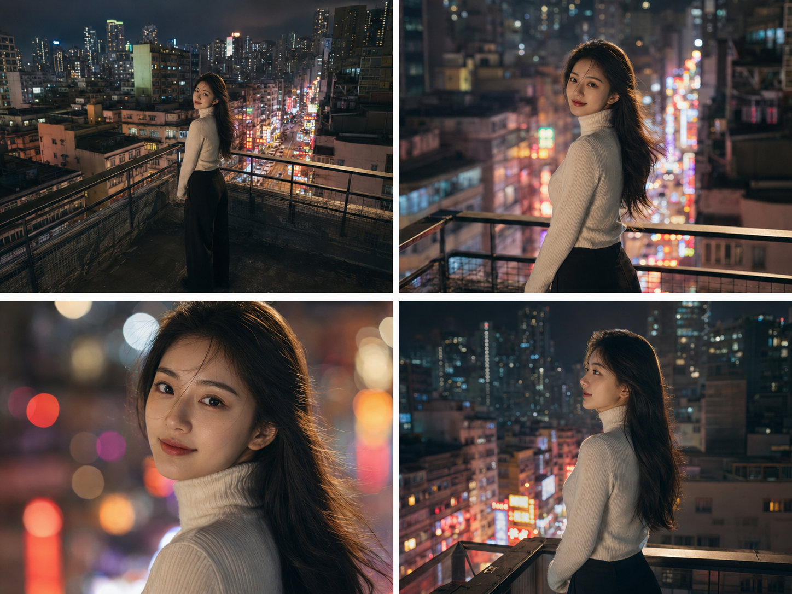
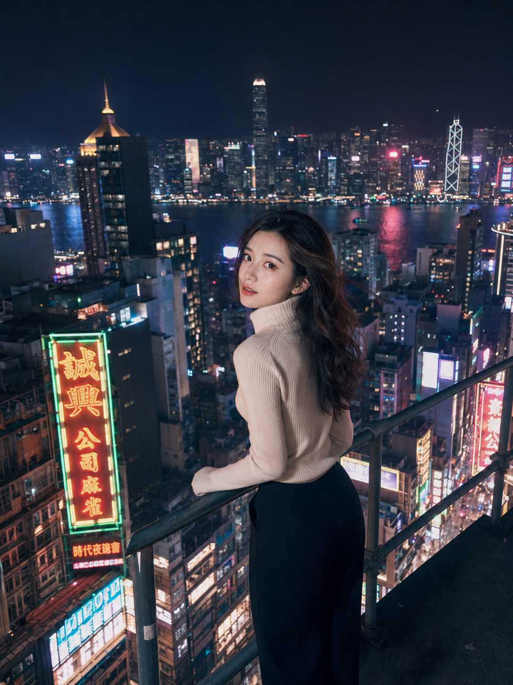
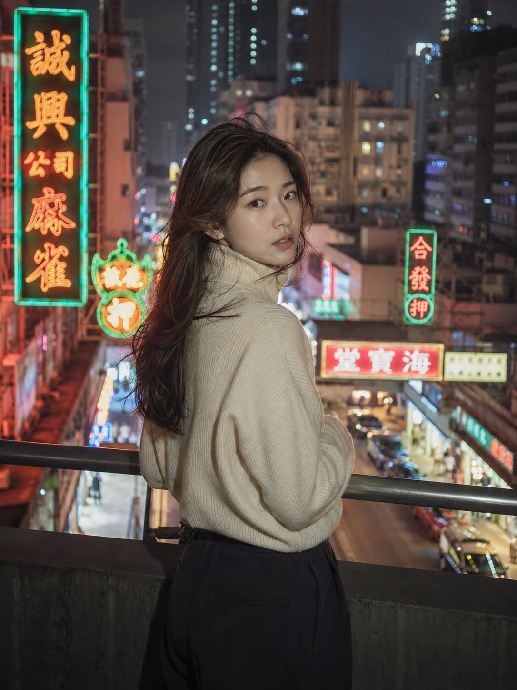
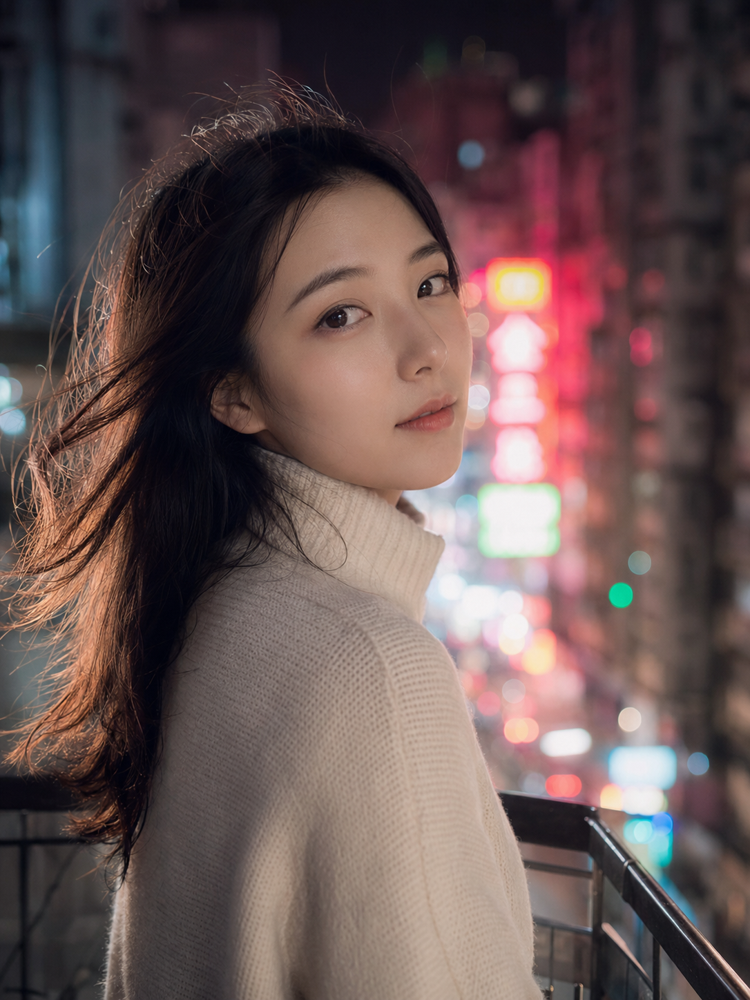

同一处香港天台，同一件米白色针织衫，只换镜头焦段，看密度感十足的霓虹街景怎么拍出三种完全不同的情绪。

提示词：
香港夜晚天台，24岁亚洲女生站在天台护栏边俯瞰楼下霓虹街道，微卷长发被夜风吹起，穿米白色高领针织衫，侧身回头看向镜头，五官自然清秀，肌肤白皙，皮肤光泽细腻，电影感夜景光影，高清锐利，色调统一精致

#GPTImage2 #千问 #生图提示词 #Prompt #城市旅游系列 #香港夜景

