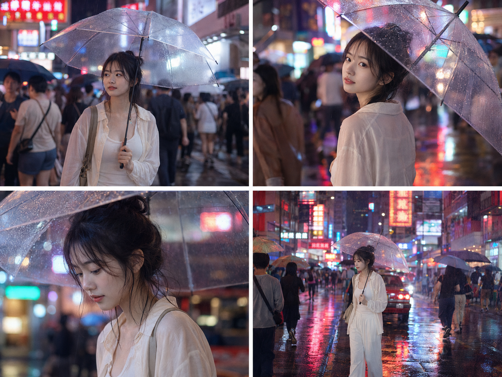

香港旺角雨夜霓虹密集，人像最容易被背景灯光糊脸、磨皮过度。关键是给面部单独安排补光，机位换成3/4侧脸，背景灯光只负责氛围不直射脸。

提示词：
24岁亚洲女生，五官自然清秀，面部干净，健康自然肤色，肌肤白皙，皮肤光泽细腻，气质清爽亲和，眼神真实，在香港旺角雨夜街头撑一把透明雨伞穿过人群，身穿米白色风衣，3/4侧脸回眸望向镜头，雨伞使用暖白色补光灯效果照亮面部五官，霓虹招牌在身后形成柔和虚化光斑不直射脸部，湿润地面反射红蓝霓虹光带，50mm人像焦段，浅景深

#GPTImage2 #千问 #生图提示词 #Prompt #城市旅游系列 #旺角夜景

