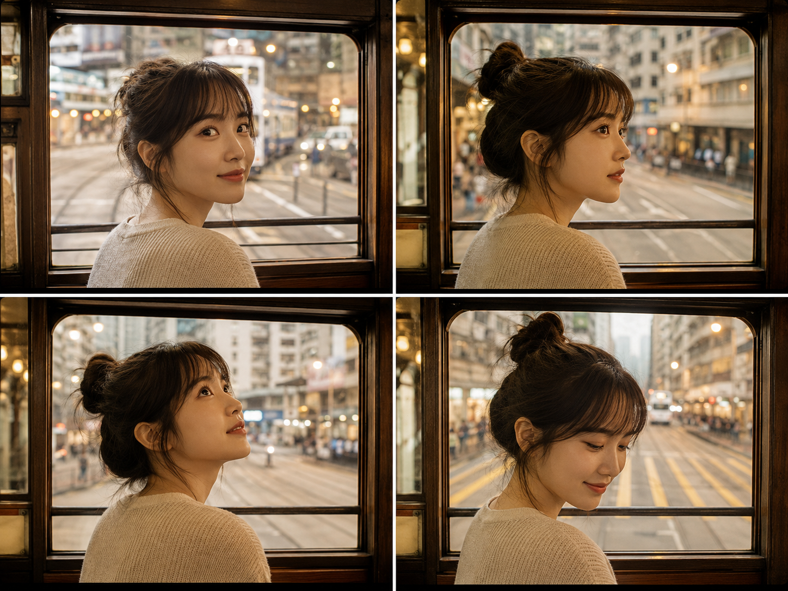
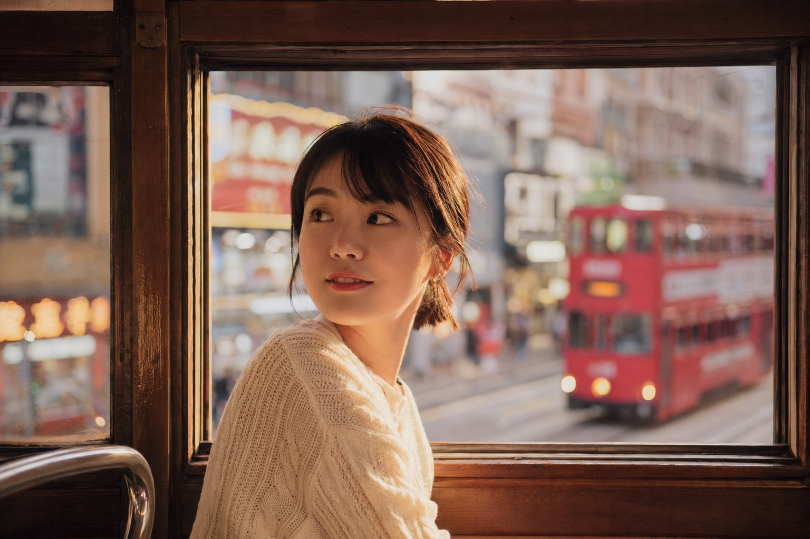
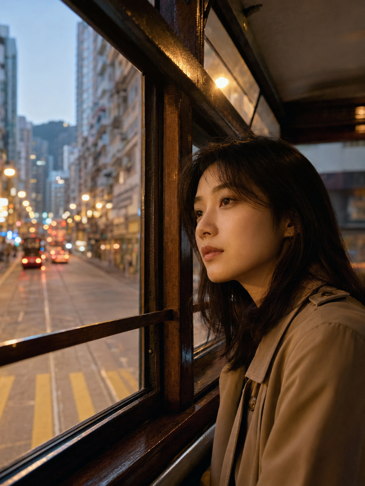
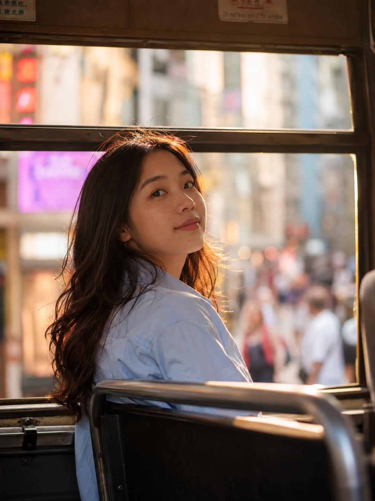

# 车窗当画框，这一构图让香港街景秒变电影感

今天分享一种构图：「框架构图」。

简单说，就是利用画面里现成的边框——门框、窗框、树枝缝隙——把主体框起来，让视线自然聚焦在框内的人身上，同时框外的景物又能交代环境和氛围。这次用香港叮叮车的木质车窗来做这个框，怀旧感和画面纵深感一次到位。

构图特点很直接：车窗四边形成天然边界，人物脸部被框住时会自动成为视觉焦点，而窗外流动的街景又在框外制造出景深和叙事感，一静一动，画面立刻有了层次。

这种构图特别适合有故事感、怀旧感的旅拍主题，也适合想让普通街拍多一点"电影截帧"感觉的场景。

---

### ❌ 常见的错误示范

24岁亚洲女生坐在公交车靠窗位置，正对镜头面无表情，车窗占据画面一半但没有框住人物任何部位，构图松散，背景模糊看不清环境，平淡纪实风格

这类写法最大的问题是"有窗但没有框"——车窗只是背景元素，没有真正把人物围起来，画面自然就散了，也没有故事感。

---

### ✅ 示例1：正脸回望

24岁亚洲女生坐在香港叮叮车靠窗位置，侧身转头回望车窗外街道，车窗木质窗框完整框住她的脸和肩膀形成天然画框构图，窗外是铜锣湾老街霓虹招牌和双层巴士的虚化背景，柔和的黄昏光线从窗外洒进车厢照亮她的侧脸，五官自然清秀，面部干净，肌肤白皙，皮肤光泽细腻，健康自然肤色，气质清爽亲和，穿浅色针织衫，短发或扎低马尾，35mm胶片质感摄影，暖色调，浅景深虚化背景，避免 AI 美女脸、网红感、过度精修、塑料皮肤、暗沉肤色、明显痘印、明显皱纹、斑点、面部变形

**改了什么：** 让车窗完整围住脸部和肩膀，而不是只做背景板；同时给窗外街景做虚化处理，突出框内主体。

---

### ✅ 示例2：3/4侧脸看向窗外（框中框）

24岁亚洲女生坐在香港叮叮车上层靠窗座位，微微侧头望向窗外，车窗框架从画面左侧完整切入围住半张脸和肩线，形成框中框构图，窗外可见叮叮车轨道、老式唐楼招牌和路灯渐次亮起的夜色街景，暖黄色路灯光斑洒在她脸颊和窗框上，五官自然清秀，面部干净，肌肤白皙无瑕，皮肤光泽自然，眼神真实带一点怀旧感，穿米色风衣，头发自然披肩，50mm人像镜头，浅景深，电影感光影，避免 AI 美女脸、网红感、过度精修、塑料皮肤、暗沉肤色、明显痘印、明显皱纹、斑点、面部变形

**改了什么：** 窗框只切一半画面，人物从另一侧探出，形成"框中有框"的双重边界，比对称构图多一层空间感。

---

### ✅ 示例3：低机位仰拍回眸

24岁亚洲女生坐在香港叮叮车车厢中段，低机位仰拍视角，车窗上沿和窗框边缘框住她扬起的下颌和回眸的双眼，形成不对称框架构图，窗外是模糊虚化的香港街道人流和霓虹灯光斑点，逆光勾勒出发丝和侧脸轮廓的金边光晕，五官自然清秀，面部干净，肌肤白皙透亮，皮肤纹理自然，表情松弛带笑意，穿浅蓝衬衫，头发微卷自然垂落，85mm长焦镜头，浅景深背景虚化成光斑，色调统一偏暖，避免 AI 美女脸、网红感、过度精修、塑料皮肤、暗沉肤色、明显痘印、明显皱纹、斑点、面部变形

**改了什么：** 换成低机位仰拍，窗框只框住半张脸，逆光勾出轮廓光，同一构图逻辑下也能拍出更有戏剧感的角度。

---

**容易犯的错误：**

1. 窗框和人物之间留白太多，框没有贴合脸部或肩膀，视觉焦点就散了。
2. 窗外背景处理得太清晰，会和框内主体抢注意力，一定要虚化处理。

**总结：** 这种构图最打动人的地方，是它自带"偷拍到的真实瞬间"的感觉——观众像是透过车窗无意间瞥见了这个回眸，故事感比正儿八经的摆拍更强。

---

存一下这三条框架构图写法，下次拍地铁、飞机舷窗、咖啡馆玻璃窗都能直接套用。欢迎在评论区留言你还想看哪种构图拆解～

---

## 往期回顾

- TRAVEL-010 汉江公园草地上看夕阳
- TRAVEL-011 香港夜晚站在天台俯瞰霓虹街道
- TRAVEL-012 旺角雨夜撑伞穿过人群

#GPTImage2 #千问 #豆包 #生图提示词 #Prompt #城市旅游系列 #框架构图
