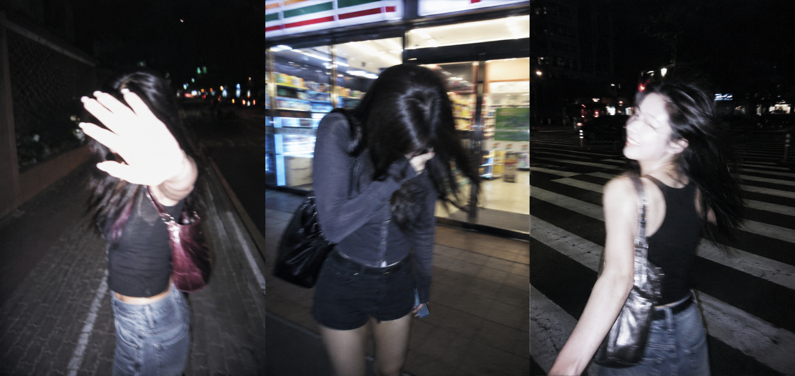
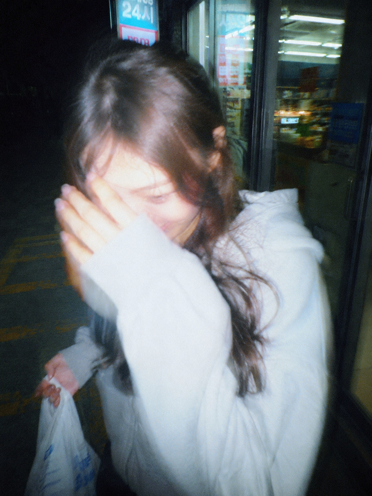
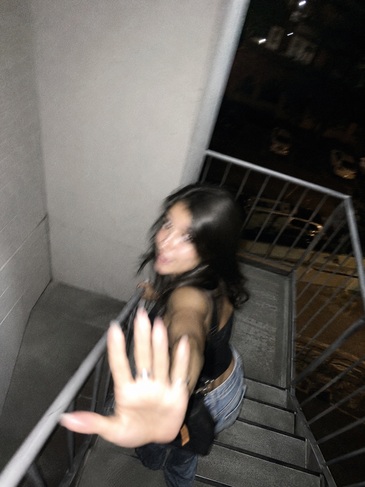
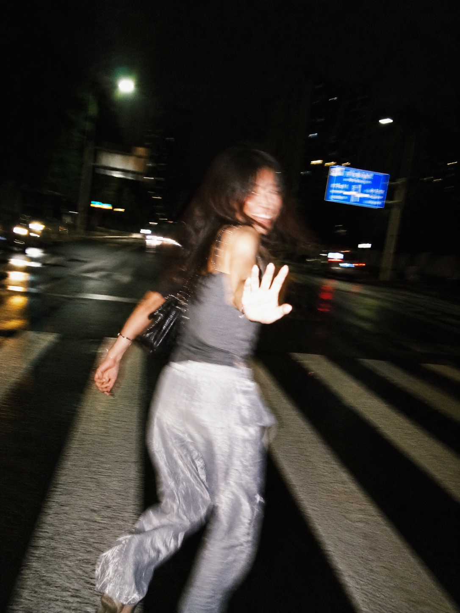

# 深夜街头被拍到的那一瞬间，豆包生成的闪光灯抓拍 Prompt 直接存

图友们大家好，今天这一期是「夜间闪光灯抓拍四场景」。

这一组模拟的是深夜街头的随手抓拍质感——强闪光灯、重度运动模糊、面部无法辨认，人物永远处在将要走出画面的瞬间。四个不同场景，同一种被偶然拍到的失控感和侵入感，像私人相册里某张你不知道是什么时候被谁拍下来的照片。

这是夜间街头抓拍系列第一期，后续会持续更新更多场景，建议收藏备用。

> 💡 **小技巧**：豆包、千问等生图工具支持上传参考图。你可以把自己的一张日常照片上传作为人物参考，再结合本期提示词，生成的照片会更贴合你自己的气质和面貌，效果比纯文字提示词更自然。

---

## 夜路回头挡镜头

适合场景：夜间街道边走边被拍，突然回头用手挡镜头，像被偷拍到的一个防御瞬间。

提示词：

超逼真的智能手机抓拍照片，3:4 竖构图。原始且无法辨认的年轻女性，仅受一般比例与氛围启发。位于东京夜间人行道，一侧是白色瓷砖墙。她正继续向前走，却在听到动静后突然半侧身回头，带一点惊讶和羞涩，嘴角是克制的微笑，一只手下意识抬起挡向镜头，像边躲边走，人物几乎要走出画面边缘。运动中闪光灯触发。强烈手持抖动，明显定向模糊，面部细节模糊，手部与头发拖影严重，墙面被拉出拉丝感，周围环境陷入深邃黑暗。强闪光灯高光，局部过曝，硬阴影，原始随性的快照感，侵入感强，俏皮又短暂，极高噪点，重度模糊，真实手机抓拍质感。

---

## 便利店门口低头躲闪

适合场景：深夜便利店刚出来就被拍到，低头缩肩躲闪地笑，手里还拿着东西，一副来不及反应的样子。

提示词：

超逼真的智能手机抓拍照片，3:4 竖构图。原始且无法辨认的年轻女性，仅受一般比例与氛围启发。场景位于深夜便利店门口，身后是玻璃门与冷白色店内灯光。她刚从便利店出来，手里拿着一罐饮料或小购物袋，察觉镜头后微微缩肩，低头躲闪地笑，另一只手抬起半遮住下半张脸，脚步短暂停住，身体略微内收，情绪是害羞、轻松、来不及反应。镜头距离很近，角度略高，构图仓促，人物被切到一部分头顶和手臂，像偷拍式快照。闪光灯瞬间打亮她和门口局部区域，背景迅速坠入黑暗。强烈手抖、局部重影、头发和手部明显模糊，玻璃反光混乱，画面过曝与高噪点并存，硬阴影明显。整体像原始手机随手抓拍，失控、俏皮、转瞬即逝。

---

## 楼梯口匆忙下楼的一瞬间

适合场景：夜间楼梯间快速下楼时被从上方拍到，突然回头伸手，构图大幅裁切，肢体动态极强。

提示词：

超逼真的智能手机抓拍照片，3:4 竖构图。原始且无法辨认的年轻女性，仅受一般比例与氛围启发。场景位于夜间公寓外部楼梯间，周围是灰白色水泥墙与金属扶手。她正匆忙地下楼，身体已经转向下一个台阶，却突然回头看向镜头，神情带一点被抓到的惊讶和玩笑感，一只手扶着栏杆，另一只手下意识向镜头伸来，像在说"别拍了"。拍摄者位置略高，带俯视感，人物只占画面下半区，构图偏斜且裁切大胆，腿部和头顶都有部分被切掉，像失手拍到的瞬间。闪光灯在运动中触发，楼梯边缘、扶手和墙面出现强烈硬阴影与高光反射。整张图存在剧烈手持抖动、方向性拖影、面部与发丝模糊、台阶线条被拉扯，噪点极重，局部过曝，原始手机快照质感强烈，陌生、侵入、稍微危险又充满记忆感。

---

## 斑马线中央转身大笑

适合场景：深夜斑马线上快步穿行时突然回头，情绪更开放，全身感更强，背景有车灯和潮湿路面反光。

提示词：

超逼真的智能手机抓拍照片，3:4 竖构图。原始且无法辨认的年轻女性，仅受一般比例与氛围启发。场景位于深夜城市斑马线中央，远处可见模糊车灯、路牌与潮湿路面反光。她正在快步穿过马路，身体朝前，突然回身看向镜头，露出一瞬间放开的笑意，一只手自然扬起像是在招呼或制止，另一只手还保持行走摆臂，整个人处在正在离开的动态中。拍摄距离稍远，接近全身构图，但人物没有被完整框住，脚部或手臂有部分切出画面，画面轻微歪斜，像追着拍时仓促按下快门。强闪光灯在移动中打亮主体，路面反光和衣料出现刺眼高光，背景迅速跌入黑暗，形成硬阴影和强反差。整张图有明显手抖、重影、失焦、发丝和四肢拖影，五官无法辨认，噪点极高，模糊严重，充满真实手机抓拍的瞬时性、冒犯感与俏皮记忆感。

---

## 使用建议

1. **保留「无法辨认」关键词**：这组提示词的核心是面部模糊、运动失控，建议保留"无法辨认""面部细节模糊""重度运动模糊"等约束词，出图效果才有那种真实的抓拍陌生感。
2. **上传参考图效果更好**：如果你想让画面里的人物体型或气质更贴近自己，可以在豆包或千问的生图界面上传一张自己的全身照作为参考，出来的结果会更有代入感。
3. **换场景直接替换括号里的词**：把"东京夜间人行道""深夜便利店门口"替换成你熟悉的地点，提示词框架完全通用，在 GPT Image 2、千问、豆包上均可使用。

这组存下来备用，下次拍完照想做成这种风格可以直接套。觉得好用的话点个关注，评论区说说你想看哪个场景，下期继续补。

---

## 往期回顾

- SELFIE-001 演出散场后的意外自拍
- SELFIE-002 午后与小动物

#豆包 #GPTImage2 #千问 #生图提示词 #Prompt #夜间抓拍 #闪光灯快照 #街头随手拍
