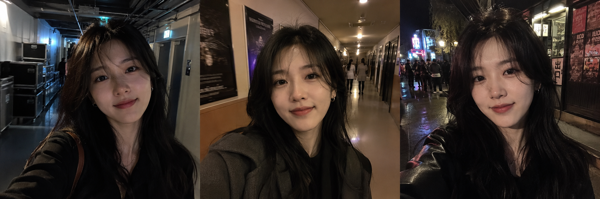
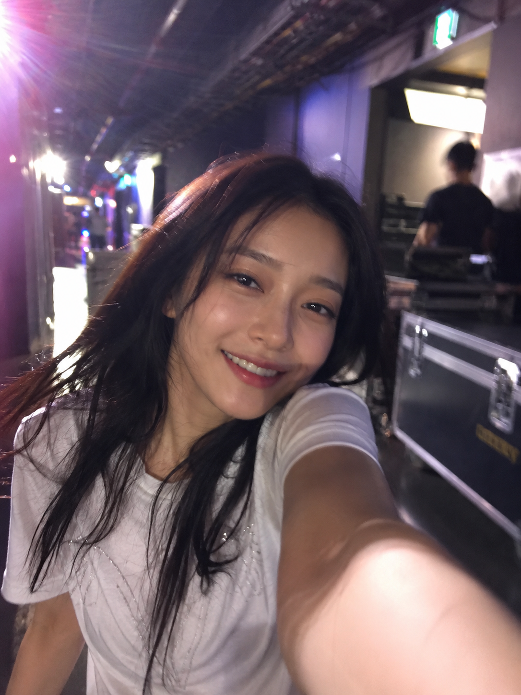
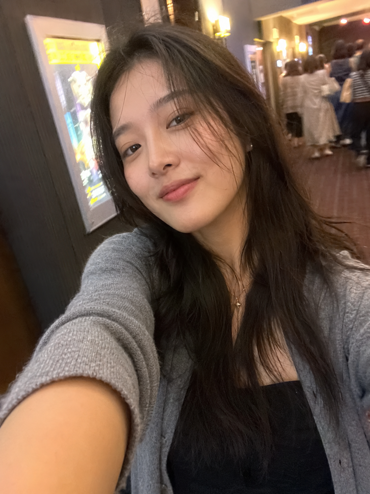
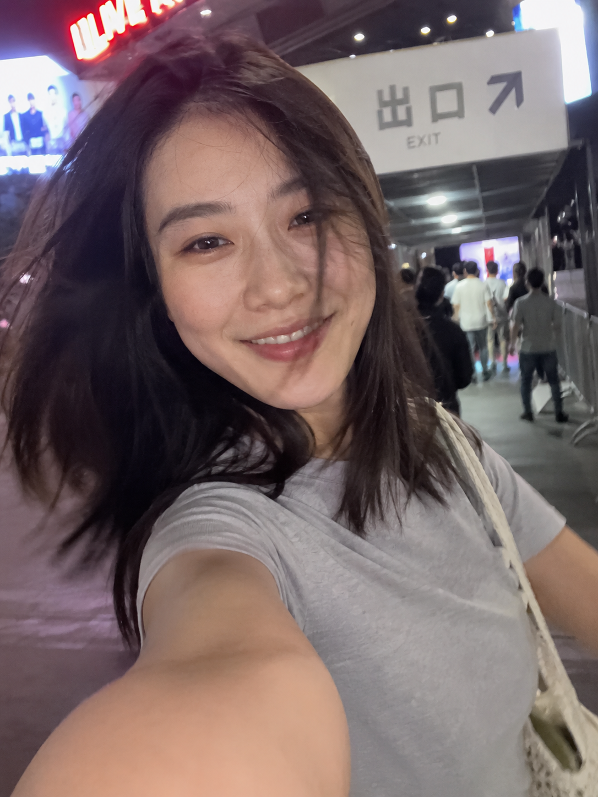
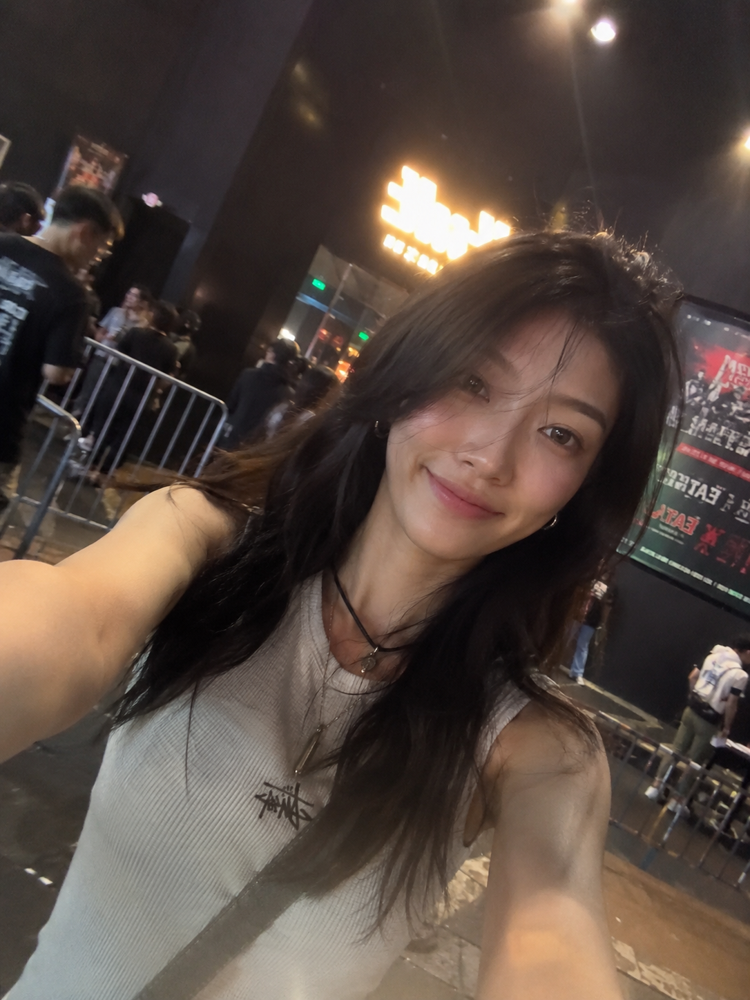

# 散场那一刻随手拍下来，豆包生成的女友感自拍 Prompt 存一下

图友们大家好，今天这一期是「演出散场后的意外自拍」。

这一组模拟的是演出结束后的真实状态——演唱会后台走廊、话剧剧院走廊、脱口秀场馆出口、live house 门口，同一个女生在不同演出散场瞬间随手举起 iPhone 前置镜头拍下的抓拍感自拍，疲惫、开心、意犹未尽，每张都是真实生活相册的感觉。

这是女友感自拍系列第一期，后续会持续更新更多场景，建议收藏备用。

> 💡 **小技巧**：豆包、千问等生图工具支持上传参考图。你可以把自己的一张日常照片上传作为人物参考，再结合本期提示词，生成的照片会更贴合你自己的气质和面貌，效果比纯文字提示词更自然。

---

## 演唱会后台走廊意外自拍

适合场景：演唱会散场后，模拟后台走廊随手抓拍的自拍，带着演出后放松疲惫但开心的微笑。

提示词：

超写实 iPhone 前置摄像头意外自拍。24 岁东亚女性，脸型偏鹅蛋脸，五官自然清秀，不是网红脸，健康自然肤色，皮肤干净有真实纹理，深棕偏黑中长发自然微乱，整体气质真实松弛。场景是现场演唱会结束后的后台走廊，她一边走一边随手举起手机前置镜头，像无意中拍下的一张抓拍自拍。她微微转身，脸上带着演出后放松疲惫但开心的微笑，嘴角自然上扬，头发有些凌乱，神态鲜活不做作。手臂伸展，手机距离过近，前置镜头透视明显，构图轻微倾斜，人物没有完全居中，头发和手臂有轻微动态模糊。低光噪点，舞台灯光轻微过曝，局部高光溢出，镜头光晕，轻微对焦不准，自然手机图像处理感，不要专业相机质感。背景柔焦模糊：后台走廊、LED 灯带、器材箱、工作人员剪影、场馆灯光余晖。3:4 纵横比。避免 AI 美女脸、网红感、过度精修、塑料皮肤、暗沉肤色、明显痘印、明显皱纹、商业写真感。请确保人物面部干净、肤色健康、自然好看。

---

## 话剧散场后剧院走廊意外自拍

适合场景：话剧散场后，模拟剧院走廊随手侧过脸抓拍，眼神里带着看完演出的余韵和浅笑。

提示词：

超写实 iPhone 前置摄像头意外自拍。24 岁东亚女性，脸型偏鹅蛋脸，五官自然清秀，不是网红脸，健康自然肤色，皮肤干净有自然纹理，深棕偏黑中长发自然披落发丝略乱，气质安静自然。场景是话剧散场后的剧院内部走廊，她边走边拿着手机前置镜头随手自拍，像刚从剧场出来时无意拍下的一瞬间。她稍微侧过脸，带着安静满足、意犹未尽的浅笑，神情放松，眼神里还有刚看完演出的余韵，表情自然不摆拍。手臂伸直，手机距离脸很近，画面略歪，构图不规整，人物轻微偏离中心，前景手臂自然透视，发丝和手臂有细微动态模糊。轻微噪点，剧院暖色灯光局部轻过曝，轻微镜头眩光，轻微跑焦，自然手机锐化和 HDR 痕迹。背景柔焦模糊：剧院走廊、深色墙面、演出海报灯箱、地毯、散场观众虚影、暖黄壁灯。3:4 纵横比。避免 AI 美女脸、网红感、过度磨皮、影棚感、塑料皮肤、明显痘印、明显皱纹。请确保人物面部干净、肤色健康、自然好看。

---

## 脱口秀结束场馆外通道意外自拍

适合场景：脱口秀散场后，模拟出口走廊回头抓拍，带着被逗笑之后还没收住的笑意。

提示词：

超写实 iPhone 前置摄像头意外自拍。24 岁东亚女性，脸型偏鹅蛋脸，五官自然清秀，淡妆或素颜感，健康自然肤色，皮肤干净，深棕偏黑中长发头发微乱，整体状态自然松弛。场景是脱口秀演出结束后的场馆外通道或出口走廊，她边走边用 iPhone 前置镜头抓拍，像和朋友刚笑着走出来时随手拍下的一张自拍。她微微回头看向镜头，带着被逗笑之后还没完全收住的笑意，有一点疲惫但很轻松，嘴角上扬，像正在轻声笑。手臂伸展，手机离脸较近，前置镜头轻微畸变，构图随意倾斜，裁切不完美，脸部略靠近镜头一侧，头发和手臂有轻微运动模糊。低光噪点，场馆灯牌小面积过曝，镜头光晕，轻微失焦，自然手机图像处理和锐化感。背景柔焦模糊：出口通道、霓虹灯牌、票务指示牌、金属栏杆、散场人群虚影、夜晚城市灯光。3:4 纵横比。避免摆拍感、网红自拍感、过度美颜、AI 美女脸、塑料皮肤、明显痘印、明显皱纹。请确保人物面部干净、肤色健康、自然好看。

---

## live house 门口意外自拍

适合场景：小型现场演出散场后，模拟 live house 门口随手侧身自拍，带着兴奋过后放松下来的笑意。

提示词：

超写实 iPhone 前置摄像头意外自拍。24 岁东亚女性，脸型偏鹅蛋脸，五官自然清秀，真实生活感长相，健康自然肤色，皮肤干净，深棕偏黑中长发发尾微乱，整体气质轻松随性，不是精致摆拍风。场景是 live house 或小型现场演出结束后的场馆门口或侧边通道，她一边走一边抬起手机前置镜头，像无意记录下一张演出后的自拍抓拍。她微微侧身，带着兴奋过后放松下来的笑意，神情自然鲜活，像刚听完一场喜欢的演出，头发稍乱，状态真实。手臂完全伸出，手机距离很近，前置镜头视角明显，画面微微倾斜，构图偏随意，人物没有完全对准镜头中心，手臂与发梢有轻微动态模糊。低光噪点，门口灯牌或舞台余光局部高光溢出，镜头眩光，轻微对焦偏移，自然手机数码处理感。背景柔焦模糊：live house 门口、黑色墙面、演出海报、排队护栏、灯牌、乐迷虚影、夜色街道光斑。3:4 纵横比。避免 AI 美女脸、写真感、过度修图、塑料皮肤、暗沉肤色、明显痘印、明显皱纹。请确保人物面部干净、肤色健康、自然好看。

---

## 使用建议

1. **控制真实感的关键词**：提示词里的"前置镜头透视明显""构图轻微倾斜""低光噪点""动态模糊"这几组词是让画面脱离写真感的核心，缺少任意一组效果都会往精修方向偏。
2. **上传参考图效果更好**：豆包和千问都支持上传参考图，把自己的一张日常自拍上传作为人物参考，生成的人物会更贴合你本人的气质，比纯文字描述自然很多。
3. **可以换场景和平台**：这套提示词框架是"演出散场 + 走廊通道 + 随手前置抓拍"，把演出类型换成音乐节、影院、展览馆，情绪改成意犹未尽或静静发呆，就能延伸出更多同类场景；千问、GPT Image 2 同样适用。

喜欢这组的话收藏起来备用，关注后不迷路，评论区聊聊你最想生成哪个场景的散场自拍~

---

## 往期回顾

女友感自拍系列持续更新中，更多场景即将上线。

#豆包 #GPTImage2 #千问 #生图提示词 #Prompt #女友感自拍 #演出散场自拍 #iPhone前置自拍
