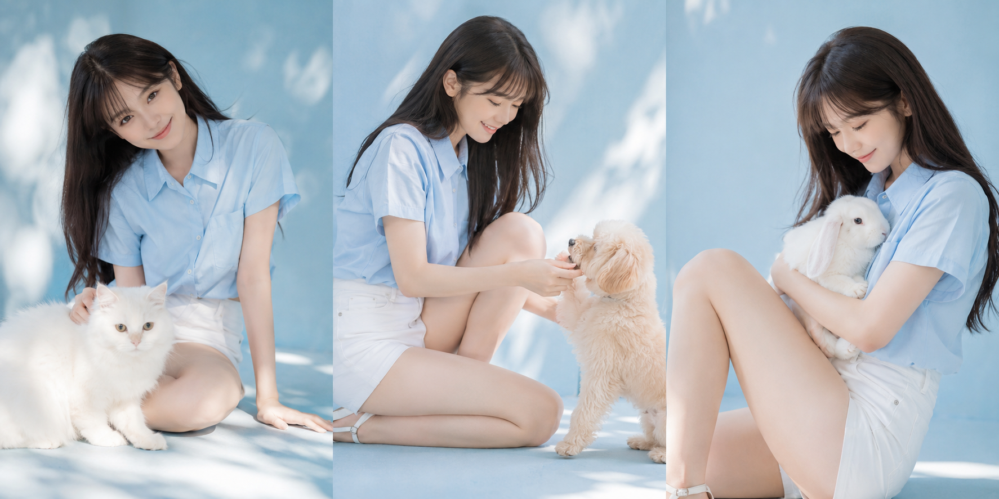
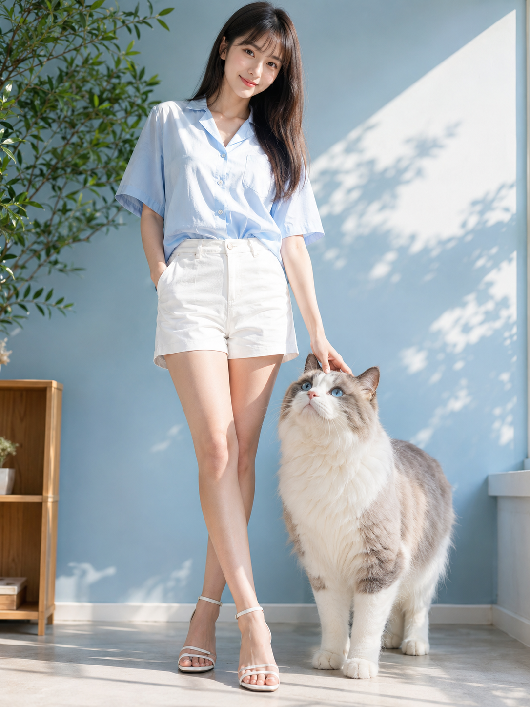
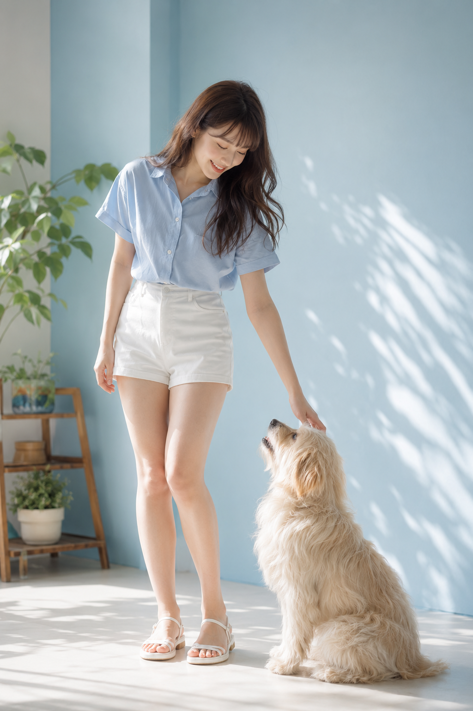
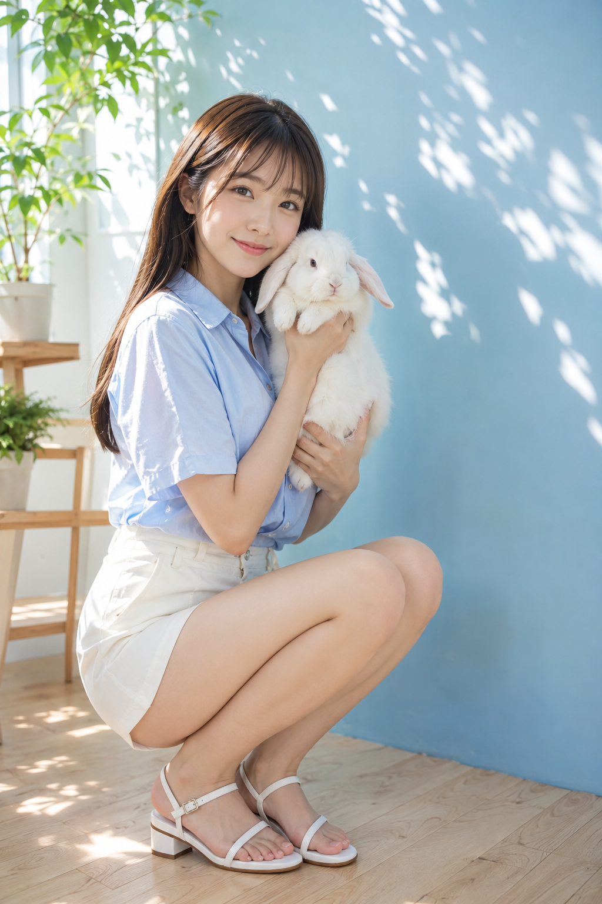
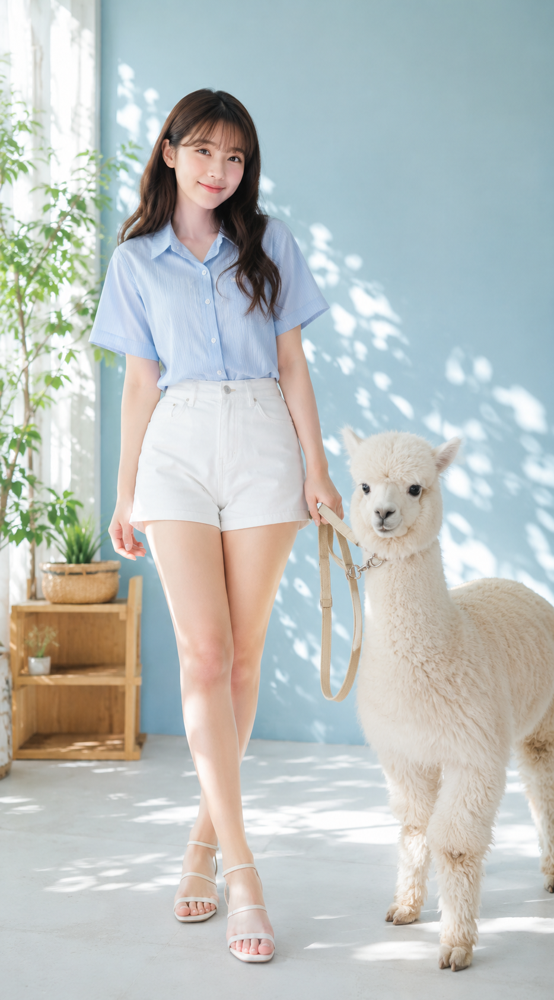

# 不用出门也能拍到这种感觉，午后和小动物同框的 AI 写真怎么做

图友们大家好，今天这一期是「午后与小动物」。

夏日午后，淡蓝色的摄影棚墙壁透着温柔的自然光，一个穿浅蓝衬衫的女生和不同的小动物同框——大白猫、奶油色小狗、垂耳兔、小羊驼，四张下来，每一张都有那种日系写真集的透亮感，安静又治愈。

这是女友感系列第 2 期。这组场景的难点在于同框的动物不能失真，所以提示词里对动物姿态和身体结构做了一些专门的约束。4 套可以直接粘贴，收藏备用。

> 💡 **用参考图效果更好**：豆包、千问都支持上传一张你自己的日常照作为人物参考，和这组提示词配合之后，生成的人物气质会更贴合你本人，比纯文字效果自然很多。

---

和猫咪同框，反而是这四组里最难生成干净的一个——猫的体型和人手的互动位置很容易出问题。这套写法把猫放在右侧前景，人手只搭头部，动作控制尽量简单，用竖构图留出足够的景深。

一位 20 多岁的女性，皮肤清透，自然妆容，深棕色长发配刘海，面带温柔微笑，自然地注视着镜头，呈现出干净的日系肖像感。她穿着浅蓝色短袖衬衫、白色高腰短裤、白色细带凉鞋。一只手插在口袋里，另一只手轻轻搭在一只大猫的头上，姿态放松，双腿微交叉站立。明亮的室内摄影棚，墙壁为淡蓝色，左侧摆放室内绿植和一个小型木质架子。午后的自然光透过窗户洒入，在墙壁和地板上投下柔和的叶影。她身旁有一只毛茸茸的白色与灰色相间的大猫，体型约到腰部，正睁着大大的蓝色眼睛好奇地向上看。竖构图，全身肖像，人物位于左侧，猫咪位于右侧前景，略微低角度，35mm 镜头，自然景深，背景柔和虚化。高清 4K，写实照片风格，日系写真集通透感，自然皮肤纹理，柔和色调，明亮清爽的夏日氛围。避免 AI 美女脸、网红感、过度精修、塑料皮肤、暗沉肤色、明显痘印、明显皱纹、斑点、面部变形、不自然的手部、多余手指、缺失手指、扭曲的猫咪身体、多余的腿、文字、Logo、水印。

---

小狗的互动感更好做——低头看、手轻抚背，这个动作 AI 出来通常比较稳定。奶油色长毛的品种选择也是有意为之，和浅蓝背景的颜色差够大，不容易糊在一起。

一位 20 多岁的女性，皮肤清透，自然妆容，深棕色长发配刘海，脸上带着柔和亲切的微笑，轻轻低头看向身旁的小狗，整体呈现清新自然的日系写真氛围。她穿着浅蓝色短袖衬衫、白色高腰短裤、白色细带凉鞋。她微微弯腰，一只手轻轻抚摸一只奶油色长毛小狗的背部，另一只手自然垂落，双腿放松站立，姿态自然。背景为明亮的室内摄影棚，淡蓝色墙壁，左侧有绿植和小型木质架子。午后自然光从窗边斜斜照入，墙面和浅色地板上有柔和的叶影。她脚边蹲着一只毛茸茸的奶油色小狗，抬头望着她，神情温顺可爱。竖构图，接近全身肖像，人物位于画面中左侧，小狗位于右下方前景，略微低角度，35mm 镜头，自然景深，背景柔和虚化。高清 4K，写实照片风格，日系写真集通透感，自然皮肤纹理，柔和明亮色调，清爽夏日室内氛围。避免 AI 美女脸、网红感、过度精修、塑料皮肤、暗沉肤色、明显痘印、明显皱纹、斑点、面部变形、不自然的手部、多余手指、缺失手指、扭曲的狗狗身体、多余的腿、文字、Logo、水印。

---

垂耳兔这张是四组里我最喜欢的一张。半蹲、双手托抱，动作细节写得越具体，AI 出来的姿态越稳定。兔子的描述里特意写了「毛发柔软蓬松、耳朵自然垂下」，让它别看起来太假。

一位 20 多岁的女性，皮肤清透，自然妆容，深棕色长发配刘海，神情温柔安静，带着浅浅微笑看向镜头，日系肖像感干净通透。她穿着浅蓝色短袖衬衫、白色高腰短裤、白色细带凉鞋。她半蹲在地上，双腿自然并拢，一只手轻轻抱起一只雪白柔软的垂耳兔，另一只手托着兔子的身体，动作轻柔自然。明亮的室内摄影棚，淡蓝色墙壁，左侧摆放绿植和一个小型木质架子，午后阳光透过窗户照进来，在墙壁与木地板上留下柔和斑驳的叶影。兔子的毛发柔软蓬松，耳朵自然垂下，安静地依偎在她怀里。竖构图，接近全身肖像，人物位于左中部，兔子位于胸前偏右位置，略微低角度，35mm 镜头，自然景深，背景柔和虚化。高清 4K，写实照片风格，日系写真集通透感，自然皮肤纹理，柔和色调，明亮清新的夏日午后氛围。避免 AI 美女脸、网红感、过度精修、塑料皮肤、暗沉肤色、明显痘印、明显皱纹、斑点、面部变形、不自然的手部、多余手指、缺失手指、扭曲的兔子身体、多余的腿、文字、Logo、水印。

---

小羊驼是这组里最有辨识度的选择，日常见得少，出图的独特感更强。用「牵着脖子布带」代替直接抚摸，互动方式更简单，AI 生成的成功率更高。

一位 20 多岁的女性，皮肤清透，自然妆容，深棕色长发配刘海，带着轻松温柔的笑意，自然地看向镜头，整体呈现干净通透的日系写真感。她穿着浅蓝色短袖衬衫、白色高腰短裤、白色细带凉鞋。她站姿轻松，一只手轻轻牵着一只小羊驼脖子上的浅色布带，另一只手自然搭在腿侧，双腿微微交叉，姿态舒展自然。背景为明亮室内摄影棚，淡蓝色墙壁，左侧有绿植和小型木质架子，午后自然光洒入，在墙面和地板上投下柔和叶影。她身旁站着一只毛茸茸的米白色小羊驼，神情温顺，微微侧头看向镜头，画面带一点可爱和治愈感。竖构图，全身肖像，人物位于画面左侧，小羊驼位于右侧，略微低角度，35mm 镜头，自然景深，背景柔和虚化。高清 4K，写实照片风格，日系写真集通透感，自然皮肤纹理，柔和明亮色调，清爽舒适的夏日室内氛围。避免 AI 美女脸、网红感、过度精修、塑料皮肤、暗沉肤色、明显痘印、明显皱纹、斑点、面部变形、不自然的手部、多余手指、缺失手指、扭曲的小羊驼身体、多余的腿、文字、Logo、水印。

---

四组提示词里「日系写真集通透感」这个词是核心，去掉之后整体质感会明显变普通。「同框动物」的部分可以直接替换成你喜欢的任何一种，结构不变，GPT Image 2 和千问同样可以用。

喜欢这组的话存一下，评论区告诉我你最想生成哪只？

---

## 往期回顾

- SELFIE-001 演出散场后的意外自拍

#GPTImage2 #千问 #生图提示词 #Prompt #女友感 #小动物写真
