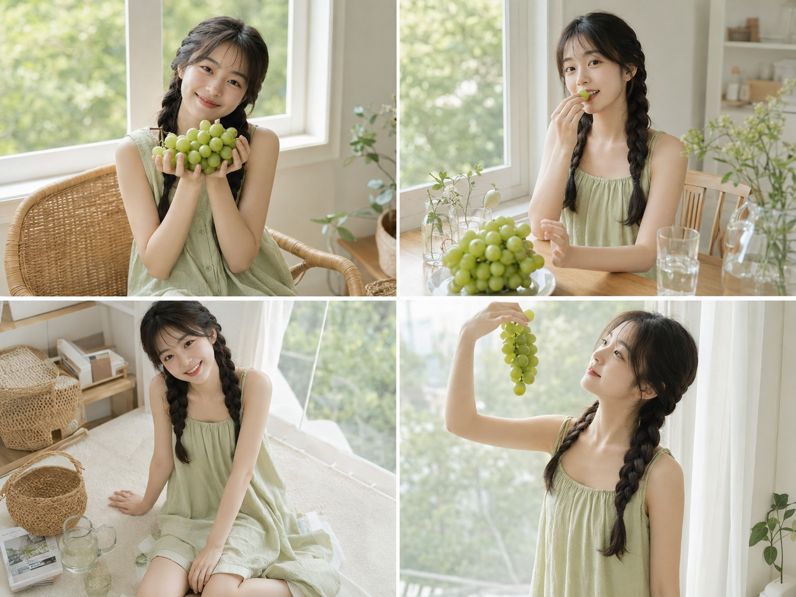
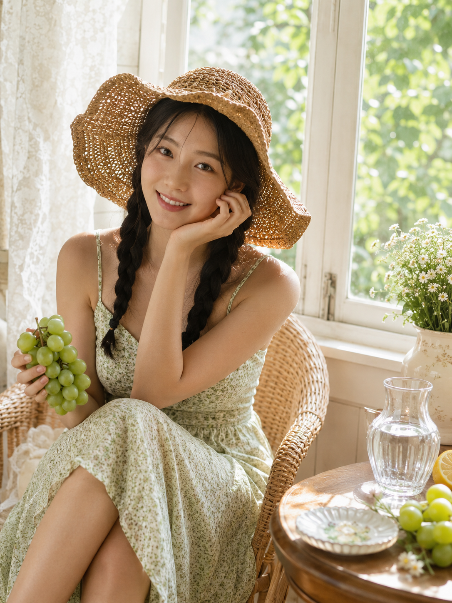
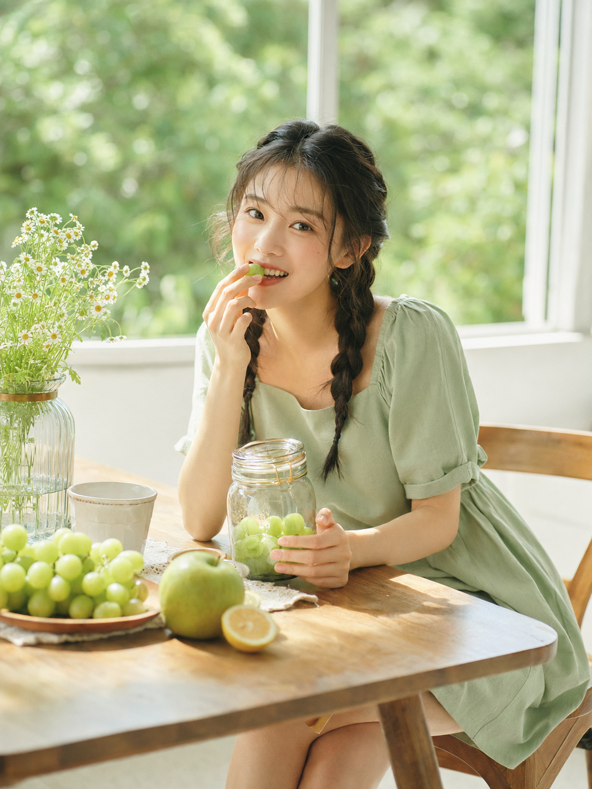
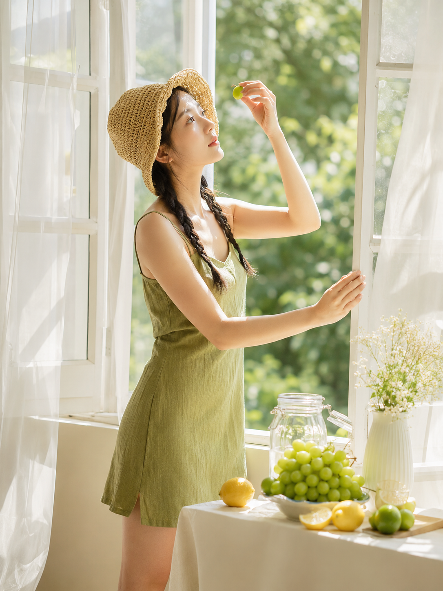
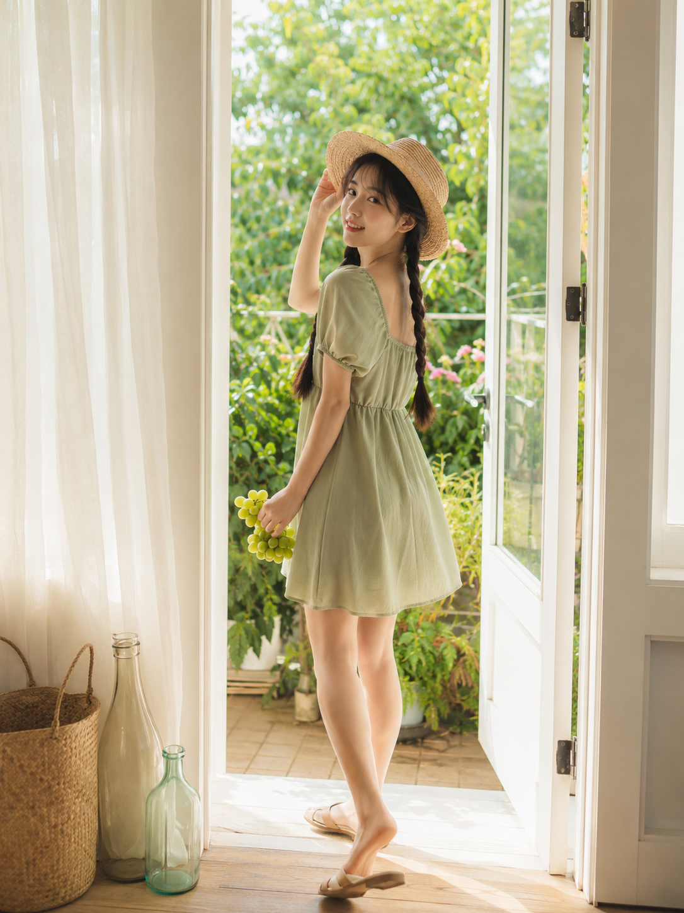
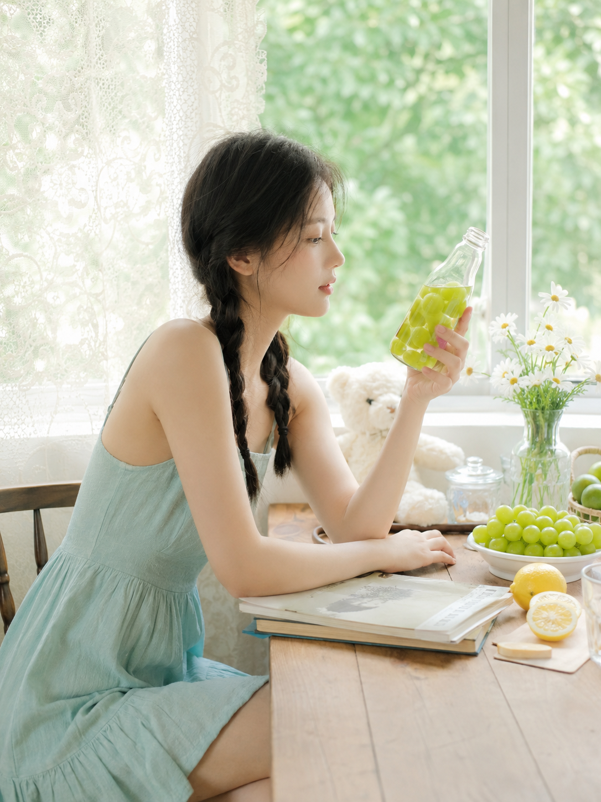

# 一串青提能拍出几种女友感？我选了八个窗边角落

夏天最好拍的道具，其实不是花，是一串带着白霜的青提。它够小、够轻，随手一拿就能带出生活感，颜色又刚好落在奶油白和木色之间，怎么搭都不会出错。这一次没有只选一个场景，而是把家里能想到的"窗边角落"过了一遍：床边、藤椅、餐桌、地毯、飘窗、沙发、阳台门、书桌，八个地方，同一套青提绿穿搭，同一个人，拍出了八种完全不同的呼吸感。

选景的第一个原则是"离窗户越近越好"。这八张图没有一张是背对窗的，因为青提本身颜色浅，只有让自然光斜着打进来，果子和皮肤才会同时透出那种糖水般的通透感。床边跪坐这张选的是侧逆光，光从纱帘外面斜切进来，刚好落在肩颈和裙摆的褶皱上，人物和背景的绿色虚化天然分层，不用额外打光。

第二个原则是"每个场景都要有一件能讲故事的道具"，而不是让人物空手站在原地。藤椅那张放了圆形木边几，上面摆着玻璃水壶和小陶瓷盘，人物只是随手提着青提歪头一笑，画面却因为几件小物有了呼吸的空间。

木质餐桌那张干脆把水果摊开——青提、柠檬、青苹果、雏菊花瓶，人咬着一颗葡萄看向镜头，生活杂志感就是这么来的：不是摆拍，是"刚好被拍到"。

布景上我特意拉开了"静"和"动"的差异。白色地毯坐姿和白色沙发边这两张走的是最松弛的居家路线，地毯上散着藤编果篮和泰迪熊，沙发扶手边一条腿垂下一条腿收起，整个人像是刚结束一个悠闲的下午；而飘窗前站姿和阳台门口回眸这两张则刻意加了动势——一个是举着青提对着光看，一个是转身回眸，逆光把发丝和帽檐的轮廓都描了一遍边，视觉上比坐姿更有张力，适合放在需要"抓眼"的位置。

书桌边这张是整组里最安静的收尾：俯身低头看玻璃瓶里的青提饮品，窗外绿影虚化成一片柔光，没有对镜头笑，反而更像被人无意间抓拍到的一瞬间，专注感很足。

八个场景看下来会发现一个规律：真正决定"女友感"强弱的，从来不是场景本身有多精致，而是光线角度和道具细节有没有落在人物触手可及的地方。青提可以换成樱桃、无花果或者一小把野花，藤椅可以换成秋千椅，书桌可以换成梳妆台——但"靠窗、有道具、光斜着来"这三条，是这组照片最值得抄的骨架。

如果你也想拍一组类似的，不用一次凑齐八个场景，从家里最亮的那扇窗开始，先拍一张就够了。

---

存下这组窗边写真的选景思路，评论区告诉我你最喜欢哪个场景，下一期我会挑读者呼声最高的角度继续拓展。

---

## 往期回顾

- SELFIE-003 窗边晨光四个瞬间
- SELFIE-002 午后与小动物
- SELFIE-001 演出散场后的意外自拍

#GPTImage2 #千问 #豆包 #生图提示词 #Prompt #女友感自拍 #青提窗边
