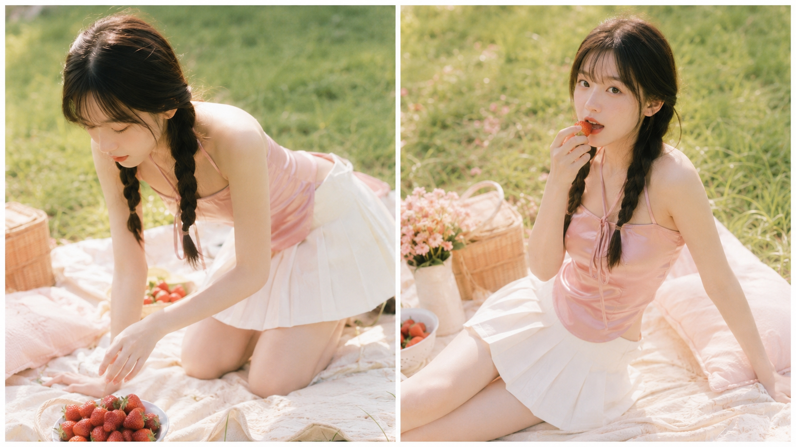
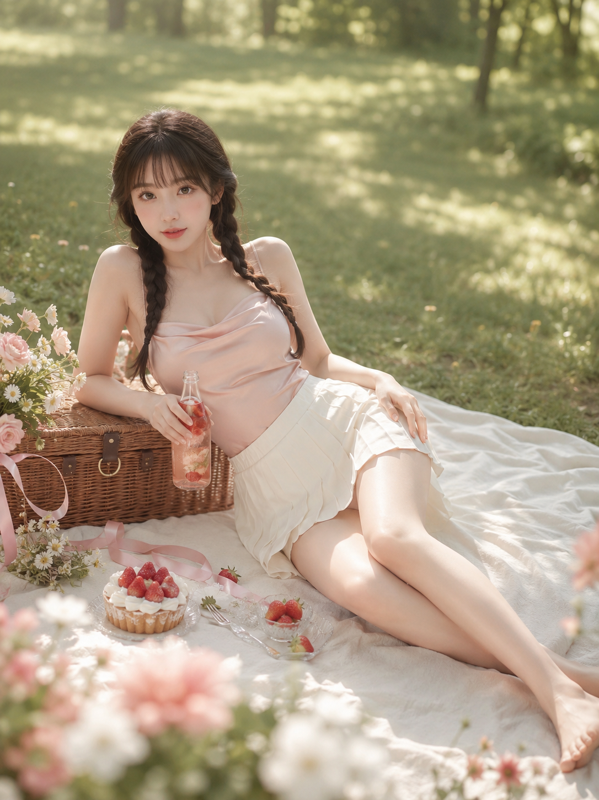
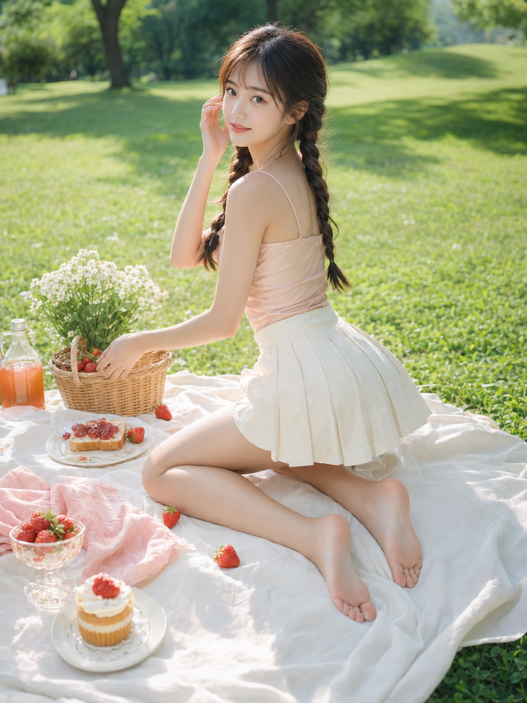
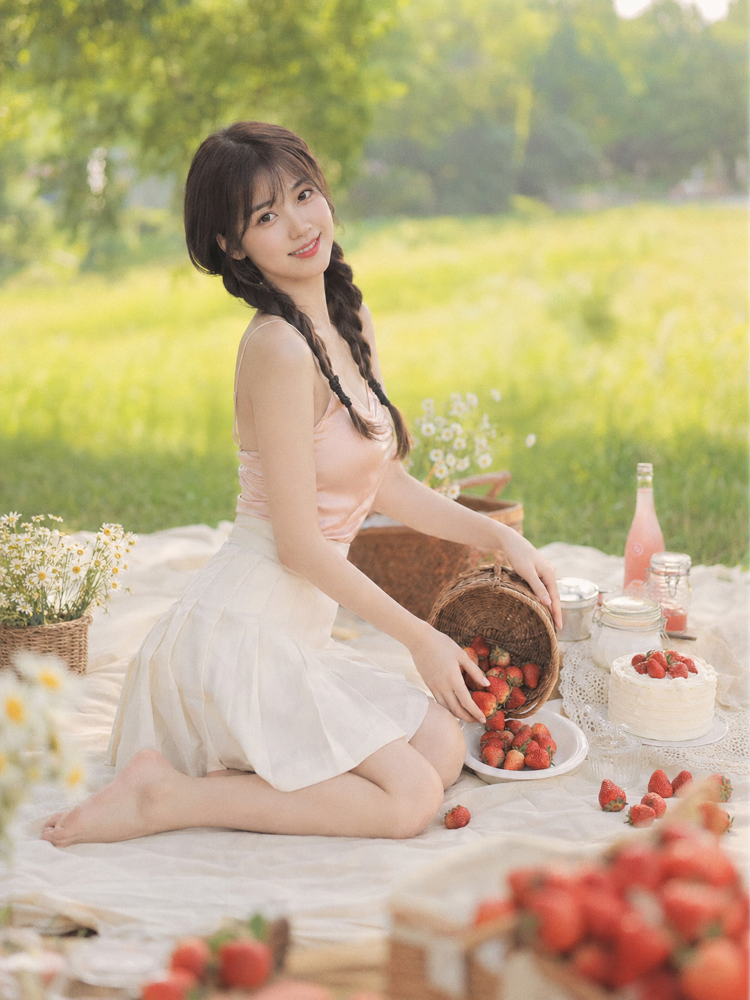

# 这组草莓野餐写法存一下，粘贴就能出图

**今天的实验：** 同一套人设、同一片草地野餐布，测试「草莓」这个道具能撑起多少种自然的女友感瞬间。

**变量说明：** 人物、服装、色调全部固定，只改动作姿态和机位视角。这样才能验证——到底是道具在起作用，还是姿态在起作用。

---

**#01 ｜ 半跪俯身摆草莓**

半跪着把草莓一颗颗摆进白瓷盘，是整组里最"生活流"的动作，不摆拍感最强。

24岁轻熟甜系亚洲女生，同一人物，同一张脸，同一身材，同一气质，黑棕色长发，双低麻花辫，空气刘海，五官自然清秀，面部干净，皮肤白皙透亮并保留自然质感，眼神明亮真实，带克制的甜欲感和柔和女性美；统一穿浅蜜桃粉缎面细肩带吊带，奶油白高腰百褶短裙，赤脚。她半跪在草地野餐布上，身体微微前倾俯身，一只手把新鲜草莓轻轻摆进白色陶瓷盘中，另一只手撑在野餐布上支撑身体，肩颈线、锁骨线、腰线和腿部线条自然舒展，抬眼看向镜头，神情甜而不腻。场景是阳光明亮的夏日草地野餐，奶油白野餐布、藤编野餐篮、散落草莓、奶油小蛋糕、玻璃汽水瓶、白色小雏菊、浅粉蕾丝餐巾、银色小叉子，远处是大片虚化绿草地与树影。整体色调为奶油白、草莓粉、浅蜜桃色、嫩绿色，日系高调柔光写真，低对比，浅景深，空气感强，轻胶片质感，画面干净高级，突出甜美与女性曲线。竖版3:4构图，中景偏全身，50mm镜头，前景草莓轻微虚化，人物为视觉中心。负面词：避免AI美女脸、避免网红感、避免未成年感、避免过度磨皮、避免塑料皮肤、避免露点、避免走光、避免低俗感、避免手指错误、避免四肢畸形、避免裙摆穿模、避免背景杂乱、避免文字、避免水印、避免logo。

> 特点：俯身角度让锁骨线和肩颈线自然拉出层次，比正面站姿更有画面呼吸感。

---

**#02 ｜ 侧坐含莓看镜头**

草莓靠近唇边这个小动作，是整组「甜而不腻」尺度感的分水岭。

24岁轻熟甜系亚洲女生，同一人物，同一张脸，同一身材，同一气质，黑棕色长发双低麻花辫，空气刘海，皮肤白皙透亮，自然裸妆，眼神柔软真实；统一穿浅蜜桃粉缎面细肩带吊带，奶油白高腰百褶短裙，赤脚。她侧坐在草地野餐布上，一条腿自然弯曲收在身前，另一条腿向侧前方舒展，身体微微后仰，一只手撑在身后，另一只手捏着一颗草莓轻轻靠近唇边，视线直视镜头，神情温柔中带一点暧昧，整体姿态舒展有女性美。场景为清新草地野餐，奶油白野餐布、藤编草莓篮、粉白色奶油蛋糕、玻璃杯中的草莓气泡水、白色野花、小盘子与散落草莓，背景是虚化树影和阳光。整体色调为奶油白、草莓红、浅粉、浅绿色，风格为高调柔光、日系甜欲写真、轻胶片感、低饱和暖色调。竖版3:4构图，中景全身，人物居中偏右，85mm镜头，浅景深，画面有呼吸感。负面词：避免AI美女脸、避免网红感、避免未成年感、避免过度磨皮、避免塑料皮肤、避免露点、避免走光、避免低俗感、避免手指错误、避免四肢畸形、避免裙摆穿模、避免背景杂乱、避免文字、避免水印、避免logo。

> 特点：85mm 长焦压缩背景，人物从环境里"浮"出来，比 50mm 更聚焦表情细节。

---

**#03 ｜ 俯卧托腮轻抬腿**

24岁轻熟甜系亚洲女生，同一人物，同一张脸，同一身材，同一气质，黑棕色长发双低麻花辫，空气刘海，皮肤白皙细腻，眼神清亮，甜美但不过分幼态；统一穿浅蜜桃粉缎面细肩带吊带，奶油白高腰百褶短裙，赤脚。她俯卧在奶油白野餐布上，手肘撑地，双手轻托下巴，小腿自然向上弯起交叠，一只脚尖轻轻翘起，身旁摆着一颗新鲜草莓和一块草莓奶油蛋糕，抬眼看向镜头，唇角带柔和笑意，整体姿态甜美中带一点撩人。场景是草地野餐，铺开的野餐布上摆有奶油蛋糕、草莓塔、玻璃奶瓶、粉色丝带、白色小雏菊、浅粉陶瓷碟，旁边有藤编篮和散落草莓，背景为高亮虚化草地和树影。整体色调奶油白、浅桃粉、草莓红、嫩绿色，光线为午后柔和自然光，画面高调通透，浅景深，轻胶片感，日系甜欲写真。竖版3:4构图，略带俯拍视角，中近景到全身，50mm镜头。负面词：避免AI美女脸、避免网红感、避免未成年感、避免过度磨皮、避免塑料皮肤、避免露点、避免走光、避免低俗感、避免手指错误、避免四肢畸形、避免裙摆穿模、避免背景杂乱、避免文字、避免水印、避免logo。

> 特点：俯拍视角 + 交叠小腿，是这组里最容易出「氛围感」的一张，姿态占了大半功劳。

---

**#04 ｜ 倚靠野餐篮半躺**

24岁轻熟甜系亚洲女生，同一人物，同一张脸，同一身材，同一气质，黑棕色长发双低麻花辫，空气刘海，五官清秀，皮肤白皙透亮，自然轻熟甜感；统一穿浅蜜桃粉缎面细肩带吊带，奶油白高腰百褶短裙，赤脚。她半躺半坐地倚靠在藤编野餐篮旁，一条腿自然伸展，一条腿轻轻弯起，身体微微侧向镜头，一只手拿着装有草莓和冰块的透明玻璃汽水瓶，另一只手轻放在大腿侧边，眼神看向镜头，神情慵懒、甜美、带克制的性感。草地野餐布上摆放草莓、奶油塔、小玻璃盘、粉色花束、白色雏菊、丝带装饰、银色甜品叉，背景是虚化草地与树影。整体色彩为奶油白、玫瑰粉、草莓红、淡绿色，风格高调柔光，带轻微胶片颗粒，低对比，突出女性身体曲线与甜欲氛围。竖版3:4构图，中景偏全身，50mm镜头，前景可带一点散景和草丛虚化。负面词：避免AI美女脸、避免网红感、避免未成年感、避免过度磨皮、避免塑料皮肤、避免露点、避免走光、避免低俗感、避免手指错误、避免四肢畸形、避免裙摆穿模、避免背景杂乱、避免文字、避免水印、避免logo。

> 特点：手持道具（汽水瓶）比空手更容易让姿态"落地"，不会显得摆得太刻意。

---

**#05 ｜ 扭身取莓回头看**

24岁轻熟甜系亚洲女生，同一人物，同一张脸，同一身材，同一气质，黑棕色长发双低麻花辫，空气刘海，面部干净，肤色白皙均匀，自然裸妆；统一穿浅蜜桃粉缎面细肩带吊带，奶油白高腰百褶短裙，赤脚。她蹲坐在草地野餐布边缘，身体微微扭转，一只手伸向藤编篮里取草莓，另一只手拨开耳边发丝，回头看向镜头，腰腹微收，腿部线条自然显露，表情清甜、眼神含一点暧昧张力。场景为阳光充足的公园草坪，奶油白野餐布、藤编篮、白色瓷盘、草莓果酱吐司、玻璃果汁瓶、白色野花、小蛋糕、散落草莓和浅粉餐巾，背景是树影与大片绿草地。整体色调为奶油白、草莓红、柔粉、浅绿色，画面清透明亮，日系甜欲写真，柔和自然光，浅景深，空气感强。竖版3:4构图，低机位3/4全身构图，35mm或50mm镜头，使人物更有修长感。负面词：避免AI美女脸、避免网红感、避免未成年感、避免过度磨皮、避免塑料皮肤、避免露点、避免走光、避免低俗感、避免手指错误、避免四肢畸形、避免裙摆穿模、避免背景杂乱、避免文字、避免水印、避免logo。

> 特点：身体扭转 + 回头视线是最容易被低估的组合词——扭转产生腰线，回头产生眼神张力，两者叠加比单独用任何一个都强。

---

**#06 ｜ 双膝跪姿分装草莓**

24岁轻熟甜系亚洲女生，同一人物，同一张脸，同一身材，同一气质，黑棕色长发双低麻花辫，空气刘海，白皙透亮肌肤，眼神真实，甜系轻熟风；统一穿浅蜜桃粉缎面细肩带吊带，奶油白高腰百褶短裙，赤脚。她双膝跪在草地野餐布上，身体微微向前俯身，把藤编篮中的草莓倒入白色浅盘中，头轻轻侧过来回看镜头，腰线和背部线条优雅，姿态既甜又有张力。布景包含奶油白野餐布、藤编篮、草莓、透明玻璃果酱罐、白色小蛋糕、白色蕾丝餐巾、雏菊和一瓶粉色汽水，背景是清透的草地和虚化树影。整体色彩为奶油白、珊瑚粉、草莓红、嫩绿，风格统一为高调柔光、轻胶片感、低对比、浅景深，画面干净，女性美突出。竖版3:4构图，中景偏全身，人物位于中间偏左，50mm镜头，前景有少量草莓虚化增强层次。负面词：避免AI美女脸、避免网红感、避免未成年感、避免过度磨皮、避免塑料皮肤、避免露点、避免走光、避免低俗感、避免手指错误、避免四肢畸形、避免裙摆穿模、避免背景杂乱、避免文字、避免水印、避免logo。

> 特点：跪姿 + 侧头回看，背部线条比正面视角更耐看，适合想突出"背影转正脸"叙事感的场景。

---

## 拆解一下：这套「草莓野餐」提示词为什么好用

六张图共用同一套人物锚点（发型、服装、肤质、负面词完全一致），只改了动作、机位、镜头三个变量，出来的六张图看起来像同一次真实野餐拍的连拍，而不是六张互不相干的 AI 图。

这是这套写法最值得抄的地方：人物锚点固定死，变量只留动作和视角，出图一致性才有保障——如果每张都重新写一遍人物描述，措辞稍有差异，AI 就容易换脸。

**可以直接替换的元素：**
- 道具：草莓 → 樱桃、蓝莓、青提，保留"手部与小颗粒水果互动"这个动作逻辑即可
- 场景：草地野餐布 → 木质野餐桌、海边沙滩布、阳台飘窗，色调随之调整
- 服装：吊带+百褶裙 → 同色系连衣裙，保持"浅色系+赤脚"的松弛感不变

**跨平台建议：** GPT Image 2 对长句中文提示词的服装与场景一致性还原度最稳；千问、豆包出图速度快，适合先跑小样确认构图再上正式提示词。

---

存下这套写法，下次不用现想怎么摆草莓了。有其他想测试的道具或场景，评论区告诉我，下一期安排上。

---

## 往期回顾

- SELFIE-002 午后与小动物
- SELFIE-003 窗边晨光四个瞬间
- SELFIE-004 青提窗边写真

#GPTImage2 #千问 #豆包 #生图提示词 #Prompt #女友感自拍 #草莓野餐
