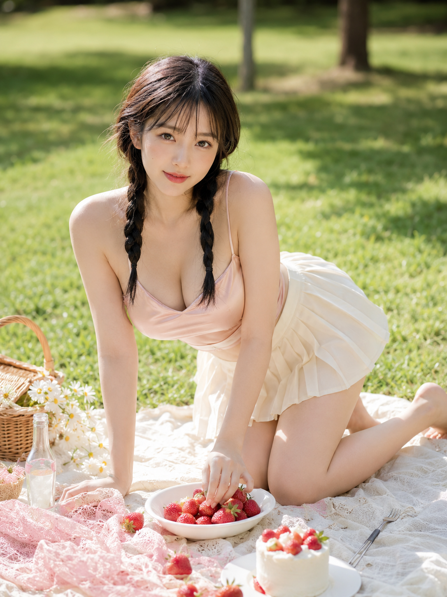
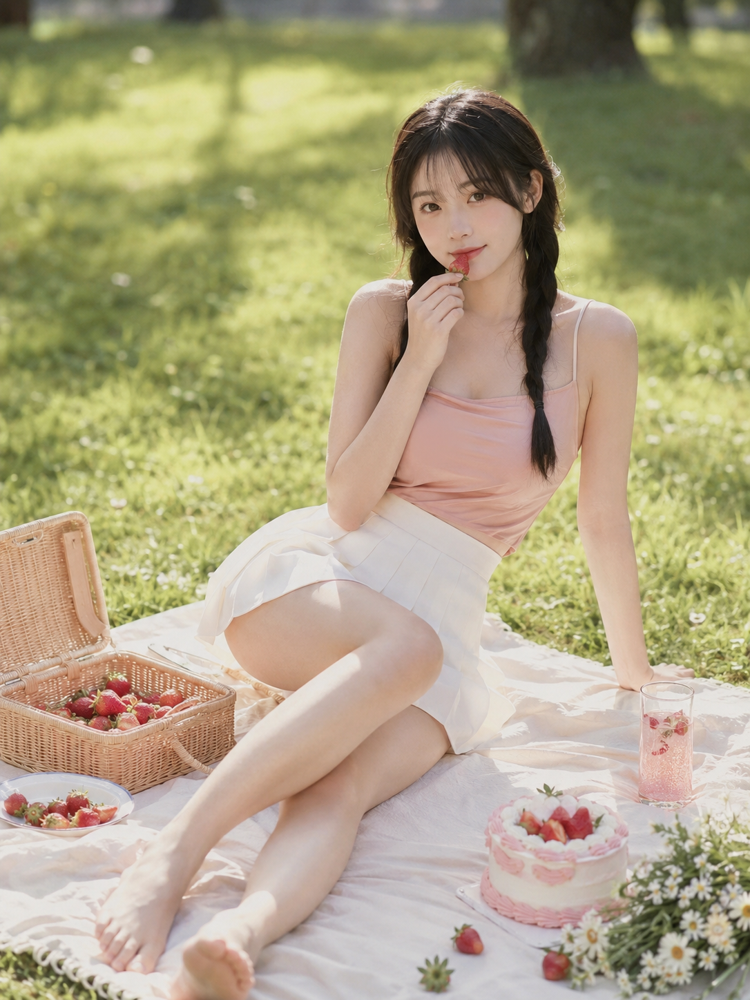
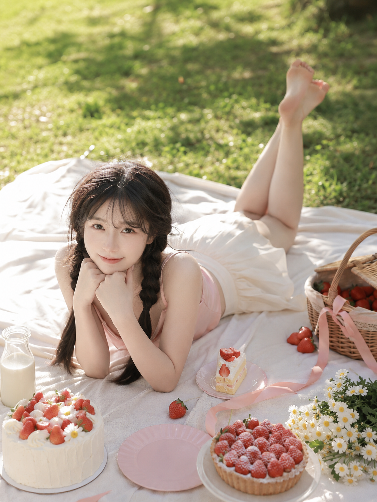

很多人问过同一个问题：同一个人物设定，怎么才能拍出一组像真实连拍、而不是互不相干的 AI 生图？这期用「草莓野餐」这个场景做了一次完整测试，人物、服装、色调全部锁死，只改动作姿态和机位视角。

**为什么这个场景容易出图**

草地野餐布光线均匀柔和，不容易出现脸部阴影；草莓这类小颗粒道具天然适合手部互动，让姿态不显得刻意摆拍；奶油白、草莓粉、嫩绿色这套配色对比温和，怎么打光都不容易翻车。

**半跪俯身摆草莓**

整组里最"生活流"的一张，半跪着把草莓一颗颗摆进白瓷盘，不摆拍感最强。

提示词：
24岁轻熟甜系亚洲女生，同一人物，同一张脸，同一身材，同一气质，黑棕色长发，双低麻花辫，空气刘海，五官自然清秀，面部干净，皮肤白皙透亮并保留自然质感，眼神明亮真实，带克制的甜欲感和柔和女性美；统一穿浅蜜桃粉缎面细肩带吊带，奶油白高腰百褶短裙，赤脚。她半跪在草地野餐布上，身体微微前倾俯身，一只手把新鲜草莓轻轻摆进白色陶瓷盘中，另一只手撑在野餐布上支撑身体，抬眼看向镜头，神情甜而不腻。场景是阳光明亮的夏日草地野餐，奶油白野餐布、藤编野餐篮、散落草莓、奶油小蛋糕、玻璃汽水瓶、白色小雏菊，远处是大片虚化绿草地与树影。整体色调为奶油白、草莓粉、浅蜜桃色、嫩绿色，日系高调柔光写真，低对比，浅景深，轻胶片质感。竖版3:4构图，中景偏全身，50mm镜头。负面词：避免AI美女脸、避免网红感、避免过度磨皮、避免塑料皮肤、避免手指错误、避免四肢畸形、避免文字、避免水印。

**侧坐含莓看镜头**

草莓靠近唇边这个小动作，是整组「甜而不腻」尺度感的分水岭。

提示词：
24岁轻熟甜系亚洲女生，同一人物，同一张脸，同一身材，同一气质，黑棕色长发双低麻花辫，空气刘海，皮肤白皙透亮，自然裸妆，眼神柔软真实；统一穿浅蜜桃粉缎面细肩带吊带，奶油白高腰百褶短裙，赤脚。她侧坐在草地野餐布上，一条腿自然弯曲收在身前，另一条腿向侧前方舒展，一只手撑在身后，另一只手捏着一颗草莓轻轻靠近唇边，视线直视镜头，神情温柔中带一点暧昧。场景为清新草地野餐，奶油白野餐布、藤编草莓篮、粉白色奶油蛋糕、玻璃杯中的草莓气泡水、白色野花，背景是虚化树影和阳光。整体色调为奶油白、草莓红、浅粉、浅绿色，高调柔光、日系甜欲写真、轻胶片感。竖版3:4构图，中景全身，85mm镜头，浅景深。负面词：避免AI美女脸、避免网红感、避免过度磨皮、避免塑料皮肤、避免手指错误、避免四肢畸形、避免文字、避免水印。

**俯卧托腮轻抬腿**

整组里最容易出「氛围感」的一张，姿态占了大半功劳。

提示词：
24岁轻熟甜系亚洲女生，同一人物，同一张脸，同一身材，同一气质，黑棕色长发双低麻花辫，空气刘海，皮肤白皙细腻，眼神清亮，甜美但不过分幼态；统一穿浅蜜桃粉缎面细肩带吊带，奶油白高腰百褶短裙，赤脚。她俯卧在奶油白野餐布上，手肘撑地，双手轻托下巴，小腿自然向上弯起交叠，一只脚尖轻轻翘起，身旁摆着一颗新鲜草莓和一块草莓奶油蛋糕，抬眼看向镜头，唇角带柔和笑意。场景是草地野餐，铺开的野餐布上摆有奶油蛋糕、草莓塔、玻璃奶瓶、白色小雏菊，背景为高亮虚化草地和树影。整体色调奶油白、浅桃粉、草莓红、嫩绿色，午后柔和自然光，高调通透，浅景深，轻胶片感。竖版3:4构图，略带俯拍视角，50mm镜头。负面词：避免AI美女脸、避免网红感、避免过度磨皮、避免塑料皮肤、避免手指错误、避免四肢畸形、避免文字、避免水印。

**关键参数说明**

- 人物锚点（发型、服装、肤质、负面词）三张图完全一致，只改动作姿态、机位角度、镜头焦段，这是保证六张图看起来像同一次连拍而不是互不相干的关键。
- 50mm 是标准中景全身镜头，85mm 长焦压缩背景让人物从环境里"浮"出来，两者搭配能拉出画面层次差异。
- 正向描述放在提示词中段主导效果，负面词只是兜底，不要指望只靠负面词控制出图质量。

**可替换的元素**

- 道具：草莓可换成樱桃、蓝莓、青提，保留"手部与小颗粒水果互动"这个动作逻辑
- 场景：草地野餐布可换成木质野餐桌、海边沙滩布、阳台飘窗，色调随场景调整
- 服装：吊带+百褶裙可换同色系连衣裙，保持"浅色系+赤脚"的松弛感

#生图提示词 #GPTImage2 #千问 #豆包 #女友感自拍 #草莓野餐
