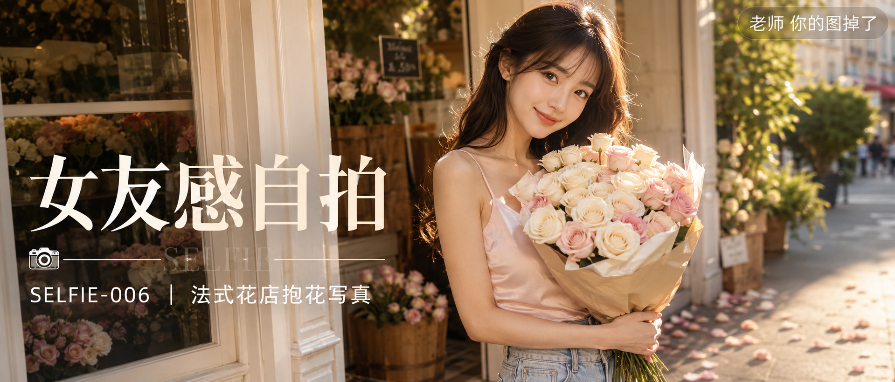
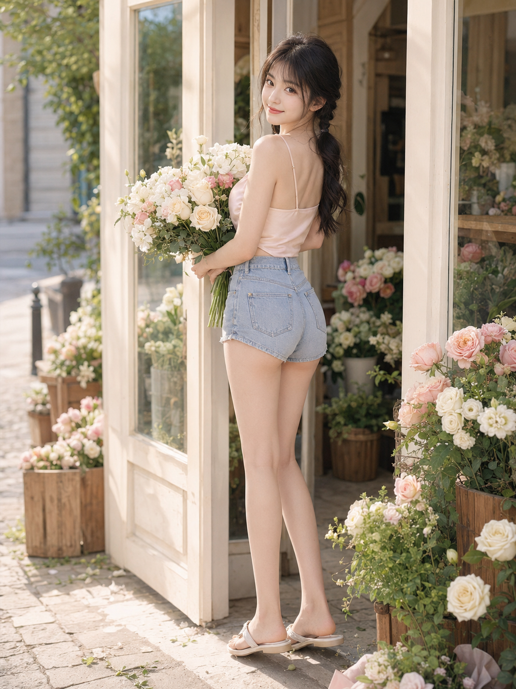
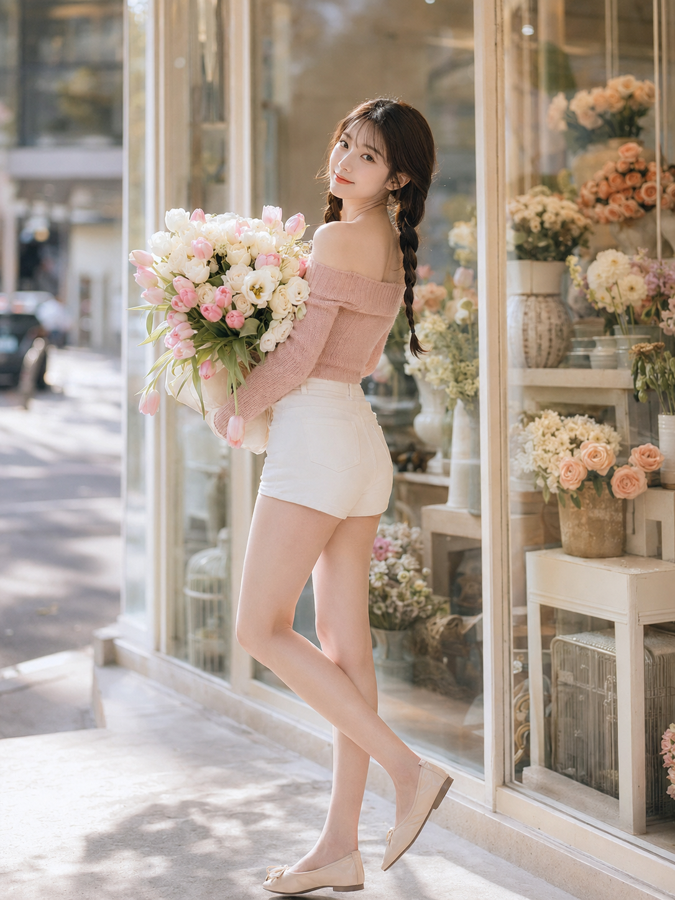
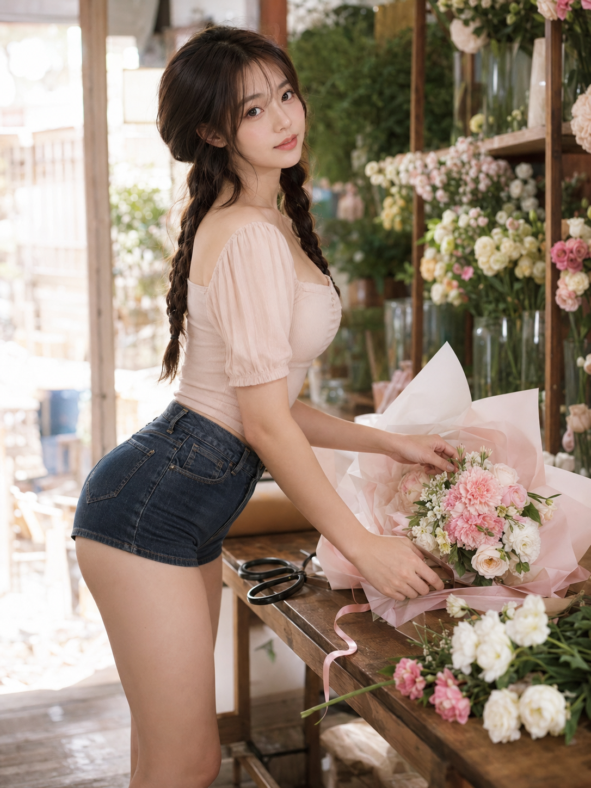
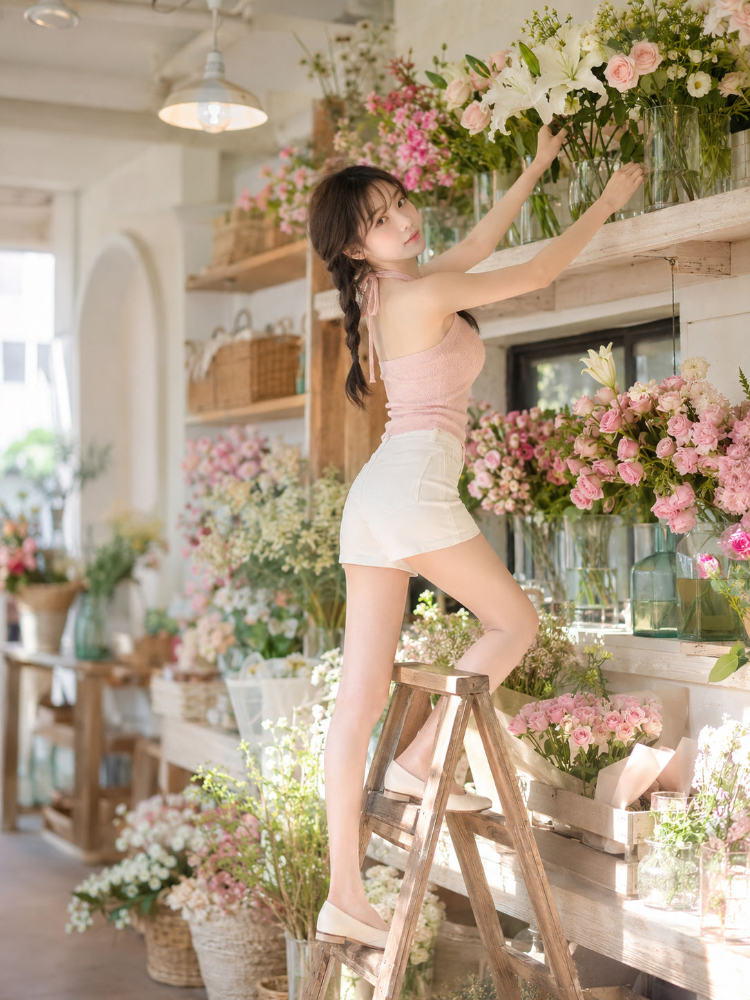
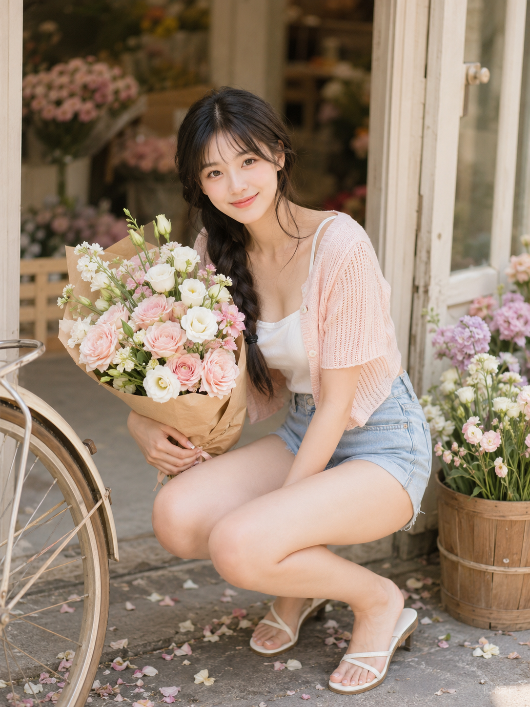
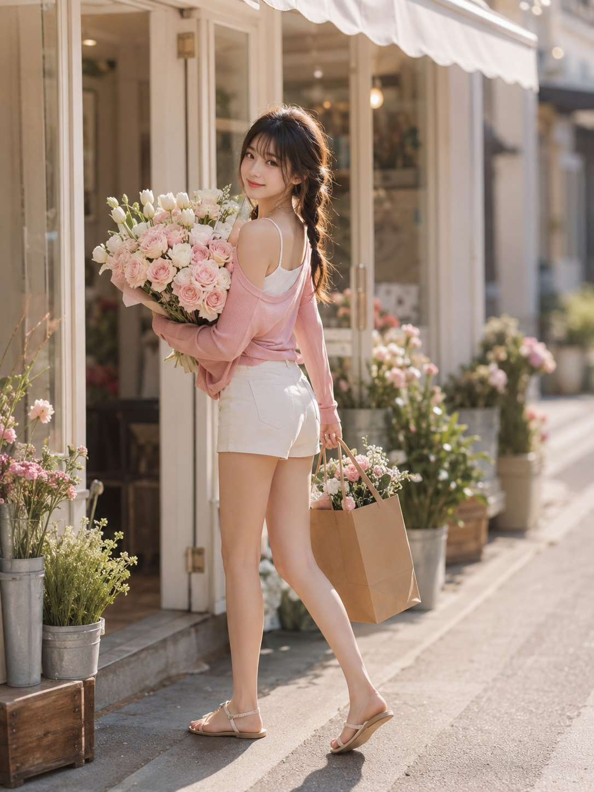

# 朋友圈都以为她去了趟巴黎，其实只是蹲在花店门口

选题的起点很简单：一家法式花店，一个女生，一束花，能拍出多少种不一样的"心动瞬间"？

答案是至少八种。同一张脸、同一身材、同一套花店场景，只换了姿态、机位和光线角度，出来的画面却各有各的情绪——有回眸的暧昧，有俯身的松弛，有蹲坐的俏皮，也有长椅上的慵懒。这也是这次设计提示词的核心思路：把"人物锚点"锁死，把"动作变量"打开，AI 才不会每张都画成不同的人。

先看门口回眸这一张——这是整组里最典型的一版写法，也是唯一放出完整提示词的一条，直接照抄就能用：

24岁亚洲女生，同一人物，同一张脸，同一身材，同一气质，黑棕色长发，微卷，低双马尾或松散双辫，空气刘海，五官自然清秀，面部干净，皮肤白皙细腻但保留自然纹理，眼神明亮带一点克制暧昧感，笑容甜而不腻。她站在法式花店门口，怀里抱着一大束奶油白玫瑰、浅粉玫瑰和白色洋桔梗，身体已经向前迈出半步，却突然回头看向镜头，肩膀轻轻后转，腰部形成自然扭转线条，微微露出锁骨和肩颈线，姿态甜美又带轻微性张力。上身穿浅奶油粉色细肩带缎面吊带小上衣，轻微贴身，面料柔软有光泽，下身穿高腰浅蓝色牛仔热裤，裤腿略短但不过分暴露，突出修长双腿和腰臀比例。场景为法式街角花店，奶油白门框，玻璃橱窗，木质花桶，散落花瓣，门边摆满浅粉和白色鲜花，背景有柔和虚化的街景和绿植。整体色调为奶油白、浅粉、蜜桃色、柔和绿色，光线为清晨或傍晚柔和自然光，甜系写真风格，高调柔光，低对比，浅景深，50mm镜头，竖版3:4，全身环境人像，画面干净高级，甜美、轻熟、充满女性美，无文字、无水印、无logo。负面词：避免AI美女脸、避免网红感、避免过度磨皮、避免塑料皮肤、避免低俗感、避免手指错误、避免腿部变形、避免背景杂乱、避免文字、避免水印、避免logo。

"身体已经迈出半步却突然回头"这句是整条提示词里最关键的动作设计——它让画面有了"被抓拍"的叙事感，而不是站定摆好姿势拍出来的呆照。这个技巧在其余七张里被反复复用，只是每次换了不同的支点动作。

---

橱窗边这张换了个思路：不追求"迈步回头"的动态感，而是靠侧身站姿把锁骨、腰线、腿部线条一次性带出来，85mm 镜头的浅景深让人物从环境里"浮"出来。

工作台前俯身整理花枝这张，是整组里性张力最克制的一张，靠俯身弧度和侧脸回眸传递情绪，而不是靠姿态本身，反而显得更高级、更耐看。

高脚梯取花这张加入了纵深感——一只脚踩高、一只脚后撤，身体自然向上延展，35mm 镜头把花店的层次全部收进画面，比平视构图多了一层"故事发生地"的空间感。

蹲姿抱花这张是整组"甜辣感"最强的一版，抬头看镜头的角度配合俏皮又克制的眼神，是最容易出片但也最容易失手的一张——蹲姿稍有不慎就会显得不自然，提示词里特意用"身体略向前压、抬头"锁定了一个安全又好看的角度。

长椅坐姿这张收尾，傍晚柔光配上松弛的坐姿，腿部线条和回眸微笑同时出现，杂志封面感最强的一张放在最后，作为整组"从街头到休憩"的情绪落点。

---

## 这套写法的设计思想

八条提示词看似各写各的，但拆开看会发现三层不变的骨架：

1. **人物锚点完全一致**——发型、五官描述、肤质、负面词几乎逐字复用，AI 才不会在八张图里画出八张不同的脸。
2. **场景锚点统一但机位不同**——同一家法式花店，但门口、橱窗、工作台、高脚梯、长椅是不同的子场景，画面不会重复，却仍然像"同一次拍摄"。
3. **每条只集中改 2-3 个变量**——动作、机位角度、镜头焦段，这三者里通常只动其中两三个，避免变量太多导致 AI 顾此失彼、人物走形。

跟 AI 对话时，与其一次性堆砌所有细节，不如先固定"不变的骨架"，再逐条替换"要变的动作"——这是这次拆解下来最值得记住的一条经验。

## 还能怎么改

- 花材：玫瑰、洋桔梗 → 换成绣球、芍药、干花，色调随之从粉调转向更深的秋冬色系
- 场景：法式花店 → 咖啡店吧台、书店角落、复古杂货铺，保留"手持道具+回眸"的动作逻辑即可
- 镜头：50mm 换成 35mm 会带出更多环境信息，换成 85mm 则更聚焦表情和肌理

这组写法你更想先试哪一张？评论区告诉我，下一期就按你们的票数来安排。

---

## 往期回顾

- SELFIE-003 窗边晨光四个瞬间
- SELFIE-004 青提窗边写真
- SELFIE-005 草莓野餐甜系写真

#GPTImage2 #千问 #豆包 #生图提示词 #Prompt #女友感自拍 #法式花店写真
