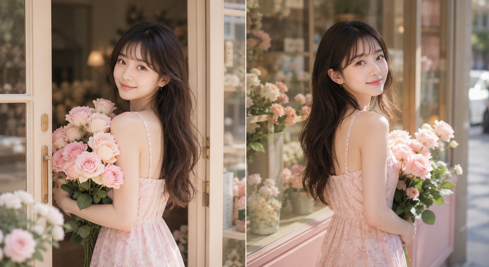

同一家法式花店，同一个人，八个不同的抱花瞬间——门口回眸、橱窗侧身、工作台俯身、高脚梯取花、蹲姿、纸袋并抱、冷藏柜前、长椅坐姿，锁死人物锚点，只换动作和机位。

提示词：
24岁亚洲女生，同一人物，同一张脸，同一身材，同一气质，黑棕色长发，微卷，低双马尾或松散双辫，空气刘海，五官自然清秀，面部干净，皮肤白皙细腻但保留自然纹理，眼神明亮带一点克制暧昧感，笑容甜而不腻。她站在法式花店门口，怀里抱着一大束奶油白玫瑰、浅粉玫瑰和白色洋桔梗，身体已经向前迈出半步，却突然回头看向镜头，肩膀轻轻后转，腰部形成自然扭转线条，微微露出锁骨和肩颈线，姿态甜美又带轻微性张力。上身穿浅奶油粉色细肩带缎面吊带小上衣，下身穿高腰浅蓝色牛仔热裤，突出修长双腿和腰臀比例。场景为法式街角花店，奶油白门框，玻璃橱窗，木质花桶，散落花瓣。整体色调为奶油白、浅粉、蜜桃色、柔和绿色，光线为清晨或傍晚柔和自然光，甜系写真风格，高调柔光，低对比，浅景深，50mm镜头，竖版3:4，无文字、无水印、无logo。负面词：避免AI美女脸、避免网红感、避免过度磨皮、避免塑料皮肤、避免低俗感、避免手指错误、避免腿部变形、避免背景杂乱、避免文字、避免水印、避免logo。

#GPTImage2 #千问 #生图提示词 #Prompt #女友感自拍 #法式花店写真

