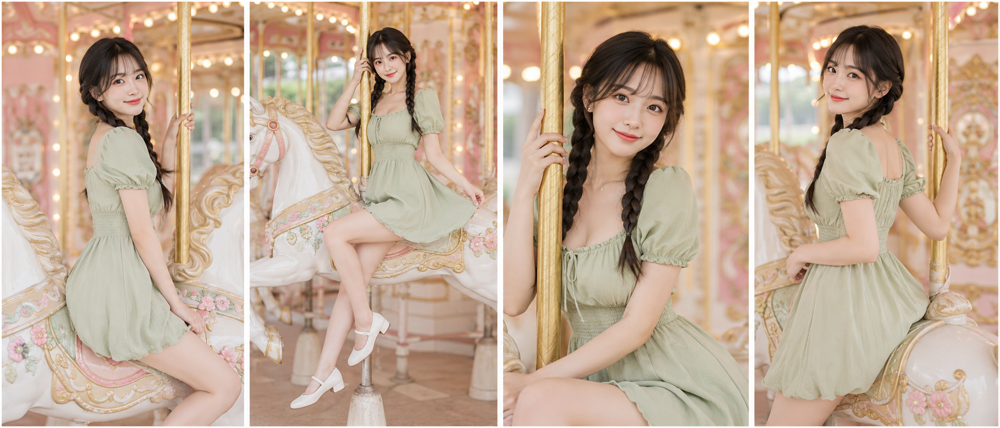
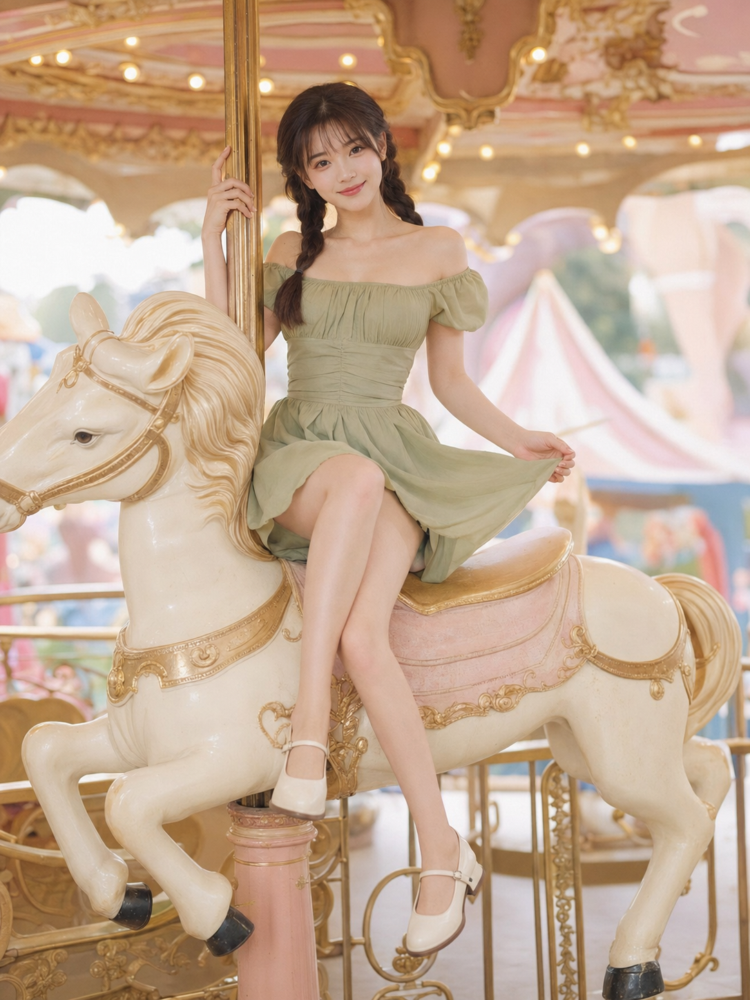
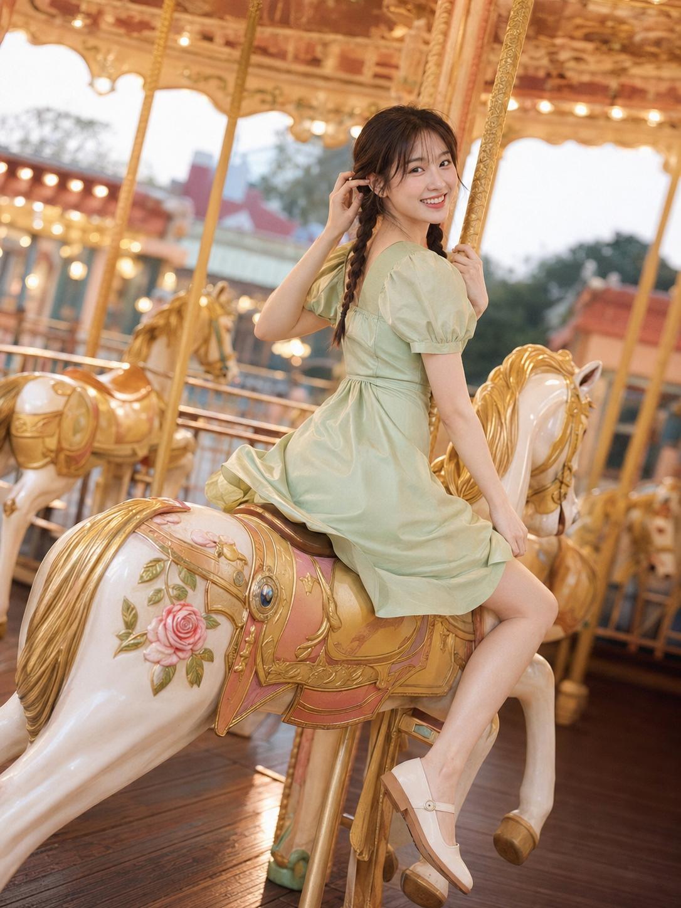
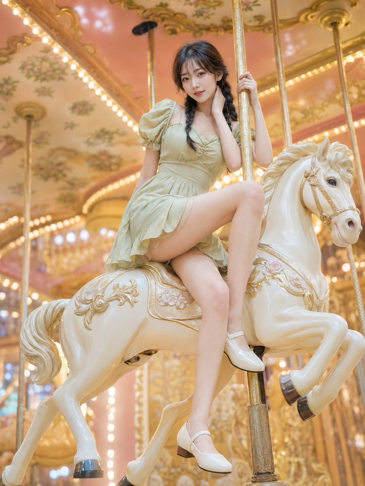
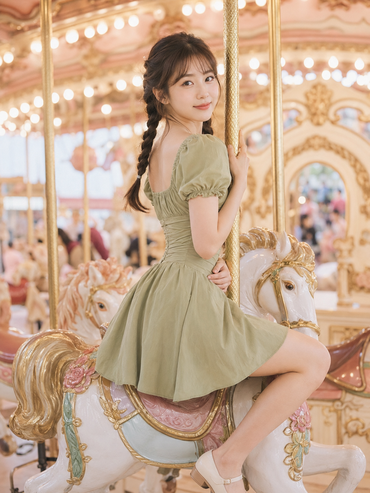
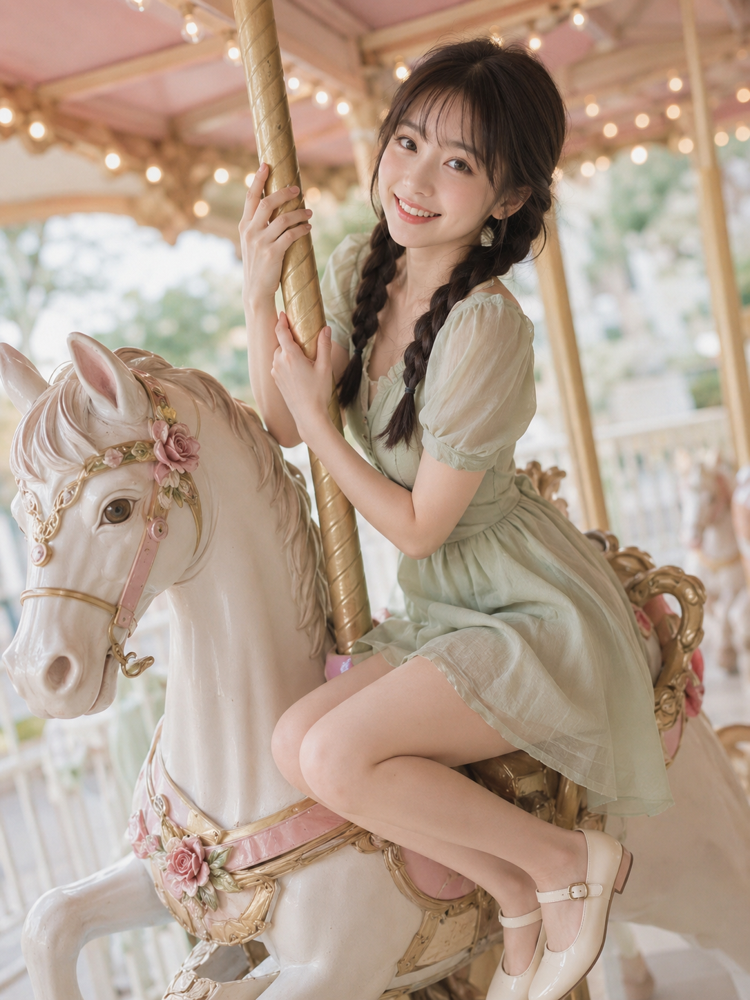
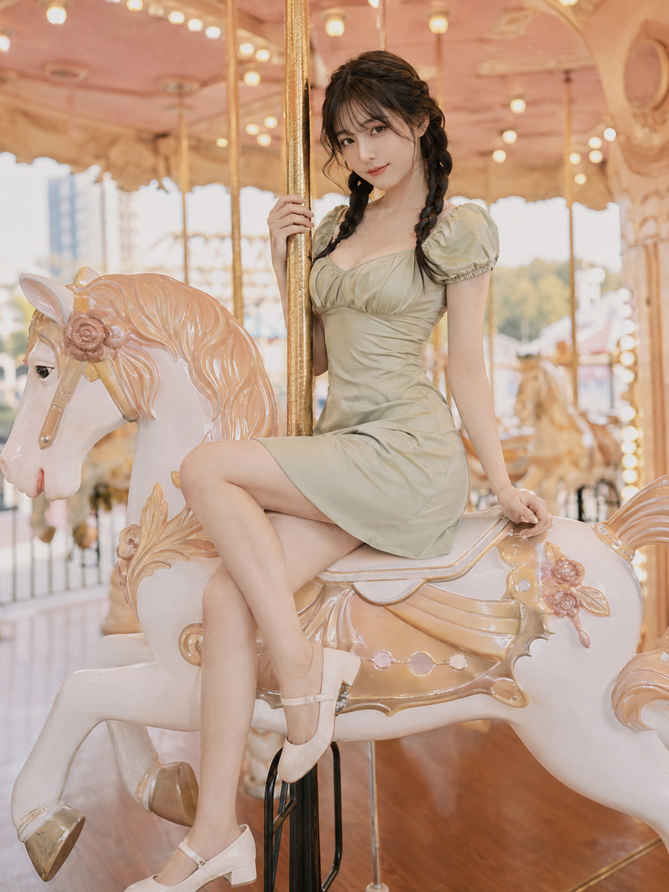

同一台旋转木马，同一个人，八个不同的坐姿和机位——侧坐回眸、抬腿轻扶裙摆、近景扶杆含笑、启动瞬间抓拍、低机位仰拍、半侧身回望、微俯拍甜笑、扶杆低头浅笑，只靠动作和角度拉开差异。

提示词：
24岁亚洲女生，同一人物，同一张脸，同一身材，同一气质，黑棕色长发双低麻花辫，空气刘海，五官自然清秀，面部干净，皮肤白皙透亮并保留自然质感，眼神明亮真实，甜系轻熟气质。穿一条浅鼠尾草绿色缎面方领泡泡袖收腰连衣短裙，裙摆长度到大腿中上部，突出腰线与腿部比例，搭配奶油白玛丽珍鞋。她侧坐在奶油白旋转木马上，双腿自然并拢斜垂，脚尖轻轻下压，一只手轻扶金色立杆，另一只手轻压被风微微带起的裙摆，身体微微前倾后再回头看向镜头，嘴角带甜而不腻的微笑，肩颈、锁骨、手臂和腿部线条自然舒展。场景为梦幻游乐园旋转木马区域，奶油白木马、浅金色雕花、浅粉顶棚、暖黄色小灯泡、模糊彩旗和柔和背景游乐设施。整体色调为奶油白、鼠尾草绿、浅金色、柔粉色，甜系高调柔光写真，日系轻胶片感，低对比，浅景深，空气感强。竖版3:4，全身环境人像，50mm镜头，无文字、无水印、无logo。负面词：避免AI美女脸、网红感、过度磨皮、塑料皮肤、五官变形、手部错误、肢体畸形。

#GPTImage2 #千问 #生图提示词 #Prompt #女友感自拍 #旋转木马写真

