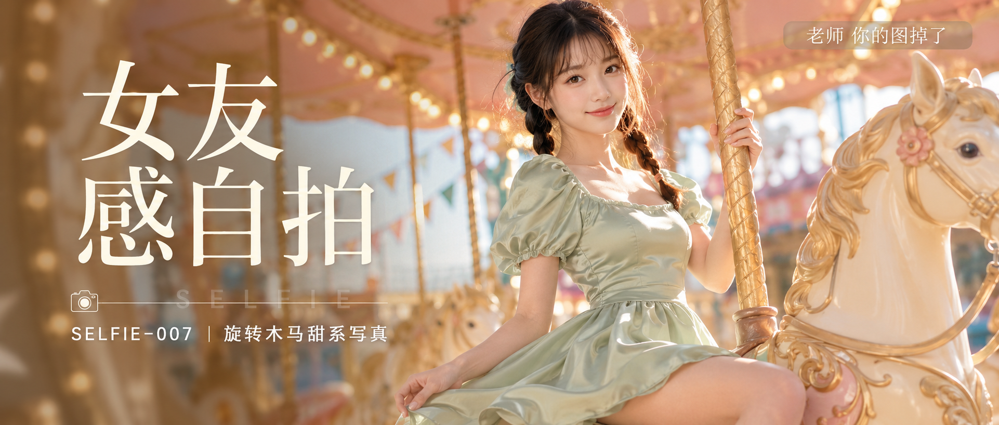

# SELFIE-007-旋转木马甜系写真 封面

## 封面提示词

24岁亚洲女生，同一人物设定，黑棕色双低麻花辫，空气刘海，五官精致自然，面部立体清晰，皮肤光泽细腻，眼神有神灵动，妆感干净清透，轮廓清晰上镜，侧坐在奶油白旋转木马上，正对镜头3/4侧脸，下巴微收，嘴角带甜而不腻的笑容，一只手轻扶金色立杆，另一只手轻压被风带起的裙摆，面部占画面三分之一以上，构图清晰聚焦人物。穿浅鼠尾草绿色缎面方领泡泡袖收腰连衣短裙，露出锁骨与肩颈线条，身材比例优越，姿态自然松弛。背景为梦幻游乐园旋转木马，奶油白木马、浅金色雕花、浅粉顶棚、暖黄色小灯泡与虚化彩旗，侧逆光打亮颧骨和发丝边缘，黄金时段暖光照脸，色彩层次丰富，电影感光影，色调统一为奶油白、鼠尾草绿、浅金色、柔粉色，构图黄金比例，前景虚化背景，画面有张力，视觉冲击力强，高清锐利，2.35:1电影横构图。【文字排版-必须完整保留，不得省略或简化任何一项】画面左侧垂直居中偏下叠加文字排版：超大号衬线字体米白色主文案「女友感自拍」，主文案正下方一条细横线左端带📷图标横线中央有透明英文水印 SELFIE，横线下方等宽白色字体副文案「SELFIE-007 ｜ 旋转木马甜系写真」；右上角浅色半透明圆角底衬配小号文字「老师 你的图掉了」（署名文字，必须出现，不可省略）；无整体蒙层，文字直接压图。【文字排版结束】避免AI美女脸、网红感、过度精修、塑料皮肤、暗沉肤色、明显痘印、明显皱纹、斑点、面部变形、避免侧脸比例过大、避免眼睛半闭、避免嘴巴微张、避免背景杂乱、避免手指错误、避免文字错位、避免水印错误。

## 封面图片

