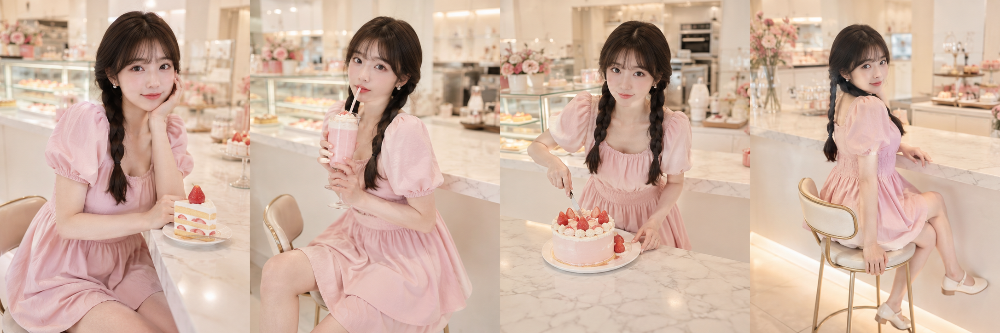
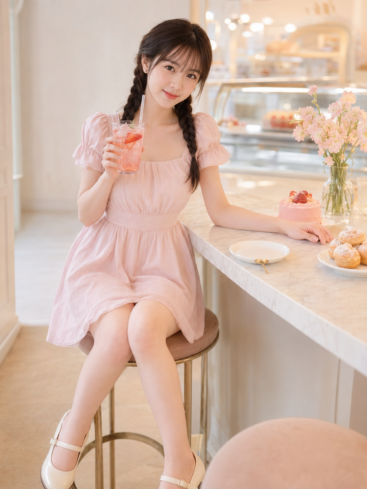
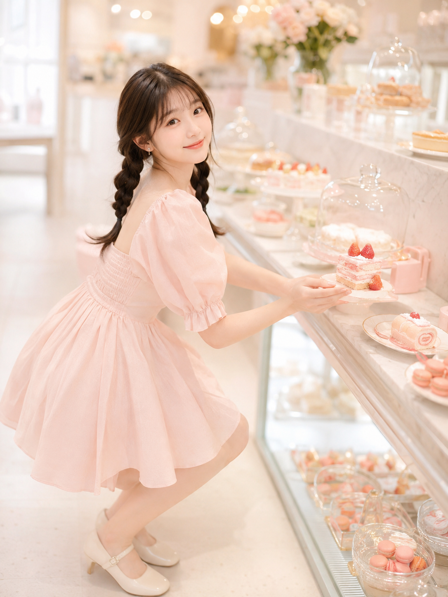

同一间奶油风甜品店吧台，同一套人设服装，十个自然瞬间——托腮、抿奶昔、切蛋糕、回眸、举樱桃、撩发、托杯、取蛋糕、咬草莓、撑脸含笑。

提示词：
24岁亚洲女生，黑棕色双低麻花辫，空气刘海，五官自然清秀，面部干净，皮肤白皙透亮，眼神明亮，妆容清透，穿浅草莓奶油粉色方领泡泡袖收腰连衣短裙，坐在奶油风甜品店高脚椅上，身体微微前倾靠近吧台，一只手自然托腮，另一只手拿银色小甜品叉停在草莓奶油蛋糕旁，眼神直视镜头，笑意很浅，甜美中带一点轻熟女人味。场景为精致奶油风甜品店吧台，白色大理石台面，草莓奶油蛋糕、马卡龙、粉色奶昔，暖白墙面与浅金色吊灯。奶油白、草莓粉、浅蜜桃色，高调柔光，浅景深，轻胶片感，竖版3:4，50mm镜头。

#GPTImage2 #千问 #生图提示词 #Prompt #女友感自拍 #甜品店写真

