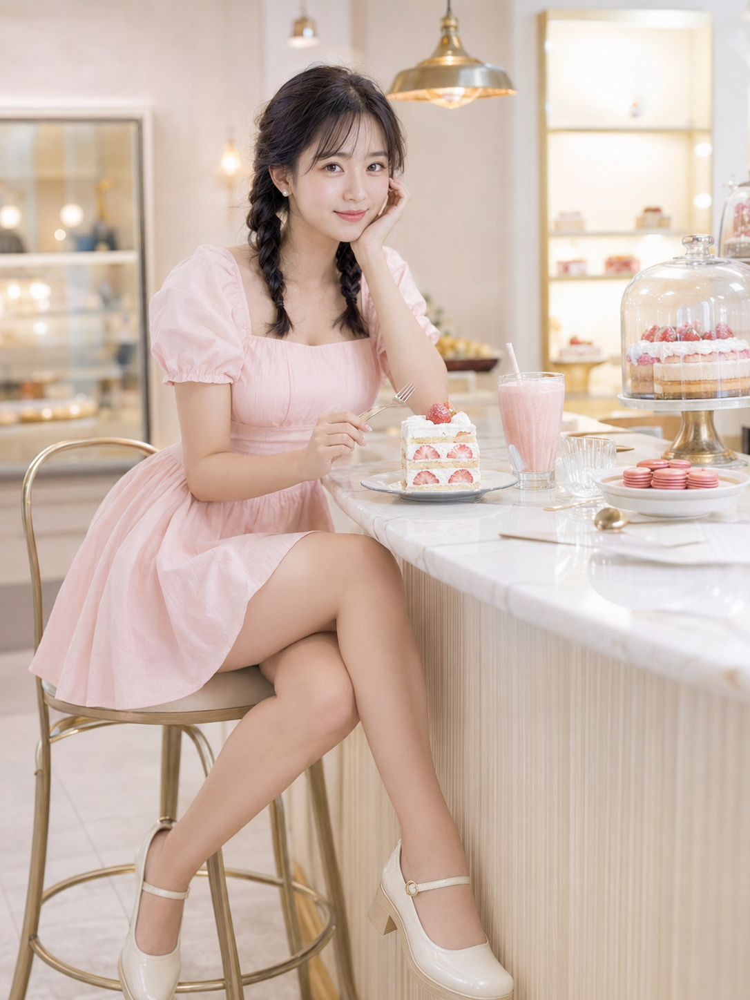
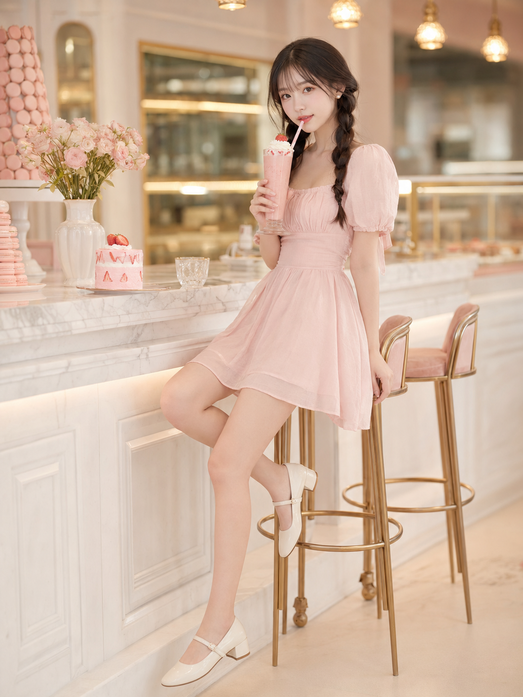
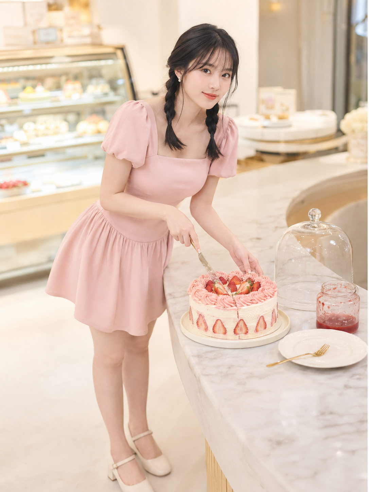

很多人问过：为什么有的室内自拍场景怎么拍都好看，有的怎么改都显得刻意？这期用「甜品店吧台」做了一次完整测试，同一套人设写了10个场景，只改动作和机位，成品放在一起像同一天拍的连拍。

**为什么这个场景容易出图**

奶油色系天然自带柔光滤镜，不容易出现脸部阴影；吧台高度刚好能让人做出托腮、侧坐、俯身这些自然动作，不需要刻意摆拍；草莓蛋糕、马卡龙这类小道具往手边一放，画面立刻有生活感。

**托腮直视款**

整组的基准模板，托腮、直视镜头、笑意很浅。

提示词：
24岁亚洲女生，黑棕色双低麻花辫，空气刘海，五官自然清秀，面部干净，皮肤白皙透亮，眼神明亮，妆容清透，穿浅草莓奶油粉色方领泡泡袖收腰连衣短裙，裙摆轻盈，穿奶油白玛丽珍鞋，佩戴小巧珍珠耳钉，坐在奶油风甜品店的高脚椅上，身体微微前倾靠近吧台，一只手自然托腮，另一只手拿着银色小甜品叉轻轻停在草莓奶油蛋糕旁，双腿自然交叠，腰背轻轻挺直，眼神直视镜头，笑意很浅，甜美中带一点轻熟女人味。场景为精致奶油风甜品店吧台，白色大理石台面，玻璃蛋糕罩，草莓奶油蛋糕、马卡龙、粉色奶昔，背景是暖白墙面、浅金色吊灯和虚化甜点陈列架。整体色彩为奶油白、草莓粉、浅蜜桃色、柔和奶黄色，高调柔光，低对比，浅景深，轻胶片感，竖版3:4构图，50mm镜头，无文字，无水印，无logo。

**侧坐抿奶昔款**

把正面托腮换成侧身半转，一条腿垂下一条腿收进椅脚，手里的道具从叉子换成奶昔吸管，若有若无的撩人感是这条和第一条最大的区别。

**俯身切蛋糕款**

从坐姿改成站姿俯身，身体前压带出腰线，这是十张里唯一的动作型场景，比静态坐姿更有画面张力。

**关键参数说明**

- 十张图共用同一套人物设定、服装、色调、光线，只改动作、机位、情绪词三样东西，这是保证图组统一又不重复的核心方法。
- 50mm 适合大多数环境人像，想要更强的背景虚化和情绪特写就换 85mm，这条规律在十张里反复验证过。
- 道具越小越自然：草莓、樱桃、马卡龙这类一只手就能拿住的小道具，比大道具更容易融入自然动作。

**可替换的元素**

- 道具：草莓蛋糕、马卡龙可换成其他甜品或饮品，保留"手边道具+自然互动"这个逻辑
- 场景：甜品店吧台可换成咖啡馆吧台、书店阅读角，色调随场景调整
- 服装：泡泡袖连衣短裙可换同色系其他款式，保持奶油色系统一

#生图提示词 #GPTImage2 #千问 #豆包 #女友感自拍 #甜品店写真
