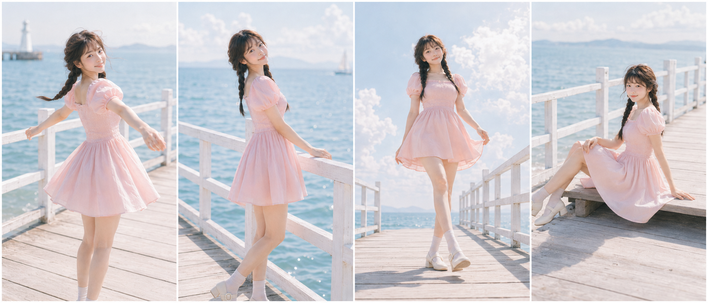
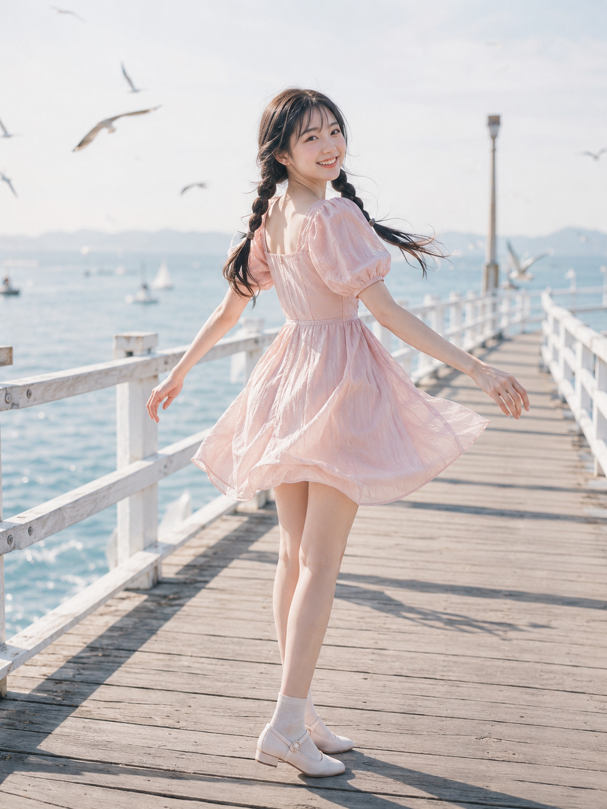
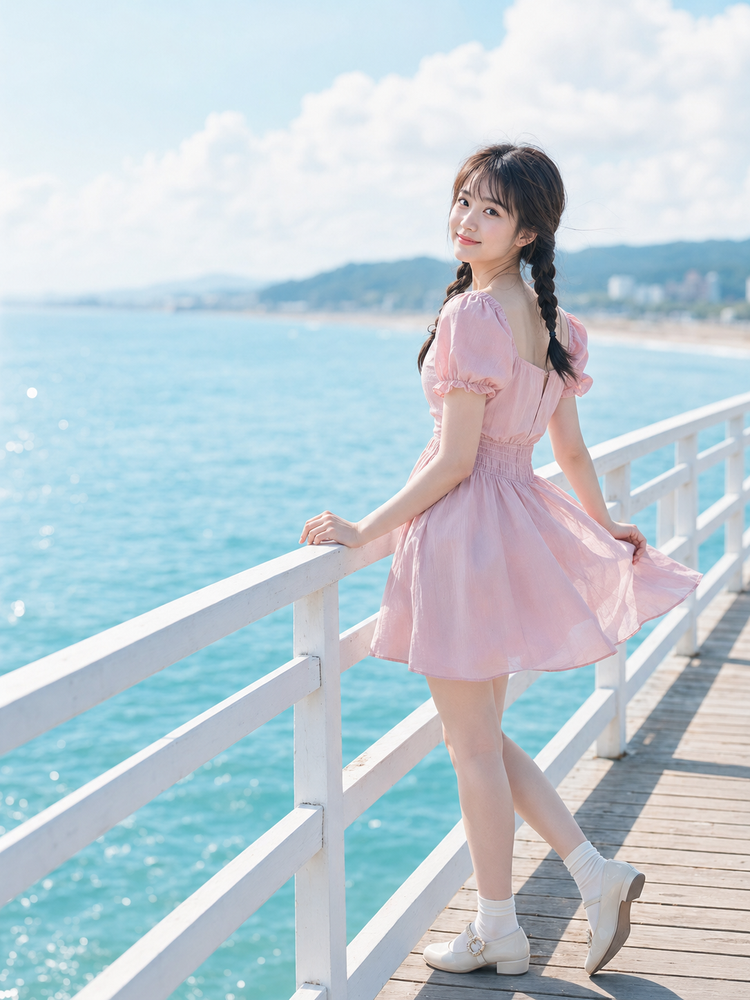
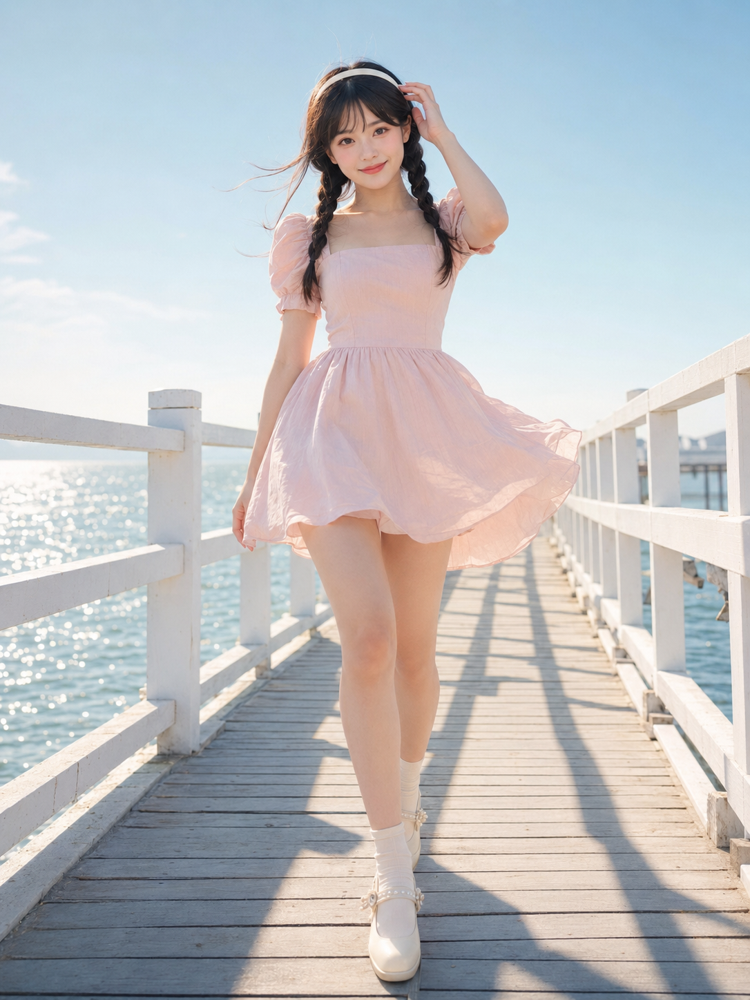
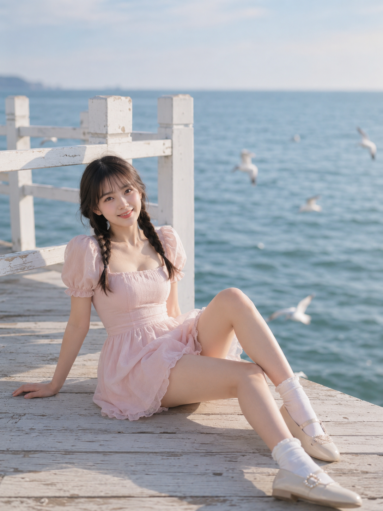
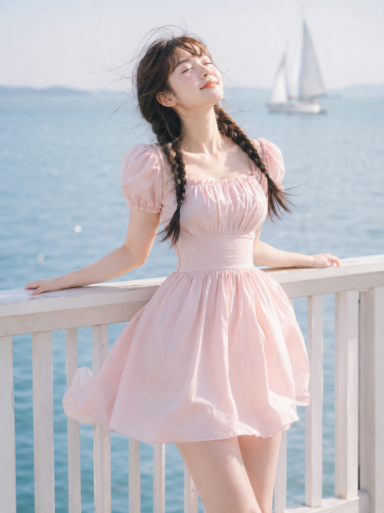
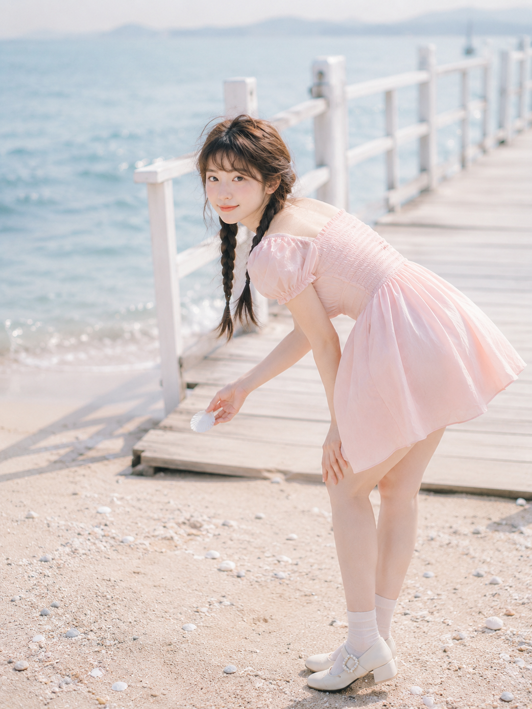
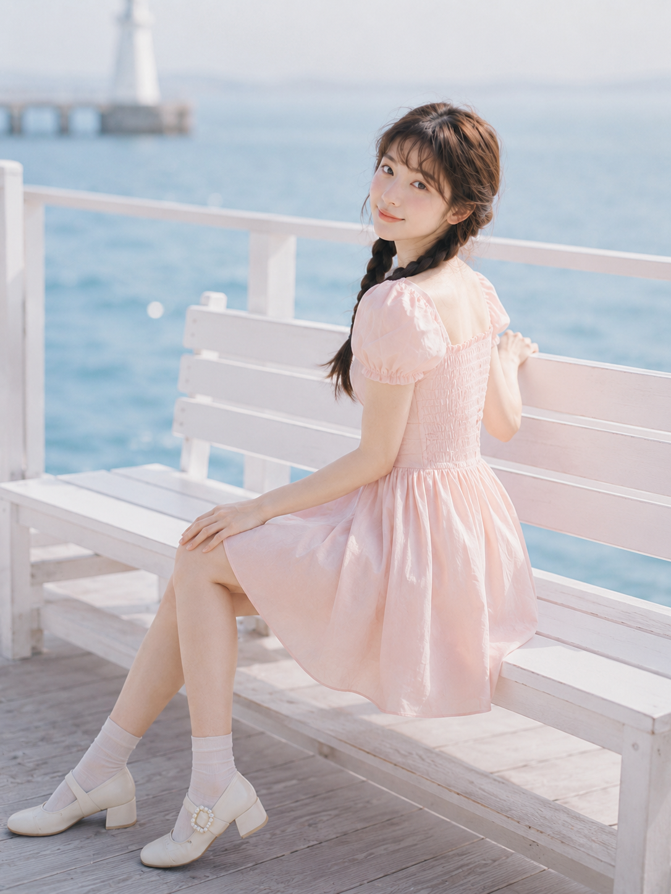
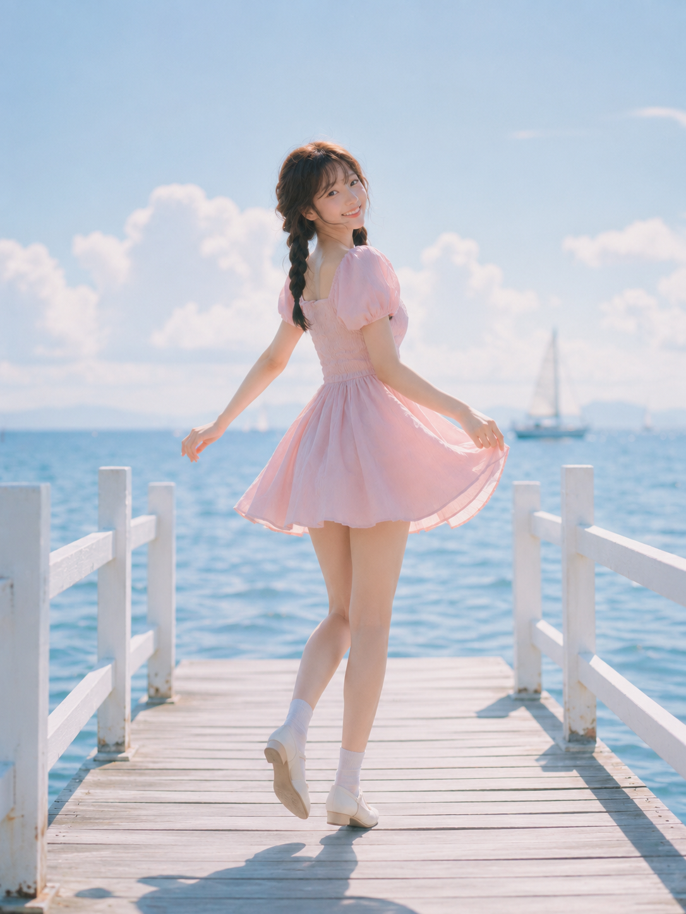
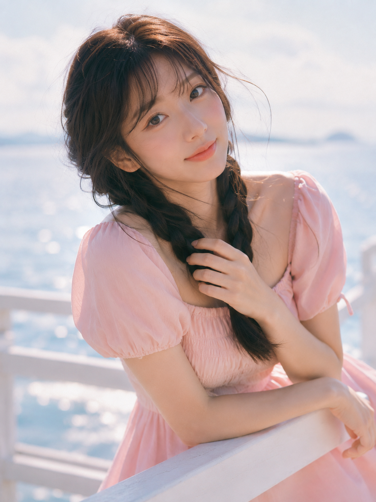

同一片白色海边木栈桥，同一套浅草莓奶油粉裙子，十个自然瞬间——迎风回眸、栏杆侧倚、迎风前行、坐姿抬腿、仰头闭眼、拾贝回望、长椅回头、逆光撩发、踮脚转身、近景凝视。

提示词：
24岁亚洲女生，黑棕色长发双低麻花辫，空气刘海，五官自然清秀，面部干净，皮肤白皙透亮但保留自然质感，眼神明亮真实，笑容甜而不腻，穿浅草莓奶油粉色方领泡泡袖收腰连衣短裙，裙摆轻盈微蓬，奶油白短袜，珍珠扣玛丽珍鞋，站在海边白色木栈桥中央，身体面向海风微微张开双臂，裙摆和发丝被风轻轻吹起，回头看向镜头露出明亮甜笑。场景为晴朗海边木栈桥，白色栏杆延伸到远处，淡蓝海面，浅色天空，远处虚化帆船和海鸥。整体色彩奶油白、浅草莓粉、天空蓝、淡蜜桃色，高调柔光，轻胶片质感，竖版3:4，35mm镜头。

#GPTImage2 #千问 #生图提示词 #Prompt #女友感自拍 #海边栈桥写真

