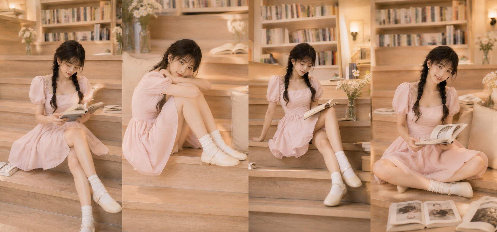
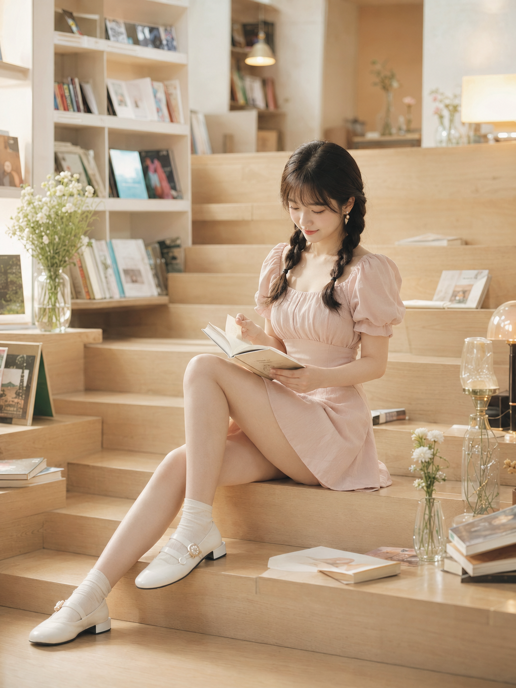
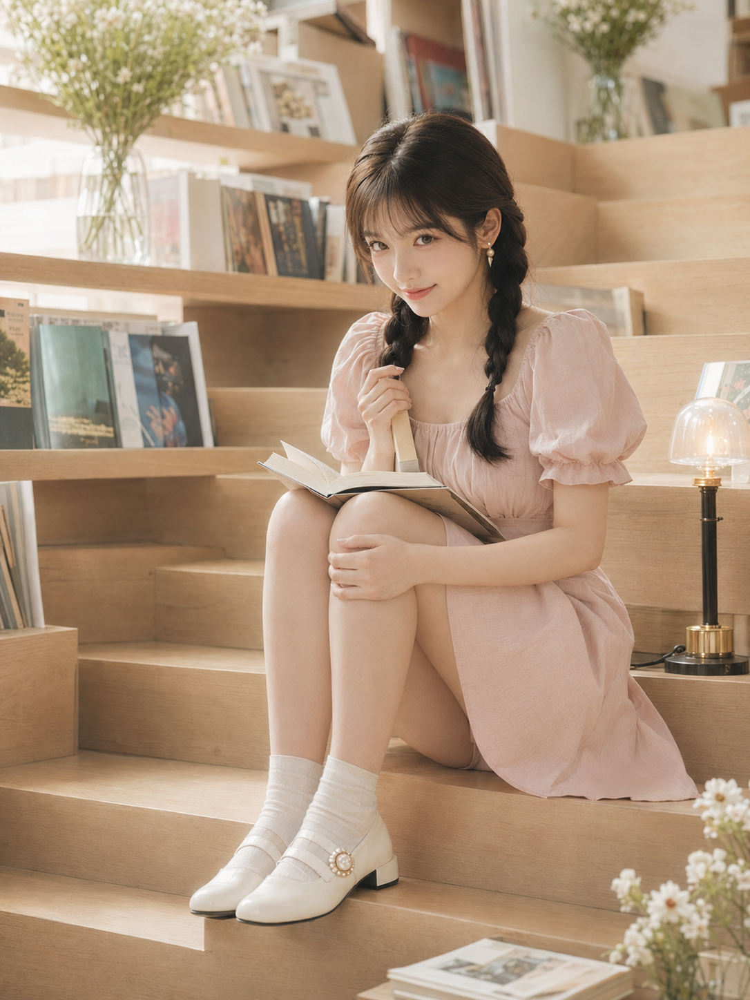
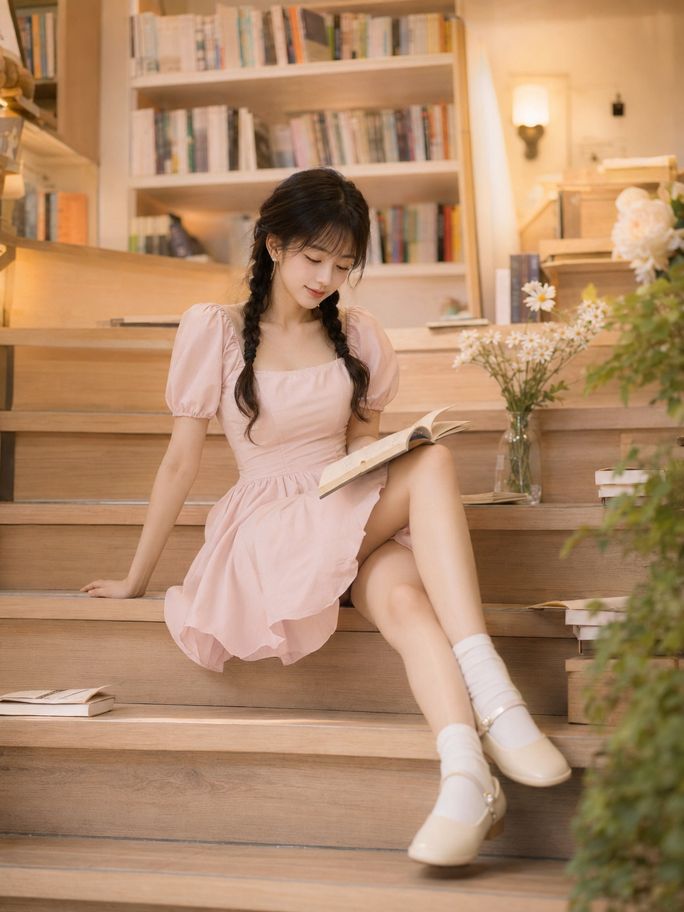
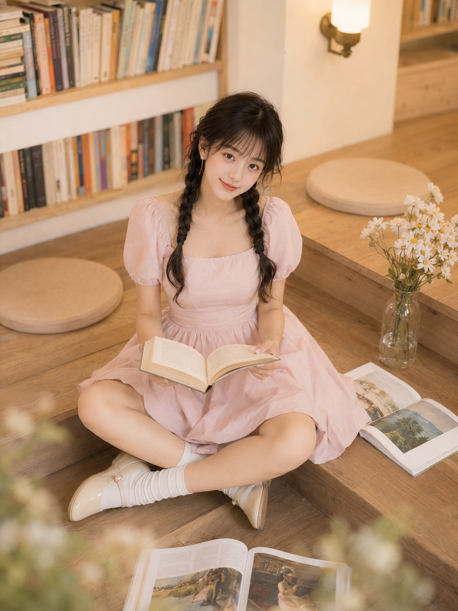
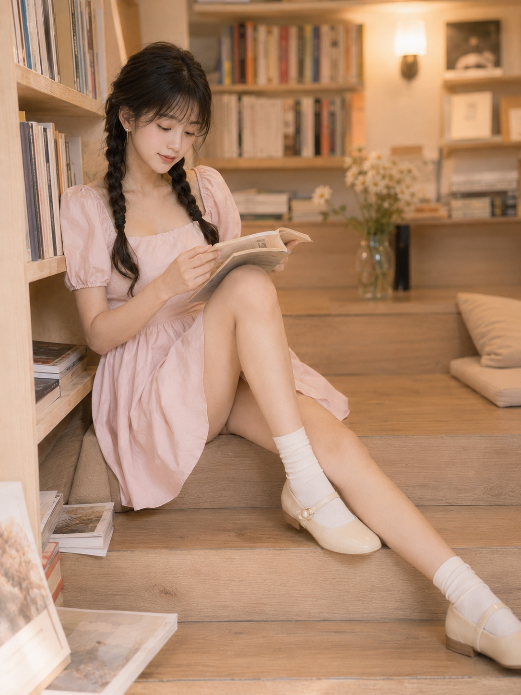
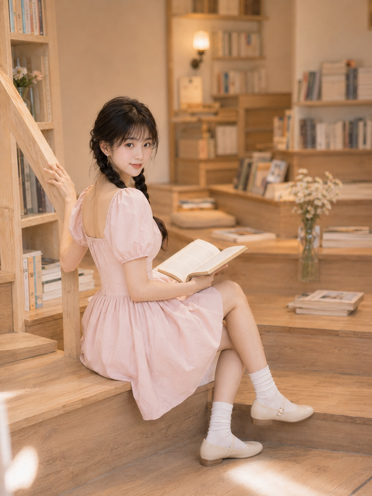

同一间独立书店，同一片浅木色阶梯阅读区，同一套浅草莓奶油粉裙子，八个自然瞬间——台阶側坐翻页、抱膝蜷坐抬眼、半倚撑手侧脸、盘腿俯拍抬笑、倚书架轻咬唇、扶手回眸浅笑、托腮转眸特写、靠垫侧倚拨发。

提示词：
24岁亚洲女生，黑棕色长发双低麻花辫，空气刘海，五官自然清秀，面部干净，皮肤白皙透亮但保留自然质感，眼神明亮真实，笑容温柔，带一点克制的撩人感，穿浅草莓奶油粉色方领泡泡袖收腰连衣短裙，裙摆轻盈微蓬，奶油白短袜，珍珠扣玛丽珍鞋，佩戴小巧珍珠耳钉，坐在独立书店浅木色阶梯式阅读区的中段台阶上，身体微微侧坐，一条腿自然弯曲收在身前，另一条腿沿台阶轻轻斜放，双手捧着一本翻开的浅色封面书，低头轻轻翻页，神情安静温柔，肩颈线条柔和，锁骨若隐若现，腰线清晰，腿部线条自然舒展，带含蓄而优雅的女性美，场景为明亮文艺书店，奶油白书架、浅木色阶梯、散落艺术书与杂志、玻璃花瓶、小白花、暖色壁灯，整体色彩为奶油白、浅木色、草莓奶油粉、柔和暖黄，竖版3:4构图，50mm镜头，浅景深，甜系写真，轻胶片感，高调柔光。

#GPTImage2 #千问 #豆包 #生图提示词 #Prompt #女友感自拍 #书店阶梯写真

