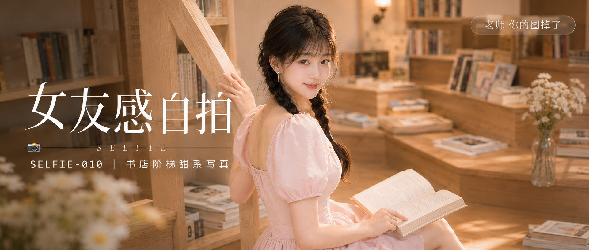

# SELFIE-010-书店阶梯甜系写真 封面

## 封面提示词

24岁亚洲女生，黑棕色长发双低麻花辫，空气刘海，五官精致自然清秀，面部立体清晰，皮肤白皙透亮有光泽，眼神有神灵动真实，笑容温柔又带一点撩人的暧昧感，妆容清透干净，穿浅草莓奶油粉色方领泡泡袖收腰连衣短裙，佩戴小巧珍珠耳钉，坐在独立书店浅木色阶梯阅读区，身体半侧朝向镜头，3/4侧脸抬眼直视镜头，怀里抱着一本翻开的浅色封面书，一只手轻轻搭在书页上，另一只手轻扶阶梯扶手，面部占画面三分之一以上，侧逆光打亮颧骨与发丝边缘，柔光环绕面部，锁骨与肩颈线条清晰好看，姿态自然松弛。背景为明亮独立书店阶梯阅读区，奶油白书架、浅木色阶梯层层叠叠、散落艺术书与杂志、玻璃花瓶、小白花、暖色壁灯，层次分明有纵深感。整体色彩奶油白、浅木色、草莓奶油粉、柔和暖黄统一，电影感光影，色调统一精致，高清锐利，视觉冲击力强，构图黄金比例，前景虚化背景，画面有张力，甜系高级写真质感，避免 AI 美女脸、网红感、过度精修、塑料皮肤、暗沉肤色、明显痘印、明显皱纹、斑点、面部变形，2.35:1 电影横构图。

【文字排版-必须完整保留，不得省略或简化任何一项】画面左侧垂直居中偏下叠加文字排版：超大号衬线字体米白色主文案「女友感自拍」，主文案正下方一条细横线左端带📷横线中央有透明英文水印 SELFIE，横线下方等宽白色字体副文案「SELFIE-010 ｜ 书店阶梯甜系写真」；右上角浅色半透明圆角底衬配小号文字「老师 你的图掉了」（署名文字，必须出现，不可省略）；无整体蒙层，文字直接压图。【文字排版结束】

## 封面图片

