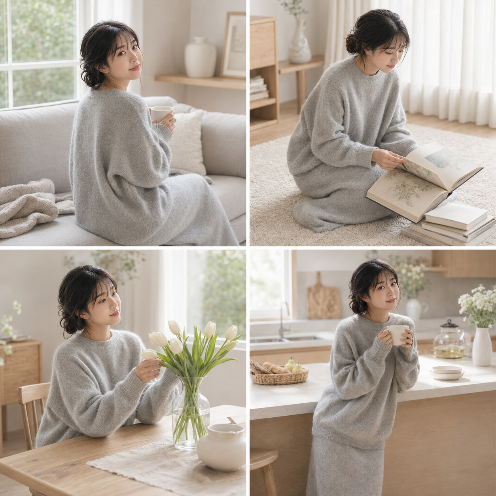
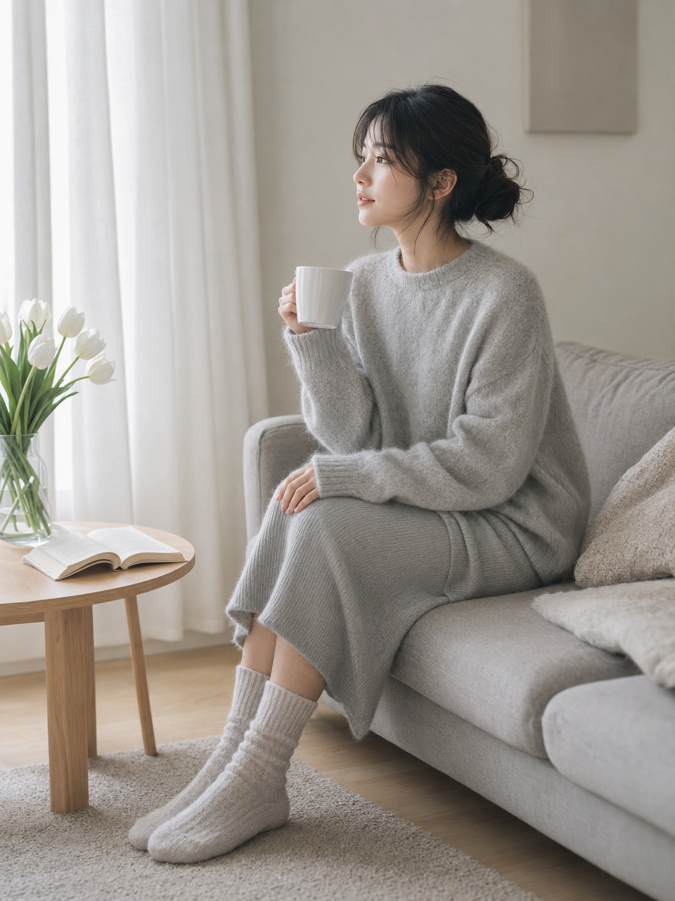
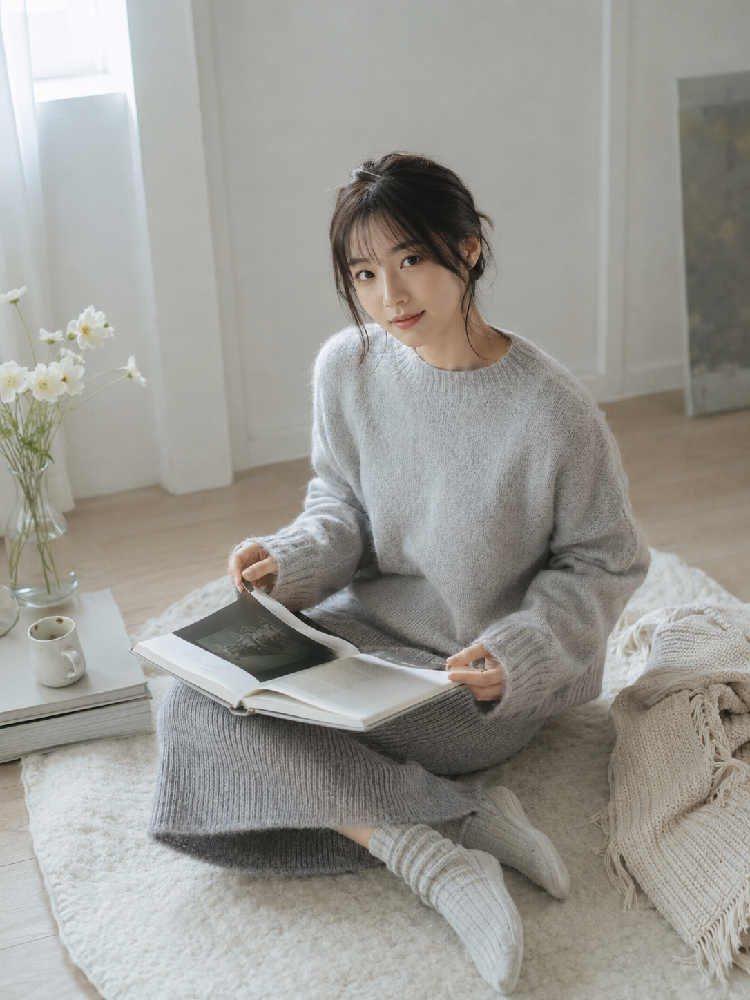
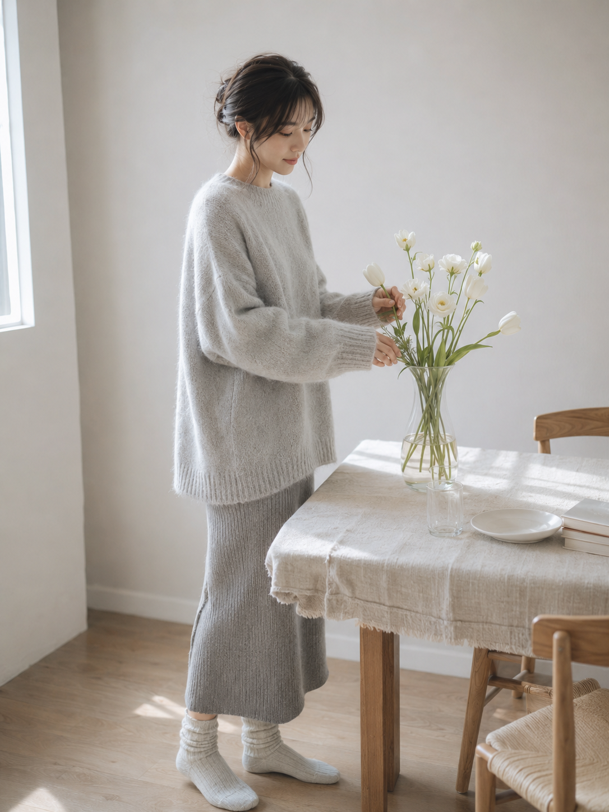
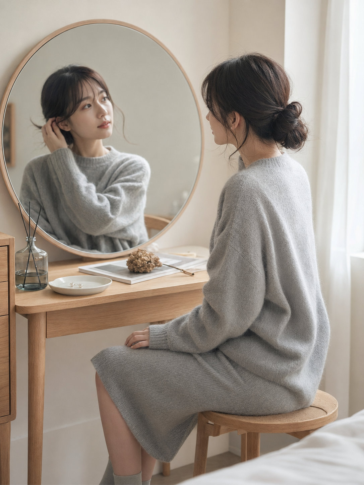
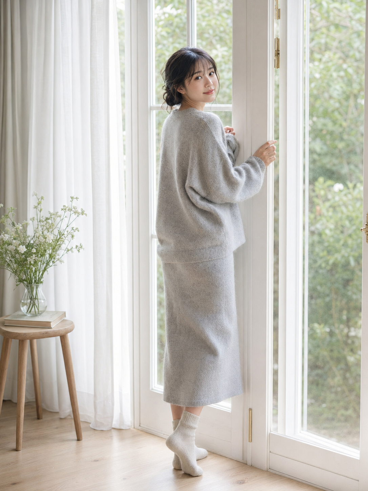
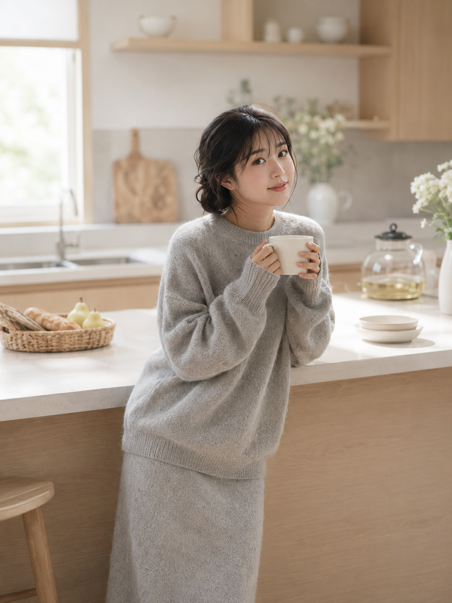

# 朋友圈都以为是真实清晨照，其实只改了这套灰调写法

很多“女友感”图翻车，并不是场景不够好，而是提示词一上来就把人物写得太满：妆容太精致、五官太模板、动作太用力，最后很容易变成影楼样片。

这一组我反过来处理：先固定一个 灰调居家人物底座，再让她在沙发、地毯、餐桌、镜前、玻璃门、厨房里完成六个自然动作。重点不是“更甜”，而是 让画面像真的有人在家里被光线轻轻拍到。

---

**Q：这组图最核心的设计思想是什么？**

我把画面控制在浅灰、奶油白、浅木色三个范围里，不让颜色抢人物的注意力。人物设定也不靠强表情和夸张姿势，而是靠毛衣绒感、窗光、手部动作和一点点回眸。这样做的好处是：AI 不需要“表演亲密感”，只要把生活细节生成稳定，照片自然会有吸引力。

---

**Q：完整提示词原版怎么写？**

下面这份是「晨光沙发」的原版，可以直接复制。它的作用是建立整组人物的脸、发型、服装、色调和安全边界，后面几个 case 都沿用这套人物底座，只替换场景与动作。

24岁亚洲女生，同一人物，同一张脸，同一气质，黑棕色中长发自然微卷，松散低发髻，脸侧有几缕柔软碎发，空气刘海，五官自然清秀，面部干净，皮肤白皙透亮但保留自然质感，眼神温柔真实，神态安静松弛，充满克制而高级的女性美。穿浅雾灰色宽松针织毛衣，细腻羊绒或马海毛质感，落肩版型，柔软包裹感强，领口自然贴合颈部，不暴露；下身搭配浅灰色过膝针织半裙，灰白色居家袜，整体灰色系穿搭。她坐在浅灰色布艺沙发一角，身体微微侧坐，双腿自然并拢斜放，一只手捧着白色陶瓷马克杯，另一只手轻轻搭在膝上，侧脸看向窗外，随后微微回眸看向镜头，神情安静柔和，像清晨刚醒后的片刻发呆。场景为奶油白色客厅，旁边是落地白纱帘和浅木小边桌，桌上有一本翻开的书、玻璃花瓶和几枝白色郁金香。晨间自然光从侧后方照进来，勾勒出面部轮廓、发丝和毛衣绒感。画面色调以浅灰、奶油白、浅木色为主，低饱和、低对比、柔和自然光、轻胶片感、浅景深、空气感，居家风艺术照，日系生活美学，杂志感写真。竖版3:4构图，中景环境人像，人物位于画面中部偏右，85mm人像镜头，背景柔和虚化，画面高级、安静、通透。无文字、无水印、无logo。负面词：避免AI美女脸，避免网红感，避免过度磨皮，避免塑料皮肤，避免五官失真，避免手指错误，避免肢体变形，避免夸张姿势，避免低俗性感，避免软色情，避免擦边，避免胸部特写，避免腿部刻意特写，避免暴露服装，避免透视衣物，避免强烈挑逗表情，避免背景杂乱，避免高饱和艳色，避免硬阴影，避免廉价影楼风，避免文字，避免水印，避免logo。

---

**Q：为什么第一张要从沙发捧杯开始？**

沙发是最稳的居家场景，因为人物可以坐得松弛，手里有杯子，眼神也有自然落点。这里我特别保留了“侧脸看向窗外，随后微微回眸看向镜头”，这句话是在跟 AI 说：不要摆拍感，要一个被镜头轻轻叫住的瞬间。

---

**Q：地毯读书这一张，重点不是书，是机位。**

地毯场景容易变乱，所以提示词里用了“略俯拍中景构图”和“人物位于画面中心偏下”。俯拍能把书页、地毯、针织毯压成柔软前景，人物不会过度占满画面，读者第一眼看到的是安静氛围，再看到脸。

这个 case 的隐藏逻辑是：人物低头阅读后再抬眼，动作有前后关系。给 AI 一个“动作过程”，比单写“温柔看镜头”更容易生成真实表情。

---

**Q：插花场景怎么避免变成廉价写真？**

餐桌插花要克制，不能让花变成主角，也不能让人物像在摆商业大片。这里把人物放在画面左侧，花瓶和餐桌放右侧，形成平衡；再用白色郁金香、奶油白洋桔梗、亚麻桌布、白瓷盘，统一材质语言。

这一张最重要的不是“花多好看”，而是动作：一只手扶花瓶，另一只手整理花材。手部一旦有明确任务，身体姿态就会自然很多，女性美来自动作、光影和衣料，而不是刻意展示身体。

---

**Q：镜前图为什么要写“镜中倒影共同构成焦点”？**

镜前整理发丝很容易生成两张不一致的脸，所以提示词里必须同时控制“人物本体”和“镜中倒影”。我让镜子只承担侧脸、发丝、毛衣轮廓的补充层次，不要求镜子里再出现一个完整正脸，这样会更稳。

这个 case 很适合做情绪图。动作是整理碎发，但真正想表达的是整理情绪，所以文字里写了“像在安静整理情绪”。情绪词要落在动作上，不要只写“治愈”“松弛”这类抽象词。

---

**Q：玻璃门边回眸，怎么写才不油？**

回眸图最容易出问题，因为 AI 会把“回头”理解成刻意挑逗。这里我把它改成“身体微微背向镜头后自然回头”，再加“一只手轻扶门框，另一只手拢住毛衣袖口”，让动作像人在门边停了一下，而不是在表演。

门外虚化绿植、门内白纱帘和浅木地板，可以给画面一点纵深。灰色毛衣放在奶油白背景里会显得更柔软，少量绿色只负责透气，不抢色调。

---

**Q：厨房捧杯这一张，为什么比单纯站着更有生活感？**

厨房岛台是很日常的空间，但如果只写“站在厨房”，人物会很空。双手捧杯、目光低垂看杯口、再自然抬眼看镜头，这三个动作让表情有停顿，也让照片像刚好被记录下来。

我会把这一张当作整组的收尾，因为它的暖光比前几张略多一点，情绪从清晨发呆过渡到放松醒来。同一组图里可以有微弱温度变化，但主色调不能突然跳走。

---

**这套写法可以怎么改？**

如果你想换成更春天的版本，服装可以从浅雾灰改成燕麦白、浅粉灰或雾蓝，但不要一次加入太多颜色。道具可以替换成玻璃杯、相机、耳机、浅色托特包；花材可以换成白玫瑰、洋甘菊、马蹄莲。场景也可以从客厅延展到飘窗、书房、阳台，但建议保留“奶油白空间 + 自然窗光 + 低饱和灰白穿搭”这个主骨架。

和 AI 交互时，我会分两步说：第一步先让它锁定 同一人物、同一服装、同一灰白色调；第二步再逐张替换动作和场景。这样比一次性把六张图全丢给它更容易保持人物稳定。

---

想要类似风格，可以直接收藏这篇。下次我可以继续拆一组更偏“春日窗边”或者“阴天卧室”的女友感写法。

---

## 往期回顾

- SELFIE-010 书店阶梯甜系写真
- SELFIE-009 海边栈桥甜系写真
- SELFIE-008 甜品店吧台女友写真
