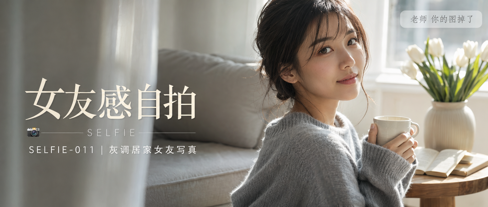

# SELFIE-011-灰调居家女友写真 封面

## 封面提示词

奶油白客厅窗边半身人像封面，24岁亚洲女生坐在浅灰布艺沙发前方偏右，黑棕色中长发自然微卷、松散低发髻、空气刘海，3/4侧脸自然回眸看向镜头，面部占画面1/3以上，五官精致自然，面部立体清晰，皮肤光泽细腻，眼神有神灵动，妆感干净清透，轮廓清晰上镜，穿浅雾灰色宽松针织毛衣，双手捧白色陶瓷杯，窗外晨光形成侧逆光打亮颧骨与发丝，柔光环绕面部，前景白纱轻微虚化，背景有浅木边桌、白色郁金香和翻开的书，电影感光影，高清锐利，色彩层次丰富，视觉冲击力强，构图黄金比例，前景虚化背景，色调统一精致，画面有张力，低饱和奶油灰白色调，轻胶片感，生活方式杂志封面质感，2.35:1 电影横构图。避免 AI 美女脸、网红感、过度精修、塑料皮肤、暗沉肤色、明显痘印、明显皱纹、斑点、面部变形，避免纯背影、纯侧影、远景小脸、眼睛半闭、嘴巴微张、暴露服装、低俗性感、软色情、擦边、文字错误、水印、logo。 【文字排版-必须完整保留，不得省略或简化任何一项】画面左侧垂直居中偏下叠加文字排版：超大号衬线字体米白色主文案「女友感自拍」，主文案正下方一条细横线左端带📷横线中央有透明英文水印 SELFIE，横线下方等宽白色字体副文案「SELFIE-011 ｜ 灰调居家女友写真」；右上角浅色半透明圆角底衬配小号文字「老师 你的图掉了」（署名文字，必须出现，不可省略）；无整体蒙层，文字直接压图。【文字排版结束】

## 封面图片

