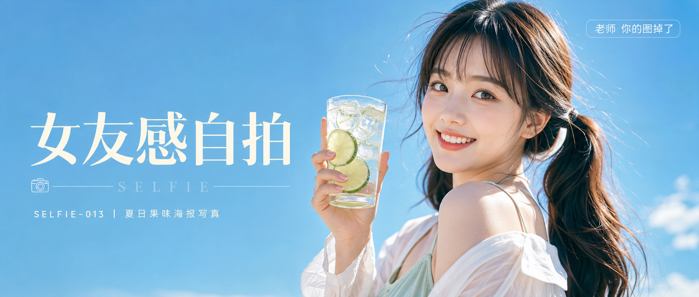
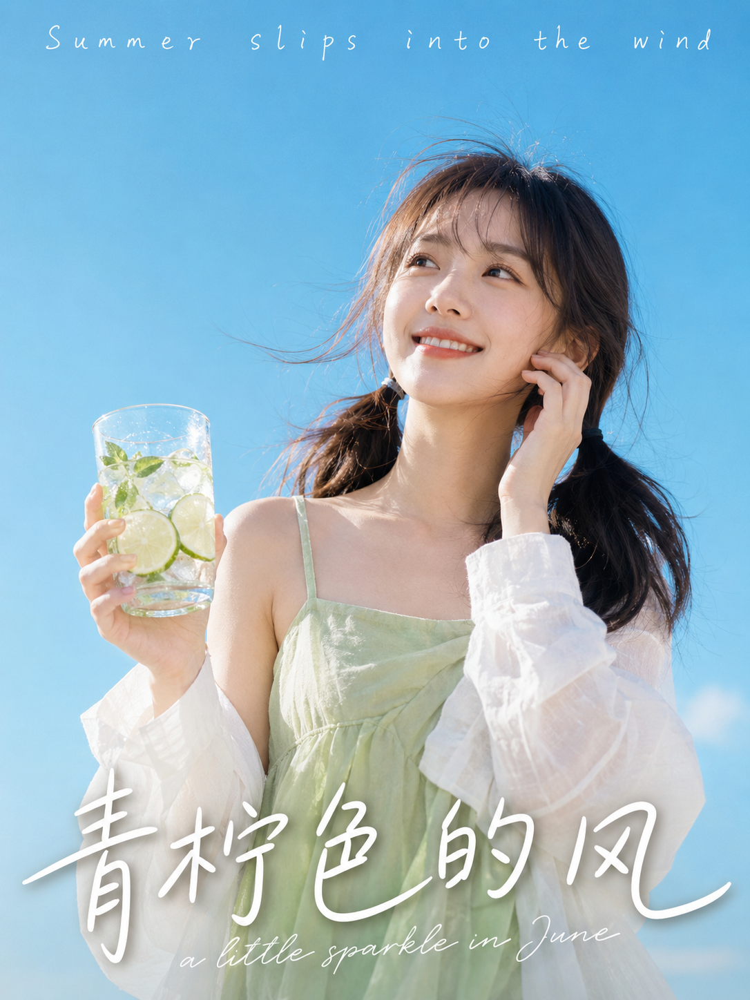
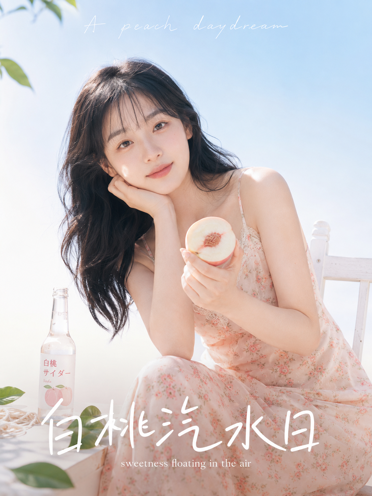
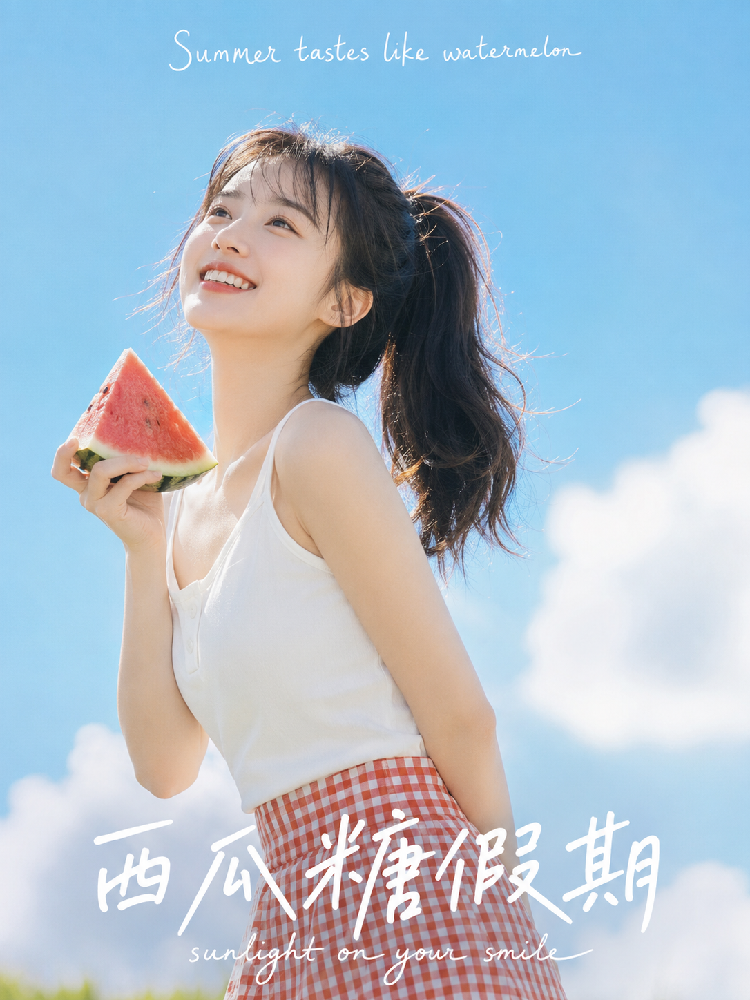
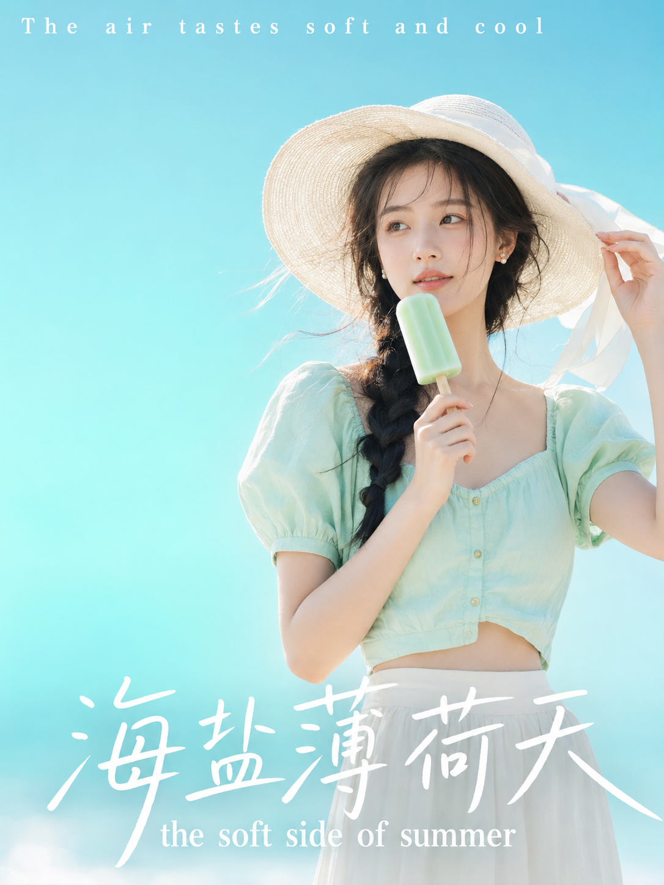
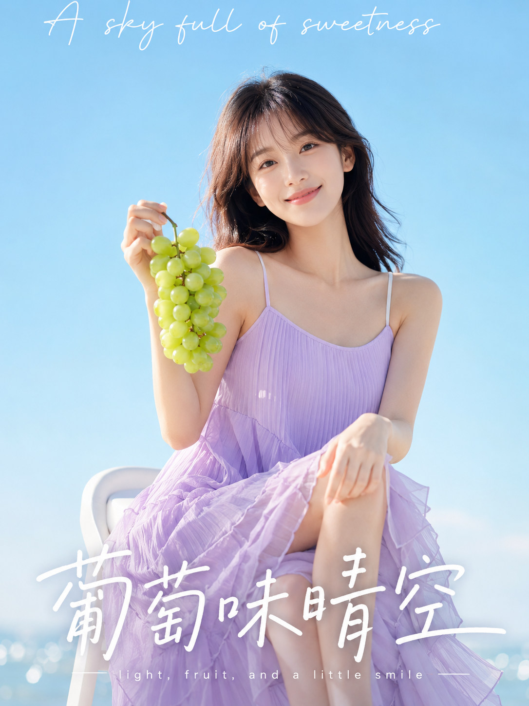
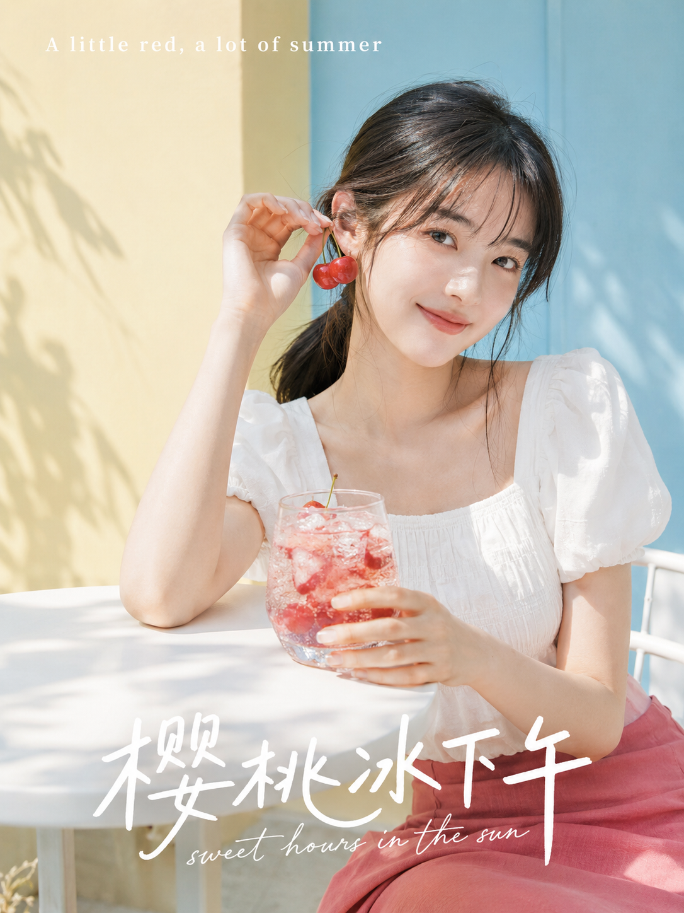
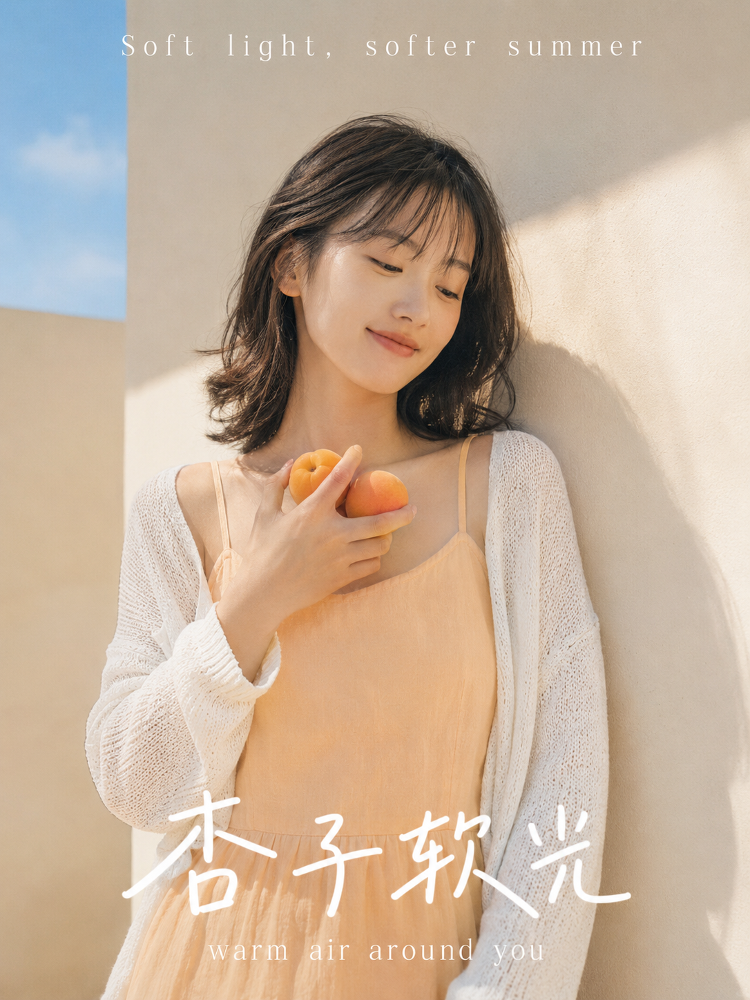
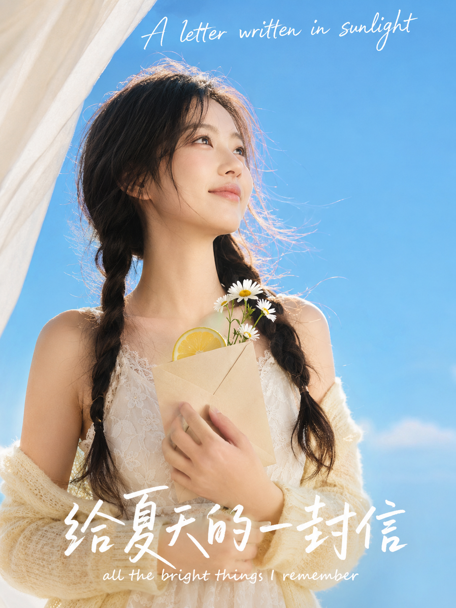

# 不出门也能拍夏日海报大片，这套水果少女写法我存了 8 版

夏天最容易让人心动的从来不是某个具体的地方,而是一种气质——蓝天很高,人很轻盈,手里总拿着点带汁水的东西。这种感觉不需要机票,只需要一套写对了的提示词。

这一次我没有从零开始想场景,而是拿一张"清透夏日+果味海报+手写标题"的老图当气质母版,把里面最容易被模型抄成"一个模子"的元素——同一顶草帽、同一颗半切柚子、同一个贴脸位置——全部拆掉,只留骨架,往里面重新填水果、服装、动作和文字。最后长出了 8 张风格统一但没有一张重复 的海报。

先说说这套写法的核心逻辑,再把其中一张完整的提示词原文给你。

## 骨架不变,填料全换

八张图共用的其实是四层结构:纯净大色块背景 + 一个明确的水果或道具动作 + 手写英文小标题 + 超大号中文主标题。这四层锁死了,画面就有了"同系列"的辨识度;但只要在层内换掉具体元素,八张图就不会长得像复制粘贴。

我在跟 AI 反复调这组提示词的时候,发现最容易让人物"面熟"的其实不是水果种类,而是**姿势和视线的重复**。所以八张图里,举杯、切桃、举瓜、扶帽檐、拎葡萄串、拎樱桃、抱杏子、贴信封——八个动作没有一个是同一个手势,视线方向也各不相同,这才是画面看起来"每张都不一样"的关键,比换水果本身更重要。

## 青柠色的风

天空蓝背景 + 一杯冰镇青柠苏打水,是整组图里最"清透"的一张。这是我唯一放完整原版提示词的一条,你可以直接复制去试:

竖版3:4夏日写真海报，清新甜系、明亮通透、日系果味少女风。纯净蔚蓝天空作为大面积背景，极简干净，没有建筑和杂物。画面主体是一位22岁亚洲女生，五官自然清秀，面部干净，健康自然肤色，黑棕色长发松散低双马尾，轻薄空气刘海，眼神明亮真实，嘴角带自然浅笑，表情松弛。她穿一条浅鼠尾草绿色细肩带连衣裙，外搭一件轻薄半透明白色罩衫，整体轻盈柔软。人物站在画面中间偏右位置，身体微微侧向镜头，一只手举着一杯透明玻璃杯装的青柠苏打水，杯中有冰块、青柠片和薄荷叶，另一只手轻轻扶住脸侧发丝，视线看向远处左上方，神情轻松、像被夏日微风轻轻吹拂。阳光明亮，肤色白皙自然，保留真实皮肤质感，发丝和肩膀边缘有柔和高光。整体色彩以天空蓝、青柠绿、白色为主，点缀少量透明玻璃质感，画面清爽、有呼吸感。镜头为近景半身人像，50mm真实摄影质感，轻微柔焦，轻奶油滤镜，海报感强。顶部天空留白区域加入白色英文手写排版：Summer slips into the wind，字距疏朗、轻盈、略带童趣；底部加入超大号白色中文手写标题：青柠色的风，下方再加一行白色细线条英文连笔副标题：a little sparkle in June。气质清爽亲和，避免 AI 美女脸、网红感、过度精修、塑料皮肤、暗沉肤色、明显痘印、明显皱纹、斑点、面部变形、手部畸形、五官错位、背景杂乱、文字乱码、错别字、过度暴露、低俗感、强烈阴天、灰暗色调、多人同框、廉价滤镜。

拆开看这条提示词,真正在控场的其实只有三句:背景颜色(纯净蔚蓝天空)、主道具动作(举杯靠近脸侧)、文字排版(顶部英文+底部中文+副标题)。剩下的服装、发型、光线描述,都是为了让人物"可信"而不是让人物"抢戏"。

## 剩下七张,讲的是同一套逻辑的七种变体

其余七张我没有再贴完整提示词,因为结构和上面这条几乎一致,换的只是"背景色 + 道具 + 服装 + 标题文案"这四个变量。直接看设计思路更有效率:

**白桃汽水日**——把纯色天空换成奶白到浅天蓝的渐变留白,人物坐姿代替站姿,主道具从"举着"变成"切开靠近胸前",这样即使道具也是水果,视觉重心也不会和青柠那张撞。

**西瓜糖假期**——这张我特意把姿势改成"扬起下巴看天",而不是继续低头看镜头的角度。视线方向的变化比换水果更能拉开图与图之间的距离感,这是这组图里我认为最容易被忽略、但效果最明显的一个改动点。

**海盐薄荷天**——道具从水果换成冰棒,色系也从"暖果色"切到"冷薄荷色",专门用来打破前两张的暖色调节奏,让四宫格式的浏览体验不会连续同色。

**葡萄味晴空**——唯一一张改用坐姿 + 中景(不是近景半身)的图,目的是让画面里出现更完整的身体比例,给这组"清一色近景海报"增加一点呼吸空间。

**樱桃冰下午**——背景色第一次跳出"蓝天系",换成奶油黄墙面,验证同一套人物设定在暖色调背景下是否依然成立。结果是成立的,只要水果色和背景色的对比够干净,不会显脏。

**杏子软光**——刻意把光比压低、把动作幅度收到最小(只是把杏子放在锁骨附近),测试"安静款"能不能和前面几张"元气款"放进同一个系列里而不违和。情绪浓度的高低差,其实也是拉开图与图区分度的一种方式,不是只有色彩和道具才能做变化。

**给夏天的一封信**——八张里唯一没有用水果做主道具的一张,换成信封+雏菊+柠檬片的组合。这是故意留的一个"意外项",用来验证骨架本身(纯色背景+手写标题+明确动作)脱离水果道具后是否依然成立——答案是可以,只要主道具足够具体,不需要非得是水果。

## 三句话说清楚这套写法怎么用

如果你想把这套写法套到自己的主题上,记住三个可替换层就够了:背景色系决定整体氛围冷暖,主道具动作决定视觉焦点和记忆点,标题文案的英文小字+中文大字结构不要动,这是让画面看起来"像一个系列"的最后一道锁。跟 AI 反复沟通的过程中,真正值得花时间打磨的不是形容词的堆砌,而是这三层要不要变、怎么变——想清楚这一点,同一个人物设定可以无限延伸出不重复的画面。

---

觉得这组写法有用的话存一下,下次想不出选题的时候直接照这个骨架换水果就行。你最想看哪个季节的同款系列,评论区告诉我。

---

## 往期回顾

- SELFIE-010 书店阶梯甜系写真
- SELFIE-011 灰调居家女友写真
- SELFIE-012 甜系居家风写真

#GPTImage2 #千问 #豆包 #生图提示词 #Prompt #女友感自拍 #夏日海报写真
