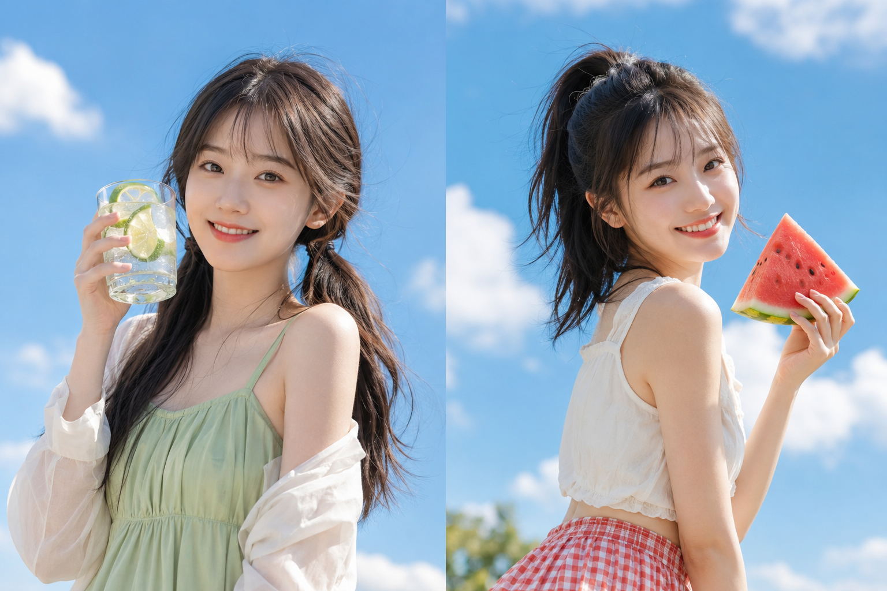

同一套骨架换水果、换道具、换标题文案，8 张海报风格统一又互不重复。

提示词：
竖版3:4夏日写真海报，清新甜系、明亮通透、日系果味少女风。纯净蔚蓝天空背景，人物穿浅鼠尾草绿色细肩带连衣裙，手举青柠苏打水，视线看向远处，顶部白色英文手写标题，底部超大号中文手写标题，海报感强，避免 AI 美女脸、网红感、过度精修、塑料皮肤。

#GPTImage2 #千问 #生图提示词 #Prompt #女友感自拍 #夏日海报写真

