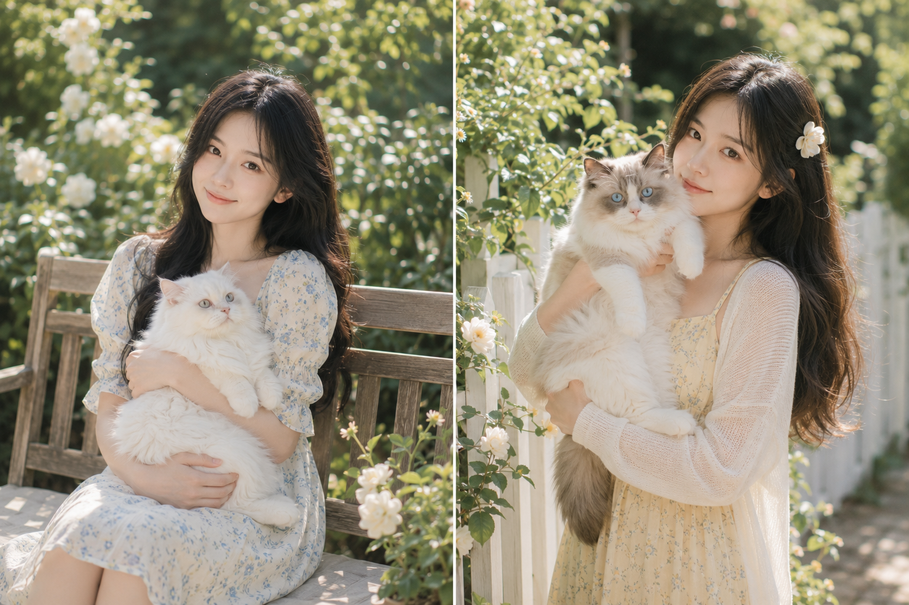
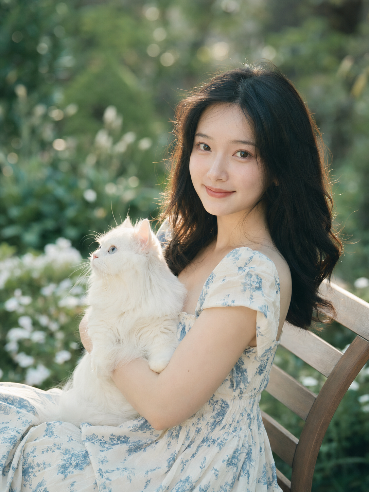
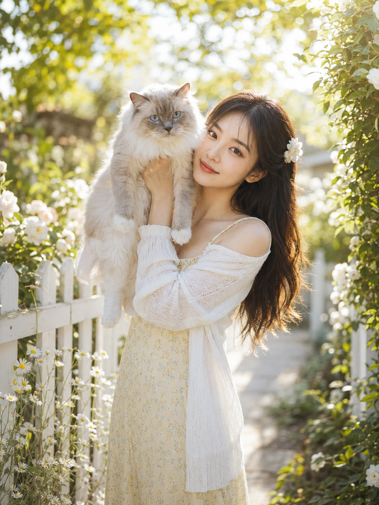
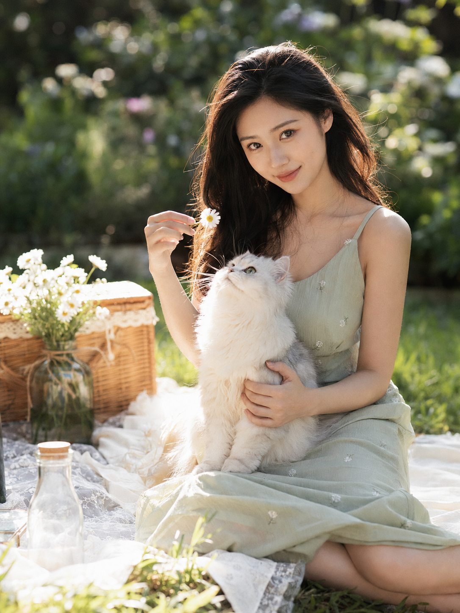
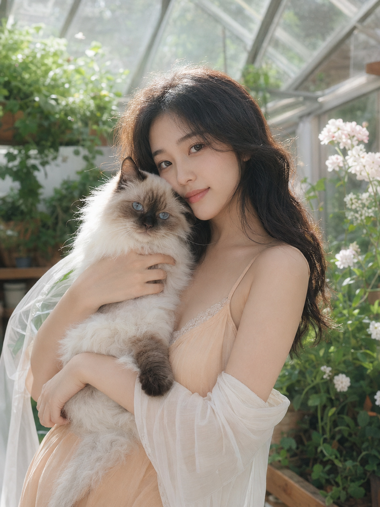
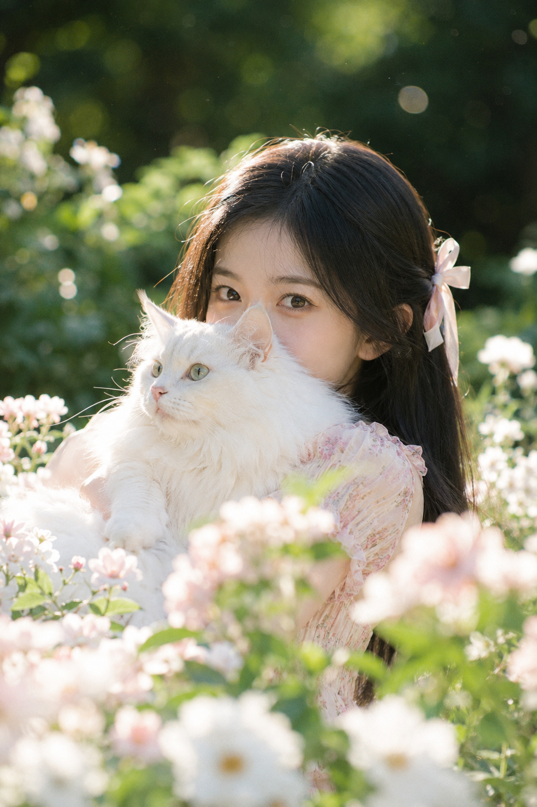
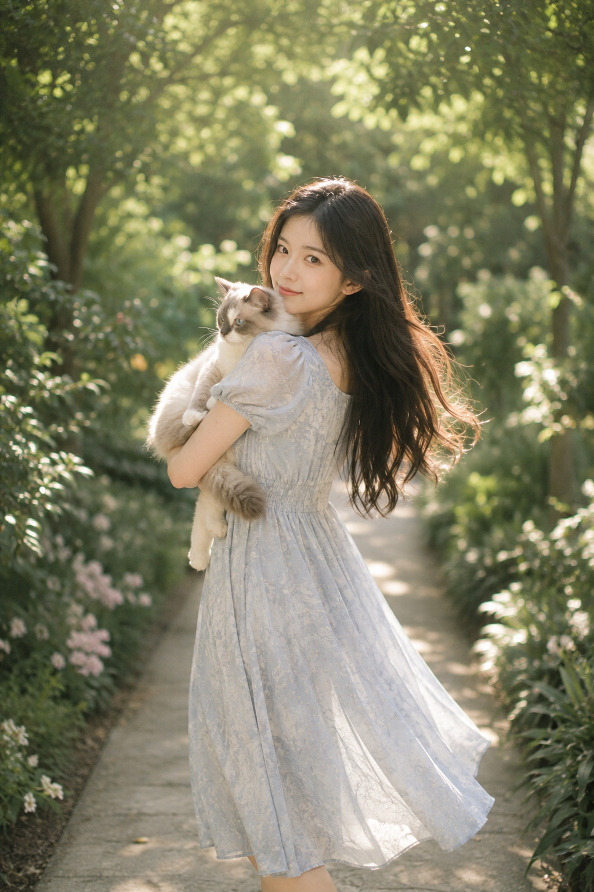
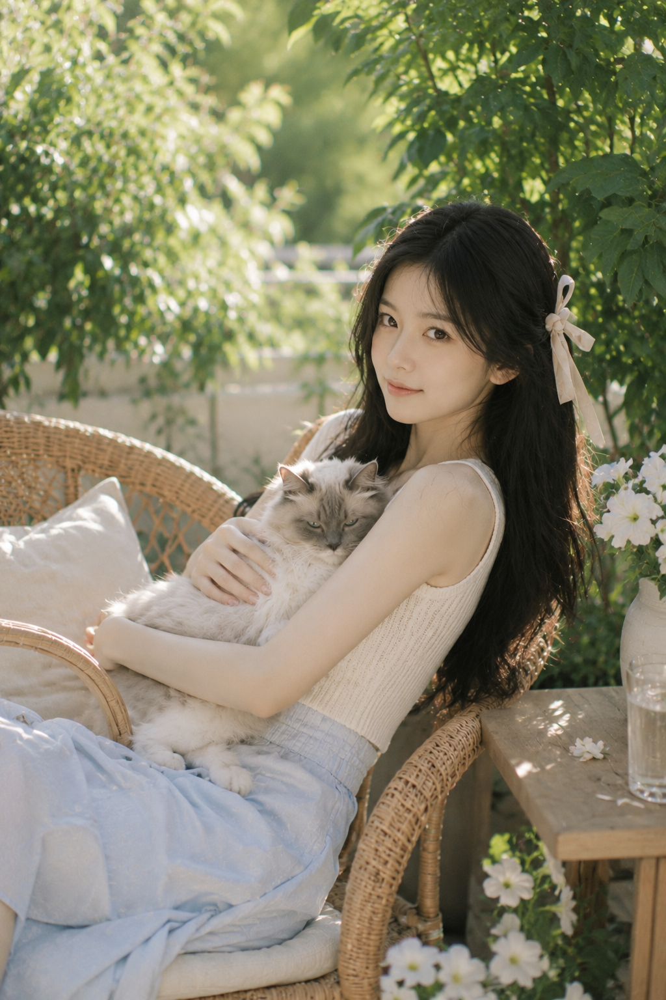
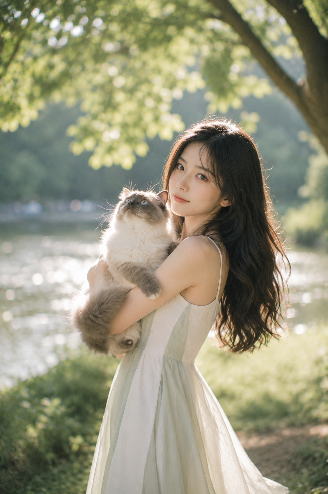

人 + 猫的组合比单人自拍更难穿帮，猫咪天然带放松感。8 个花园场景，抱猫方式和猫的视线各不相同，整组不重复。

提示词：
24岁亚洲女生，清秀自然的五官，面部干净，健康自然肤色，黑色长发柔顺披肩，发尾微卷，淡妆通透，眼神温柔明亮真实，穿奶油白与浅雾蓝配色的法式方领碎花连衣裙，自然坐在花园木质长椅一侧，怀里抱着一只蓬松的大体型白色长毛猫，猫咪安静靠在她臂弯里，微微仰头看向远处。午后自然逆光从侧后方照亮人物发丝与猫咪绒毛，85mm人像镜头，f/1.8，大光圈浅景深，奶油白、浅蓝、暖肤色、森林绿低饱和色调，日系夏日写真氛围。避免网红感、AI美女脸、塑料皮肤、手部畸形、猫咪变形、文字、水印

#GPTImage2 #千问 #生图提示词 #Prompt #女友感自拍 #抱猫写真

