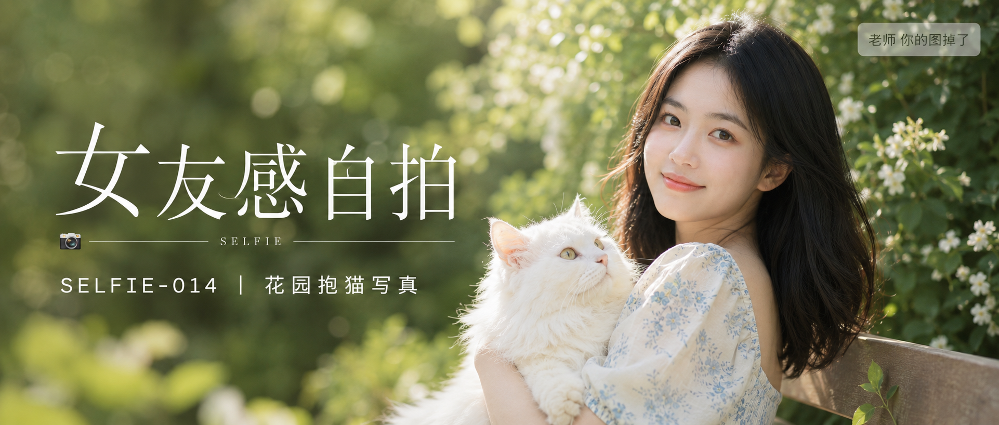

# SELFIE-014-花园抱猫写真 封面

## 封面提示词

花园女友感抱猫写真封面，24岁亚洲女生，五官精致自然，面部立体清晰，黑色长发柔顺披肩，发尾微卷，淡妆通透，眼神有神灵动，妆感干净清透，轮廓清晰上镜，健康自然肤色，皮肤光泽细腻。她穿奶油白与浅雾蓝配色的法式方领碎花连衣裙，坐在花园木质长椅上，身体3/4侧转、正脸清晰看向镜头，嘴角带自然笑意，面部占画面三分之一以上；怀中抱着一只蓬松的大体型白色长毛猫，猫咪安静靠在她臂弯里，毛发细节清晰，与人物形成温暖记忆点。周围是虚化的夏日花园绿植与白色小花光斑，姿态自然优雅。侧逆光打亮发丝与颧骨轮廓，柔光环绕面部，奶油白与森林绿形成清新色彩对比，电影感光影，高清锐利，色彩层次丰富，视觉冲击力强，构图黄金比例，前景虚化背景，色调统一精致，画面有张力，商业写真级完成度。避免暴露、透视衣物、刻意强调身体部位、纯背影、纯侧脸、远景小人物、眼睛半闭、嘴巴微张、面部与手部畸形、猫咪变形、背景杂乱，避免 AI 美女脸、网红感、过度精修、塑料皮肤、暗沉肤色、明显痘印、明显皱纹、斑点、面部变形，2.35:1 电影横构图。

【文字排版-必须完整保留，不得省略或简化任何一项】画面左侧垂直居中偏下叠加文字排版：超大号衬线字体米白色主文案「女友感自拍」，主文案正下方一条细横线左端带📷横线中央有透明英文水印 SELFIE，横线下方等宽白色字体副文案「SELFIE-014 ｜ 花园抱猫写真」；右上角浅色半透明圆角底衬配小号文字「老师 你的图掉了」（署名文字，必须出现，不可省略）；无整体蒙层，文字直接压图。【文字排版结束】

## 封面图片

