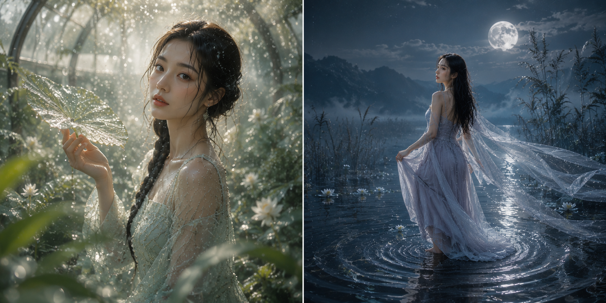
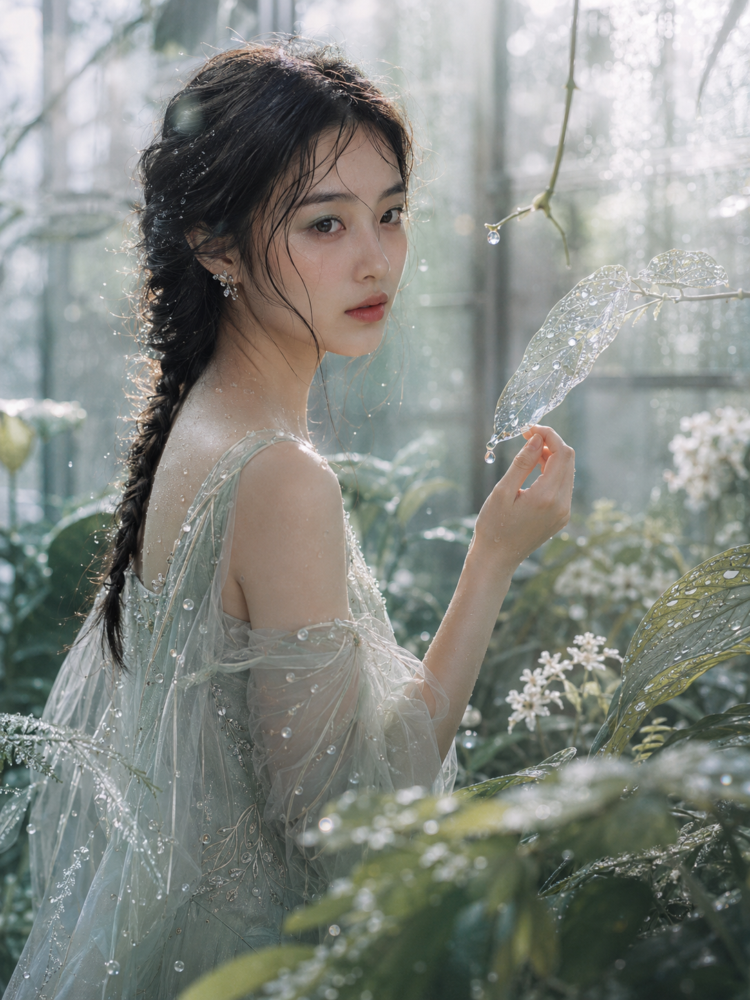
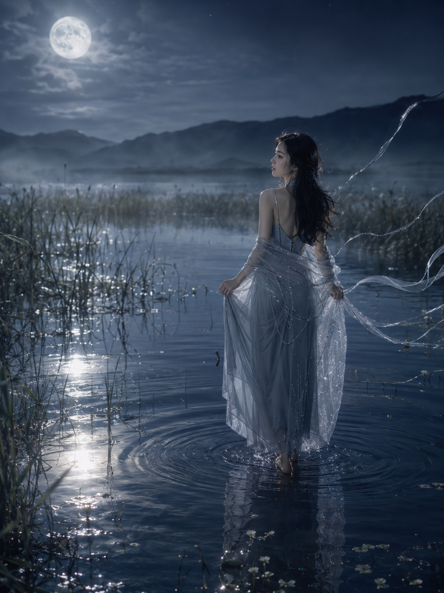
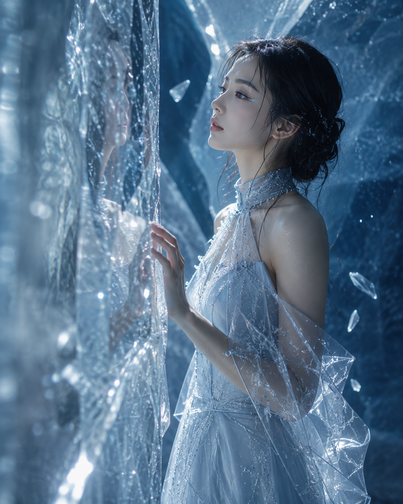
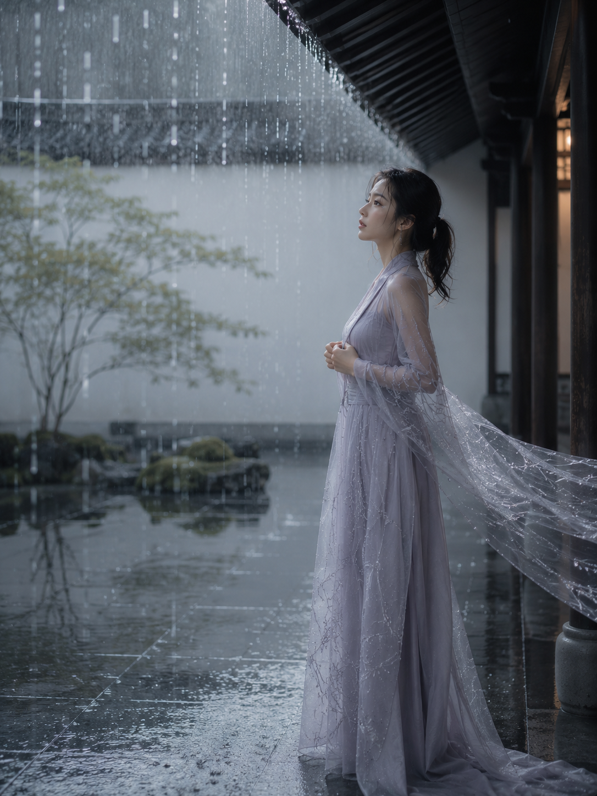
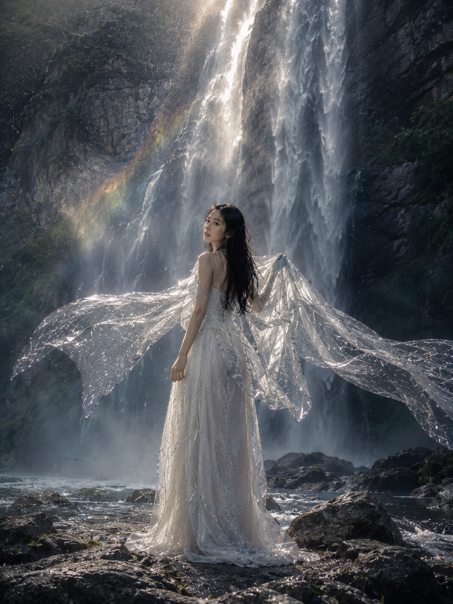
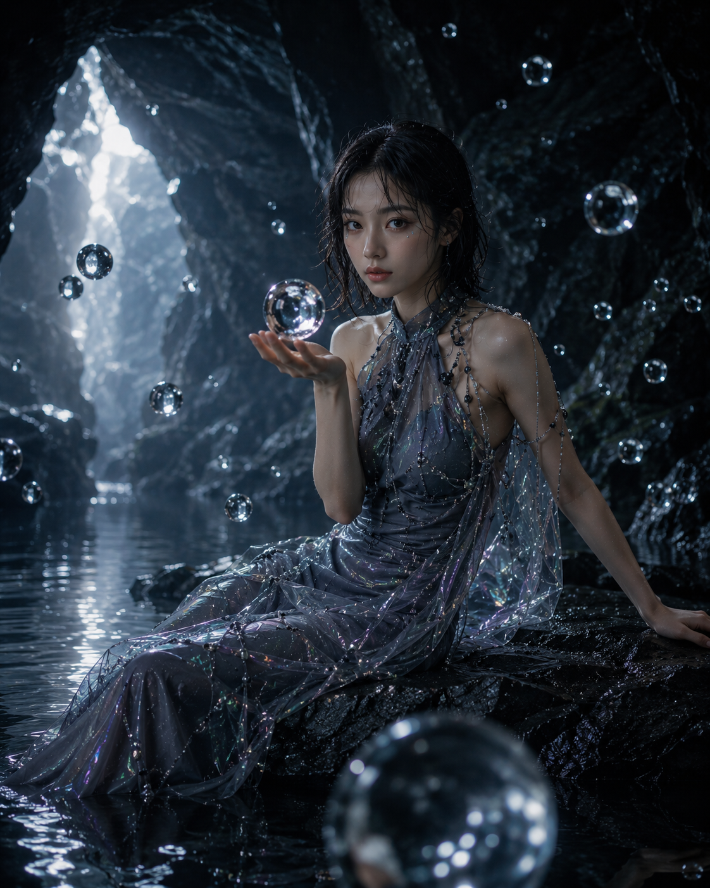
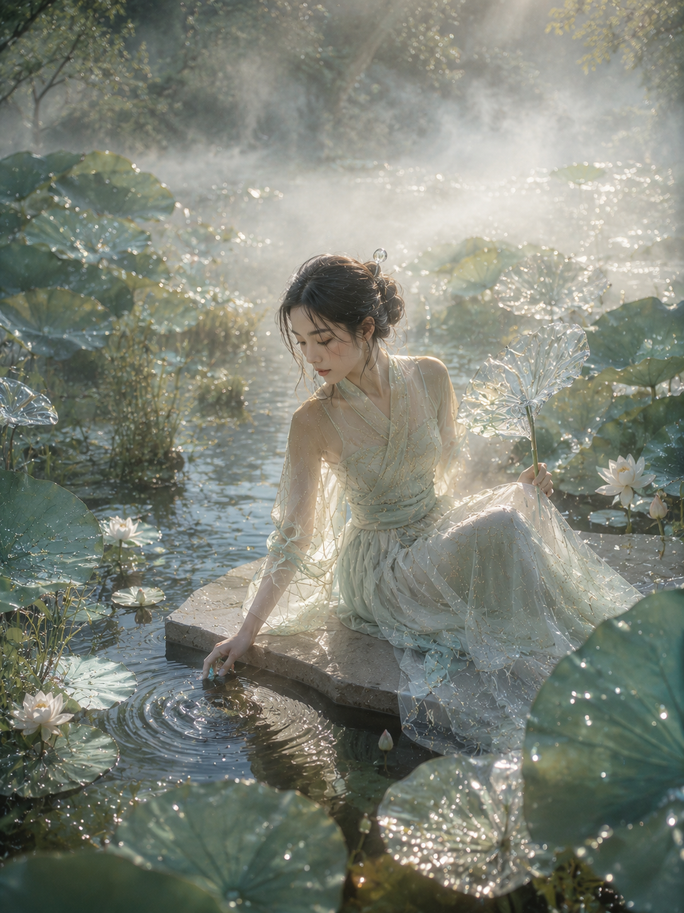
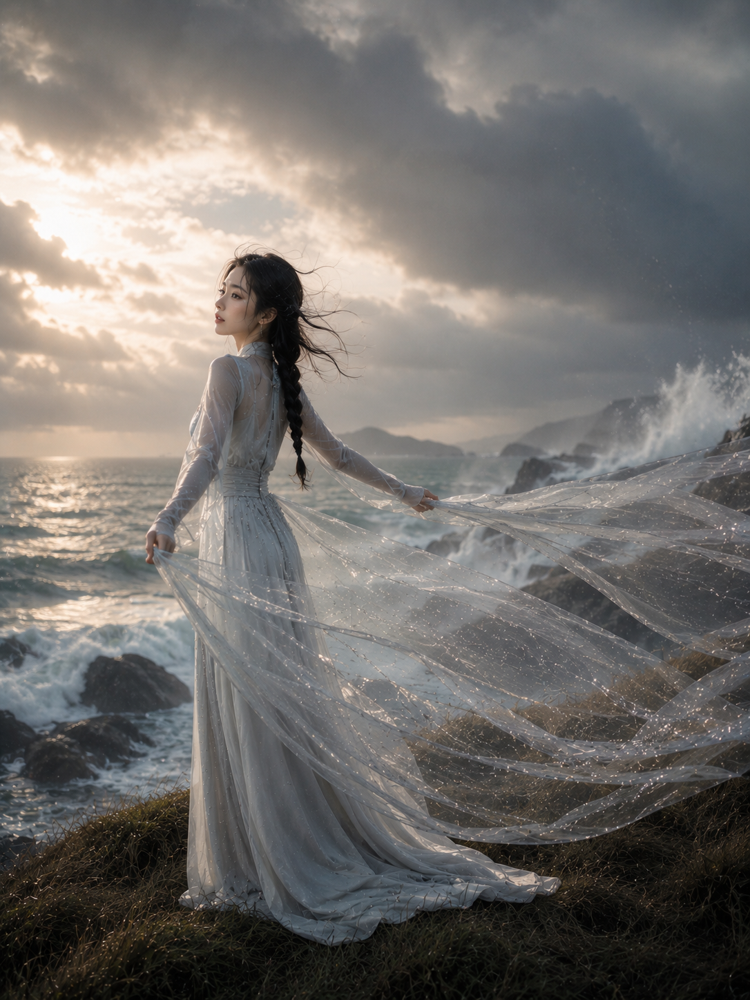

# 这组东方水境写真我存了 8 版，温室露珠那张改了最多次才定稿

**Q：为什么这次不拍日常生活场景，改拍"水"这个元素？**

因为水本身就是最容易出高级感的视觉素材——它能折射光、能悬浮、能凝成露珠也能拉成雾纱，同一位人物换一种"水的形态"，画面气质就能完全不同。这次围绕水元素设计了 8 个场景：温室露珠、月下芦苇、蓝冰裂隙、雨庭流光、瀑布银翼、洞窟水滴、荷池晨光、悬崖水纱，覆盖了露、雾、冰、雨、瀑、滴、涟漪、纱八种水的状态。

每一版都刻意避开同一个坑：AI 生图遇到"水"，第一反应经常是画一圈爆炸式的环脸水花，看多了会腻。这 8 版全部要求"不形成夸张水柱""不环绕脸部"，让水安静地待在场景里，而不是抢镜的特效。

正文完整展示第一版「晨雾露珠温室」的提示词原文，你可以直接复制去跑；其余 7 版把设计思路拆开讲，方便你按需替换水的形态和场景。

---

**Q：温室露珠这一版，为什么被选作正文范本？**

它是 8 版里视觉最克制、也最耐看的一版——没有大幅度动态特效，全靠"露珠悬浮 + 侧逆光"两个变量撑起整个氛围。人物托叶片、低头观察水珠的动作也很生活化，不像摆拍。这版还兼顾了封面需要的强吸睛度：温室的透光背景和逆光轮廓光天然适合做视觉焦点。

竖版 3:4，高质感东方幻想时尚人像摄影。同一位24岁漂亮亚洲女生，清秀自然的鹅蛋脸，真实东亚五官，黑色长发松散编成一条低位鱼骨辫，脸侧垂落湿润碎发，神情安静清醒。她站在清晨的玻璃植物温室中，身体侧对镜头，一只手轻轻托起覆盖露珠的透明叶片，低头观察叶尖即将滴落的水珠，随后微微抬眼望向镜头，姿态纤细、自然、克制。女生穿浅鼠尾草绿与珍珠白渐变的薄纱长裙，方形领口，肩颈线条柔和，裙身覆盖细密银线、微型玻璃珠和植物叶脉刺绣，面料像被晨露浸湿的轻薄花瓣，半透明但内衬完整，不暴露。佩戴小巧银色枝叶耳饰，清透水光妆，灰绿色眼影，淡蜜桃腮红，水润豆沙唇，皮肤保留自然纹理，鼻尖、锁骨与肩部有细小露珠。温室内部布满蕨类、白色小花、半透明藤蔓与蒙着水汽的玻璃墙，低饱和鼠尾草绿、雾白、浅银灰和少量淡金色构成画面。大量露珠悬浮在人物周围，不形成夸张水柱，而是像时间被凝固的透明珍珠；近处叶片和水珠形成自然前景遮挡，部分露珠折射出人物眼睛和温室灯光。清晨侧逆光穿过玻璃和植物，在发丝、薄纱和水滴边缘形成柔和银金色轮廓光，空气中有细腻雾气与丁达尔光束。中景侧身构图，人物位于画面左侧三分之一，右侧保留层叠植物和明亮玻璃作为空间延伸，镜头透过前景叶片拍摄，形成窥视感和丰富纵深。全画幅相机，85mm镜头，f/2.0，浅景深，高速快门冻结露珠，眼睛精准对焦，轻微柔焦与自然辉光，高级植物杂志大片、森林精灵、露水仙境、真实摄影质感，画面清透、湿润、安静、空灵。避免复刻常见环脸水花构图，避免巨大水柱，避免正面证件照式构图，避免AI美女脸、网红脸、塑料皮肤、过度磨皮、浓妆、面部变形、手指畸形、额外肢体、服装过度透明、低俗暴露、植物穿过身体、水珠遮挡眼睛、背景杂乱、廉价影楼感、卡通感、3D渲染感、过度HDR、文字、Logo、水印、乱码。

拆开看这条提示词，真正决定质感的是三处细节："大量露珠悬浮，不形成夸张水柱"直接否定了 AI 最容易走的爆水花套路；"镜头透过前景叶片拍摄"制造了偷窥感和纵深，让画面不再是平的；"侧逆光穿过玻璃和植物"负责把发丝和水滴都镀成银金色轮廓光。这三处思路可以直接套到任何"人物 + 透明介质"的场景里。

---

**Q：换成"水在夜晚"会是什么效果？**

月下芦苇这一版给出了答案。核心变量从"露珠悬浮"换成了"水面倒影"，把静态的水面当镜子，反射月亮、芦苇和裙摆。人物姿态也从"托叶低头"改成了"背身四十五度侧望"，避免和温室版正面构图重复。水面涟漪这个动态元素只在脚边小范围扩散，没有让水漫过全身，这是控制"克制感"的关键写法。

**Q：水可以是固态吗？**

可以，蓝冰裂隙这一版把水元素换成了冰晶。有意思的是构图逻辑也跟着变了——不再追求"水的流动感"，而是追求"光的折射感"：镜头故意从一块虚化的前景冰晶后方拍摄，让人物的脸透过冰层产生轻微的重影效果，但仍要求"主体五官清晰完整"。这个写法测试了一件事：半透明介质做前景遮挡时，一定要明确保留主体清晰度，否则 AI 容易把整张脸都揉进重影里，反而显得五官变形。

**Q：如果想要更"东方"的意境，怎么改？**

东方雨庭流光这一版把场景搬进了石庭屋檐下，用垂直雨线代替了露珠和涟漪。这版最值得学的写法是"透明披帛被侧风吹起"——同一块半透明布料，挂在肩上是静态的服装，被风吹起就成了画面里唯一的动态线条，不需要额外加水花特效就能让整张图"活"起来。屋檐、石板这些东方建筑元素也天然自带留白感，不需要堆砌古装元素也能拍出意境。

**Q：想要更壮阔的场景怎么办？**

逆光瀑布银翼把镜头拉远，让人物站在瀑布下游的浅水岩台上，用低机位三分之二全身构图去对抗瀑布的体量感。这版最关键的一句是"人物显得纤细但不渺小"——大场景人像最容易翻车的地方就是人物被环境完全吞没，加上这句限定后，构图会自动把人物放在视觉焦点位置，即使占画面比例不大也不会显得像随手抓拍的路人。

**Q：室内小空间也能拍出水元素大片吗？**

悬浮水滴洞窟证明可以。这版把水元素做成了十余颗悬浮的透明水球，每颗水球内部都折射出洞口和岩壁，相当于用水球当成了"迷你镜头"再造了一层空间。人物姿态也刻意选了"手掌托水球"而不是"被水花包围"，姿态更有控制力，避免了柔弱姿态可能带来的违和感。

**Q：荷花元素怎么和水结合不显俗气？**

琉璃荷池晨光的解法是"只让少量荷叶变成琉璃质感"，其余荷叶睡莲都保持真实植物的样子。真实元素和幻想元素按比例混合，比全盘幻想化更耐看——如果所有荷叶都变成半透明琉璃，画面会显得假；只让局部"琉璃化"，反而制造出一种若有若无的奇幻感，同时保留了荷池本身的生活质感。

**Q：海边场景怎么避免"美人鱼风"的老套路？**

海雾悬崖水纱这版特意在负向约束里写明"避免美人鱼造型、奇幻盔甲和廉价亮片裙"，把水元素做成一条"被海风拉起的透明水纱"而不是鱼尾。这也是这组图里唯一用了仰拍机位的一版，让人物轮廓和天空分离，配合大幅留白的构图，整体更像时装广告大片，而不是奇幻游戏立绘。

---

**这套写法能给你的启发**

如果你也想拍"东方幻想 + 水元素"这类题材，不需要真的想好 8 个完全不同的场景。水的形态（露/雾/冰/雨/瀑/滴/涟漪/纱）和人物与水的互动方式（托举/远望/触碰/牵引）这两个变量组合起来，就足够撑起一组视觉差异明显但气质统一的图。哪怕只有一个场景，换掉水的形态也能出好几张完全不同调性的图。

跟 AI 交互时还有个共同经验：8 条提示词里全部写明了"不形成夸张水柱""不环绕脸部""不遮挡眼睛"这类否定句。水元素类提示词最大的坑不是画面不够美，而是 AI 默认把"水"理解成爆炸式特效——主动否定这个默认联想，比事后挑图筛选省事得多。

---

存下这套写法，下次想拍有意境感的场景就不用愁。8 种水的形态里，你最想先试哪一版？评论区聊聊，下一期可能就安排后续场景。

---

## 往期回顾

- SELFIE-012 甜系居家风写真
- SELFIE-013 夏日果味海报写真
- SELFIE-014 花园抱猫写真

#GPTImage2 #千问 #豆包 #生图提示词 #Prompt #女友感自拍 #东方水境写真
