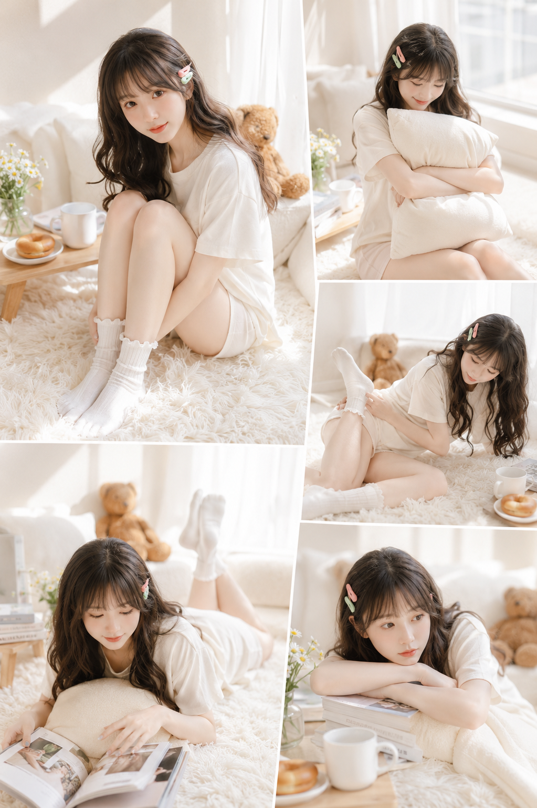
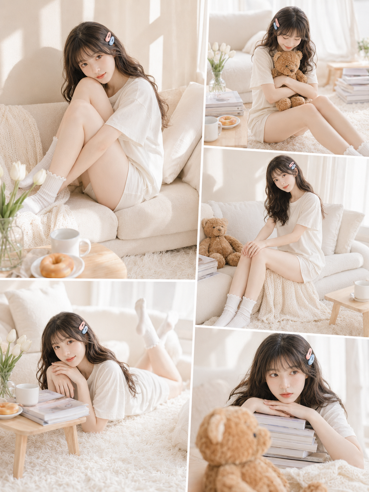
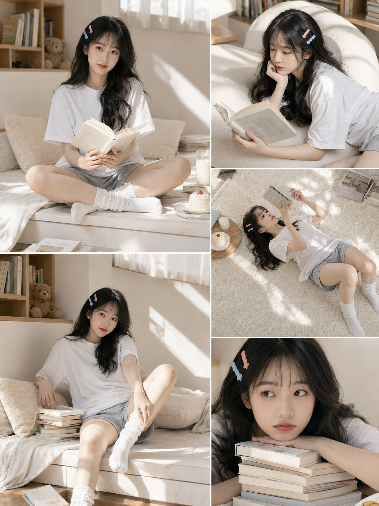
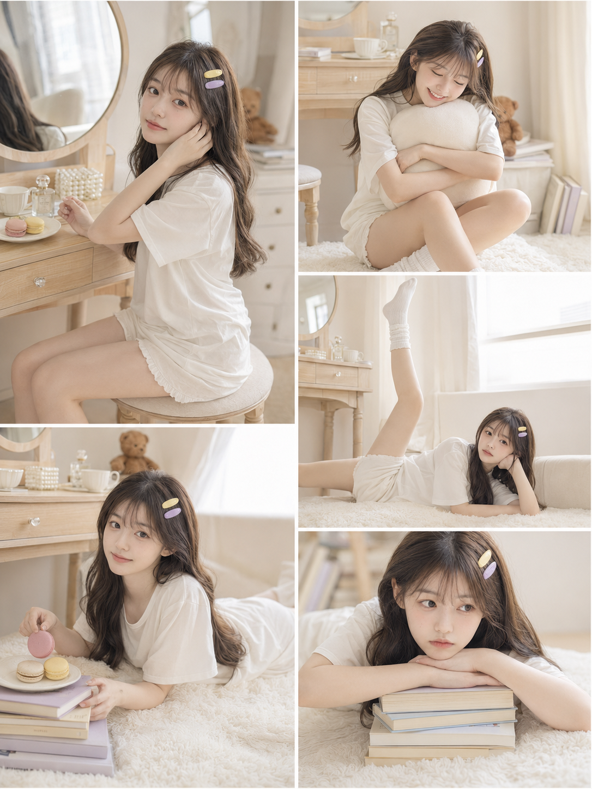
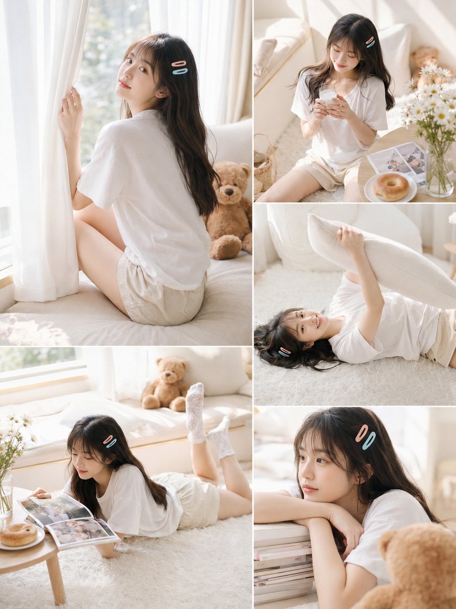
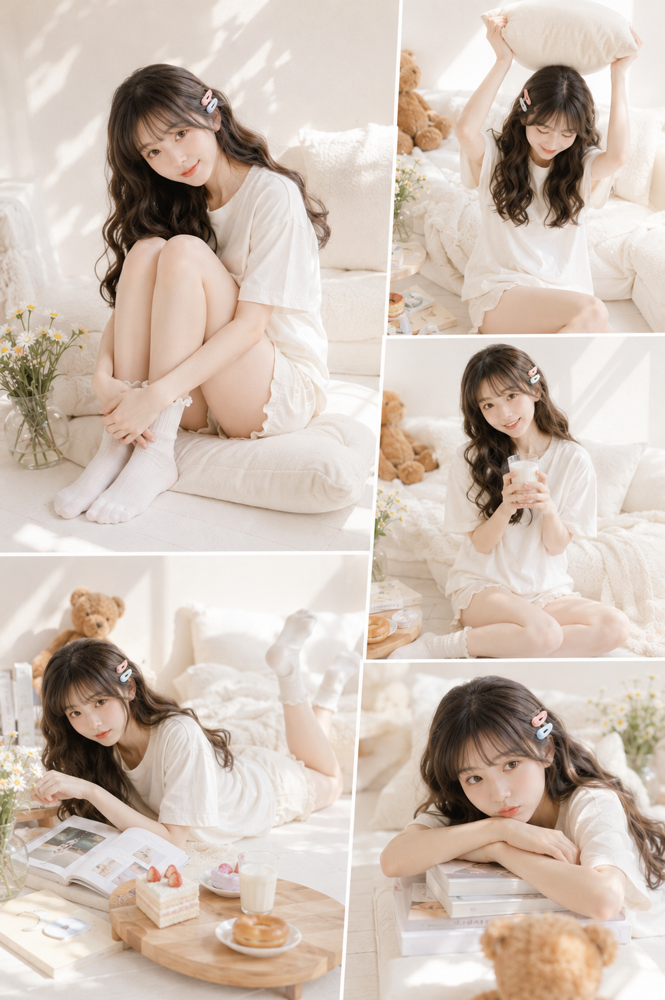

同一个人、同一套穿搭、同一个场景，AI 一次出 5 张不同瞬间，拼成杂志内页感的五宫格。这次做了 6 版奶油系居家场景，正文只放第一版。

提示词：
竖版 3:4 日系少女胶片风多图拼贴写真海报，5 张同一人物、同一空间、同一穿搭的写真组成时尚杂志式不规则拼贴版式，整体明亮、清透、软萌、治愈。19-21岁亚洲女生，黑棕色长发大波浪，空气刘海，右侧发间别蜜桃粉与薄荷绿发夹，五官清秀精致，面部干净，健康自然肤色。穿宽松奶油白短袖上衣搭配浅米白居家短裤，白色木耳边中筒袜。场景为奶油白窗边地毯休息区，白纱帘、蓬松抱枕、小雏菊、毛绒小熊。拼贴内容：抱膝回眸、抱靠枕低头笑、侧躺整理袜口、趴地翻杂志、托腮发呆五个瞬间。侧上方自然光穿过白纱帘，低饱和低对比、轻胶片颗粒，避免网红感、塑料皮肤、AI美女脸、手脚畸形。

#GPTImage2 #千问 #生图提示词 #Prompt #女友感自拍 #拼贴写真

