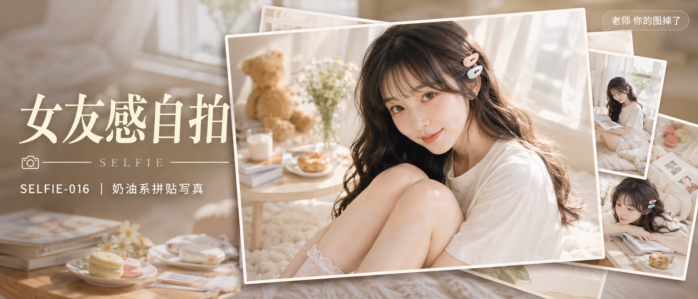

# SELFIE-016-奶油系拼贴写真 封面

## 封面提示词

奶油系少女拼贴写真封面，多图堆叠形成视觉层次感：前景为一位 19-21 岁亚洲女生的正脸大特写照片，黑棕色长发自然大波浪，轻薄空气刘海，右侧发间别浅蜜桃粉与浅薄荷绿两枚糖果感发夹，五官清秀精致，眼睛大而明亮，皮肤白皙通透，妆感干净清透，轮廓清晰上镜，眼神有神灵动，面部占画面三分之一以上，嘴角带自然温柔笑意，穿宽松奶油白短袖上衣，坐在白色长绒地毯上抱膝侧头看镜头，健康自然肤色，皮肤光泽细腻。这张主图以略微倾斜、带白色相框描边的照片形式叠放在最上层；背后错落堆叠 2-3 张同系列的模糊小图（窗边软垫、地毯翻书等居家场景剪影），呈现书桌拼贴、层层叠放的视觉效果，边缘带轻微投影，营造真实相片堆叠的立体感。背景为奶油白窗边虚化场景，白纱帘透光、暖色木质与蜜桃粉薄荷绿点缀，侧逆光打亮发丝与颧骨轮廓，柔光环绕面部。电影感光影，高清锐利，色彩层次丰富，视觉冲击力强，构图黄金比例，前景虚化背景，色调统一精致，画面有张力，商业写真级完成度。避免暴露、透视衣物、刻意强调身体部位、纯背影、纯侧脸、远景小人物、眼睛半闭、嘴巴微张、面部与手部畸形、背景杂乱，避免 AI 美女脸、网红感、过度精修、塑料皮肤、暗沉肤色、明显痘印、明显皱纹、斑点、面部变形，2.35:1 电影横构图。

【文字排版-必须完整保留，不得省略或简化任何一项】画面左侧垂直居中偏下叠加文字排版：超大号衬线字体米白色主文案「女友感自拍」，主文案正下方一条细横线左端带📷横线中央有透明英文水印 SELFIE，横线下方等宽白色字体副文案「SELFIE-016 ｜ 奶油系拼贴写真」；右上角浅色半透明圆角底衬配小号文字「老师 你的图掉了」（署名文字，必须出现，不可省略）；无整体蒙层，文字直接压图。【文字排版结束】

## 封面图片

