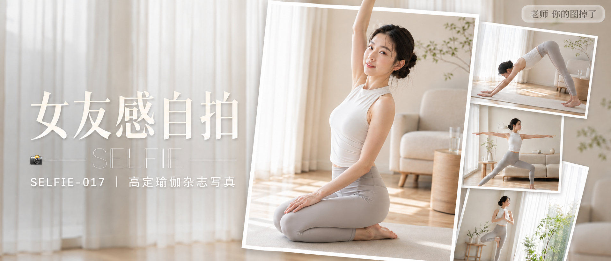

# SELFIE-017-高定瑜伽杂志写真 封面

## 封面提示词

高端瑜伽杂志封面，多图堆叠形成视觉层次感：前景为一张倾斜叠放、带白色相框描边的主图，画面中一位24岁漂亮亚洲女生跪坐在浅米灰色瑜伽垫上，上半身转向镜头呈3/4侧脸角度，黑棕色长发梳成干净松弛的低发髻，脸侧几缕柔软碎发，五官精致耐看，面部干净，眼神有神灵动、真实平静，皮肤白皙透亮、健康自然肤色，妆容清透，唇色水润，穿珍珠白高领无袖运动上衣与浅雾灰高腰瑜伽裤，一只手轻扶膝盖、另一只手臂优雅向上伸展打开胸腔，姿态松弛自信，面部占画面三分之一以上，侧逆光打亮颧骨与发丝轮廓，柔光环绕面部；背后错落堆叠 2-3 张同系列模糊小图（下犬式剪影、战士二式剪影、绿植窗边树式剪影），呈现杂志专题拼贴、层层叠放的立体效果，边缘带轻微投影，营造真实相片堆叠质感。背景为奶油白落地窗虚化场景，白纱帘透光，浅木色家具若隐若现，整体色调统一为奶油白、珍珠灰、浅木色。电影感光影，高清锐利，色彩层次丰富，视觉冲击力强，构图黄金比例，前景清晰背景虚化，色调统一精致，画面有张力，商业杂志封面级完成度。避免暴露、透视服装、衣物走光、刻意强调身体部位、软色情、擦边视角、纯背影、纯侧影、看不清表情的远景、眼睛半闭、嘴巴微张、面部与手部畸形、背景杂乱，避免AI美女脸、网红感、过度精修、塑料皮肤、暗沉肤色、明显痘印、明显皱纹、斑点、面部变形，2.35:1 电影横构图。

【文字排版-必须完整保留，不得省略或简化任何一项】画面左侧垂直居中偏下叠加文字排版：超大号衬线字体米白色主文案「女友感自拍」，主文案正下方一条细横线左端带📷横线中央有透明英文水印 SELFIE，横线下方等宽白色字体副文案「SELFIE-017 ｜ 高定瑜伽杂志写真」；右上角浅色半透明圆角底衬配小号文字「老师 你的图掉了」（署名文字，必须出现，不可省略）；无整体蒙层，文字直接压图。【文字排版结束】

## 封面图片

