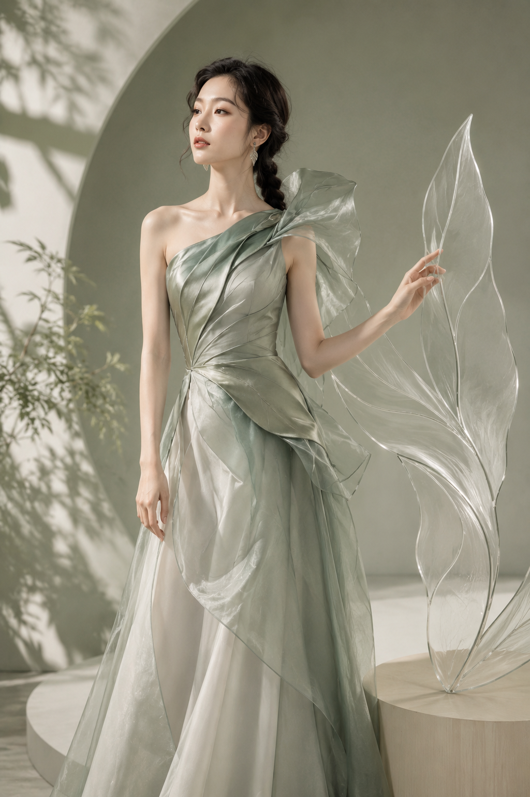
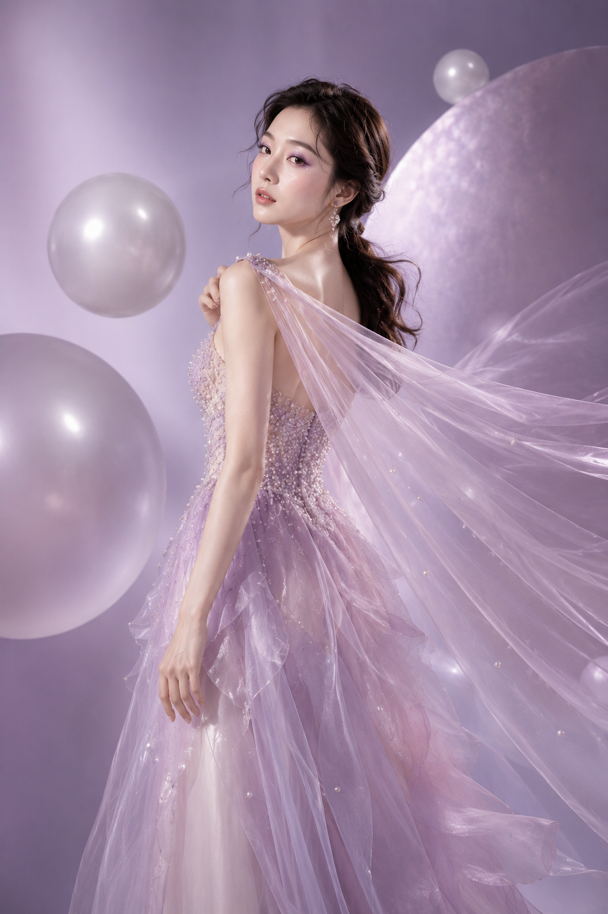
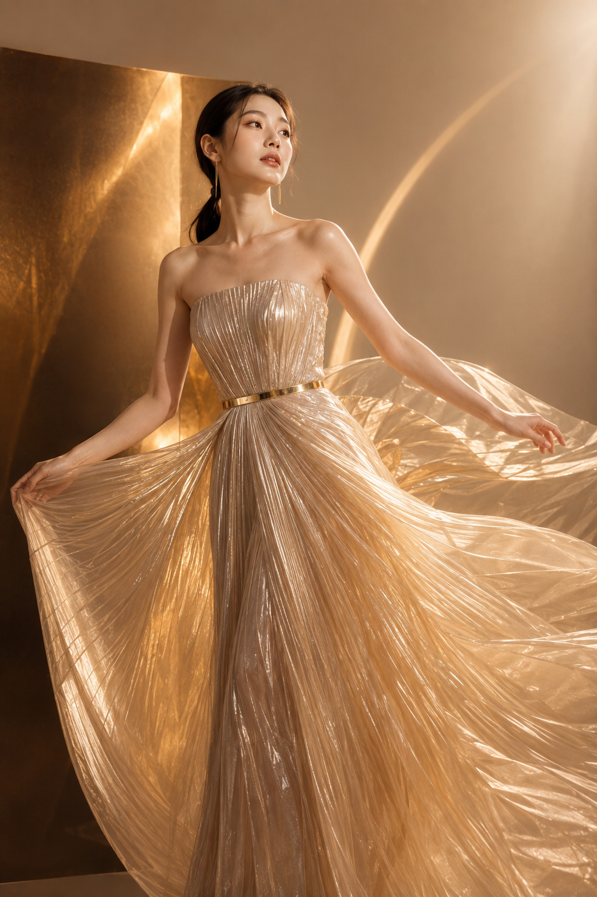

# 同一套写法框架，AI 拍出了 6 本不同的高定杂志封面

图友们大家好，今天分享一组和平时不太一样的内容——不是生活抓拍，而是高定时尚杂志封面。这类图看起来门槛很高，实际上背后是一套可以复用的"骨架"：人物设定 + 高定礼服 + 影棚布光 + 刊头排版，四块拼起来，换一套配色和材质词，就能生成完全不同气质的封面故事。

这次一口气设计了 6 个版本：冰川蓝水晶、酒红天鹅绒歌剧、鼠尾草植物雕塑、淡紫珍珠梦境、黑白建筑先锋、香槟金光影褶裥。色彩、材质、姿态、布景全都不一样，但你把它们并排看会发现——真正让每一版"看起来像正版杂志"的，从来不是礼服多华丽，而是文字排版指令有没有被认真对待。这也是今天想重点拆的地方。

正文完整放第一版「冰川蓝水晶」的提示词原文，你可以直接复制去改配色；其余 5 版，我把设计思路拆开讲，方便你按需替换成自己想要的风格。

---

**01｜冰川蓝水晶 —— 完整范本**

选它做正文范本，是因为这版的结构最典型：冷色调、雕塑感礼服、极简背景，三者统一在"克制"这个气质下，改动难度最低，最适合当模板用。

竖版2:3，高端国际时尚杂志封面，冰川蓝水晶高级定制主题，真实写实影棚摄影。画面主体是一位24岁漂亮亚洲女性，真实自然的东亚面孔，柔和鹅蛋脸，五官精致清秀，眼神冷静自信，皮肤白皙透亮，呈自然柔和的冷白肤色，保留细腻皮肤纹理和自然光泽，不惨白、不塑料。黑棕色长发梳成低位光滑盘发，耳侧留有两缕柔软弧形碎发，佩戴细长银色水晶耳坠。清透冷调妆容，灰蓝眼影、银白眼角高光、淡粉腮红、水润裸粉唇。她穿一件冰川蓝、雾白与透明银色组合的雕塑感高定礼服。上身为高领无袖结构，胸衣覆盖细密透明水晶、银线刺绣和冰裂纹珠片；左肩延伸出一片不规则透明硬纱，像冰层与玻璃薄片形成的抽象雕塑。腰部收束，下方裙摆由浅冰蓝欧根纱、银灰薄纱和半透明网纱组成，形成不对称斜向展开的巨大廓形，裙摆主要延伸至画面左下方，右侧保留排版空间。服装内衬完整，不透视、不暴露。人物采用站立三分之二侧身姿态，身体面向画面左侧，脸部转向镜头，右手轻扶腰部，左手自然垂落，姿态冷静、克制、像雕塑。背景为极简浅冰灰到雾蓝色渐变影棚，后方设置两块半透明磨砂亚克力板和一道狭长银色反光面，形成现代冰川建筑感，没有家具和花卉。顶部刊头使用虚构品牌名"AURELIA"，超大号白色Didot风格高对比衬线字体，横跨顶部，字母部分被人物头部与透明肩部造型遮挡。右侧排版准确清晰的英文文案："THE ICE ISSUE""CRYSTAL COUTURE""LIGHT / FORM / SILENCE"下方加入小字号窄体无衬线字体："VOLUME 08 — WINTER EDITION"排版采用衬线标题与极细无衬线小字混排，留白充足，文字不遮挡人物面部。大型柔光箱从左前上方照射，右后方加入冷白轮廓光，水晶、银线和透明薄纱出现细小锐利高光。全画幅相机，85mm镜头，f/4，眼平机位，人物和礼服主要结构清晰，背景平滑柔化。整体色彩为冰川蓝、雾白、银灰和少量深黑，高级时尚编辑摄影、奢侈品牌广告、冷静、清透、未来感、8K真实摄影质感。避免复刻香槟色蓬松公主裙，避免相同侧身双手交叠姿势，避免真实杂志品牌名称，避免文字乱码、错误拼写、字母重叠，避免AI美女脸、网红感、塑料皮肤、过度磨皮、面部变形、手指畸形、多余肢体、腰部过细、服装透视、低俗暴露、廉价塑料质感、背景杂乱、婚礼现场、花墙、动漫感、3D渲染感、水印、二维码、Logo错误。

拆开看这条提示词，真正决定"像正版杂志"而不是"AI 壁纸"的是三处细节：刊头文字被人物身体自然遮挡——"字母部分被人物头部与透明肩部造型遮挡"这句看似多余，实际是杂志封面的标准做法，真实刊物的刊头几乎从不完整躲在人物后面，会有遮挡关系；其次是留白位置提前规划，"裙摆主要延伸至画面左下方，右侧保留排版空间"这句直接把构图和文字区域绑定，避免生成完再抠图加字的尴尬；最后是姿态词只写了"冷静、克制、像雕塑"三个形容词，没有堆砌复杂动作，让 AI 有空间去处理服装的雕塑感，而不是被动作词分散注意力。

---

**02｜酒红天鹅绒歌剧 —— 用色彩定义"情绪基调"**

如果说冰川蓝版本讲的是"冷"，这一版就是反过来讲"暖而不艳"。深酒红、黑樱桃、暗金三色叠加，比单纯写"红色礼服"高级得多——单一色相容易显廉价，三个邻近色叠加才有高定质感。设计这版时特意让人物坐在方凳边缘而不是站立，是因为歌剧院主题需要更"从容"的姿态，坐姿天然比站姿松弛，配合天鹅绒帷幕背景，戏剧感立刻上来了。

**03｜鼠尾草植物雕塑 —— 用材质对抗"甜腻感"**

这一版最容易踩的坑是"植物主题"很容易滑向清新甜美风，跟高定杂志的距离感冲突。解法是把真实植物换成半透明亚克力雕塑——"布景只出现一件半透明亚克力叶片雕塑，不使用真实花墙和密集绿植"这句负向约束非常关键，它把"自然主题"和"廉价花墙感"精确切割开，同时用低饱和灰绿代替鲜绿，情绪就从"甜"变成了"静"。

**04｜淡紫珍珠梦境 —— 用姿态打破"标准脸"**

这版跟其他 5 版最大的不同是回望姿态：脸从肩上转回镜头，而不是常规的正面或侧身。这个小改动解决了一个常见问题——高定礼服图很容易拍成"人物僵硬地举着一件衣服"，而回望的动势天然带出披纱的飘动线条，人和衣服的关系变得自然。

**05｜黑白建筑先锋 —— 用负空间做"减法奢华"**

这一版几乎是前 4 版的反面：没有薄纱、没有珠片、没有柔光，靠几何阴影和纯色块本身撑起高级感。这提醒了一件事——高定感不等于堆砌材质，把礼服写成"建筑立面"，用硬光在墙面投出清晰阴影，减法有时候比加法更有杂志封面的先锋气质。

**06｜香槟金光影褶裥 —— 用风机制造"活的瞬间"**

最后这版加入了一个前 5 版都没有的变量：风机制造的裙摆动态。"飞扬裙摆末端轻微动态模糊"这句让整张图从"摆拍定格"变成"抓拍瞬间"，配合模拟低角度金色日光，画面立刻活了起来，这也是所有静态高定封面里最容易被忽视、但效果提升最明显的一个变量。

---

六版看下来，真正的差异不在配色表，而在"哪个变量被当成主控"——冰川蓝主控的是遮挡关系，酒红主控的是姿态松弛度，鼠尾草主控的是材质替代，淡紫主控的是回望动势，黑白主控的是负空间，香槟金主控的是动态风。设计一版新的高定封面之前，先问自己一句：这版想让 AI 优先处理哪个变量？想清楚这一点，剩下的配色和材质词只是填空。

跟 AI 交互的时候还有一个通用经验：文字排版指令必须单独成段，用括号或标记包起来强调"必须完整保留"，不能和画面描述用逗号连在一起写。长提示词里，模型天然会优先保证画面主体正确，排版细节混在描述里很容易被弱化甚至丢失——这也是这套六联提示词全部把刊头文案单独分行、用引号框出来的原因。

不同模型的适配上，GPT Image 对长句文字排版的还原度最稳，千问对色彩层次的把控更细腻，豆包出图速度快、适合先跑草稿定构图再精修。

---

存下这套框架，觉得有用的话点个赞和在看，评论区告诉我你最想看哪种风格的杂志封面——中式旗袍高定？赛博机能风？还是复古好莱坞？下一期安排。

---

## 往期回顾

- SELFIE-017 高定瑜伽杂志写真
- SELFIE-016 奶油系拼贴写真
- SELFIE-015 东方水境幻想写真

#GPTImage2 #千问 #豆包 #生图提示词 #Prompt #女友感自拍 #高定杂志封面
