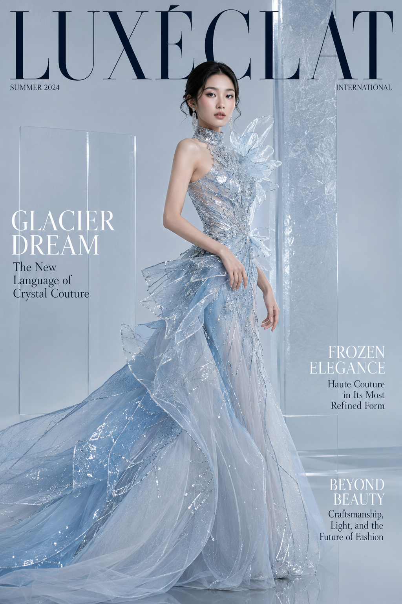
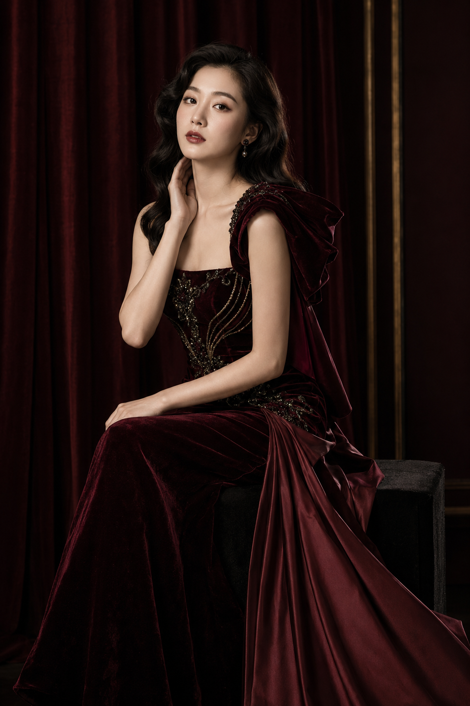
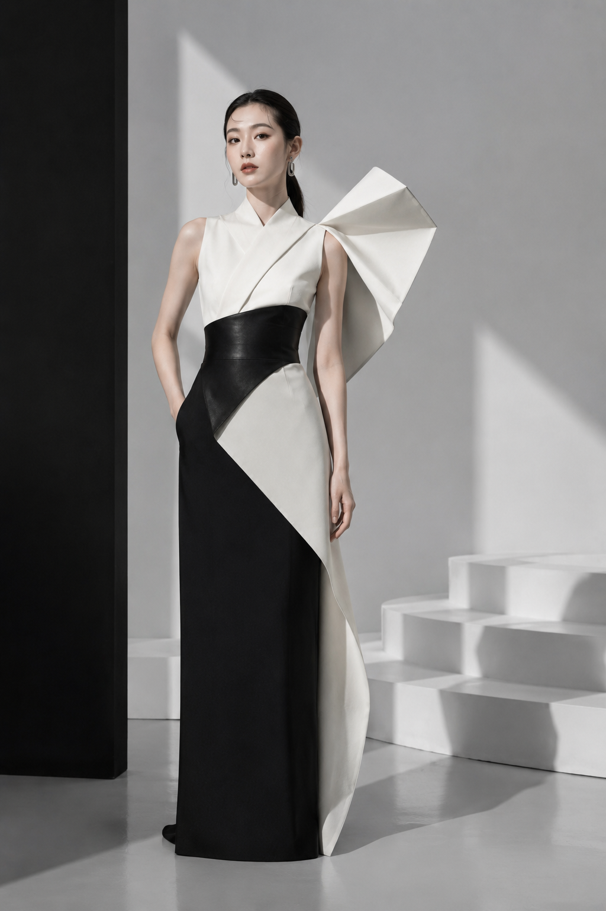

高定时尚杂志封面这类图看起来门槛很高，实际上背后是一套可以复用的骨架：人物设定+高定礼服+影棚布光+刊头排版，四块拼起来，换一套配色和材质词，就能生成完全不同气质的封面故事。这一期一口气设计了6个版本，这里拆解其中的关键设计逻辑和完整提示词。

**为什么这套骨架能拍出"像正版杂志"而不是"AI壁纸"的效果**

真正决定质感的不是礼服多华丽，而是三处细节：刊头文字要被人物身体自然遮挡（真实杂志的刊头几乎从不完整躲在人物后面，会有遮挡关系）；留白位置要提前规划，把构图和文字区域绑定，避免生成完再抠图加字；姿态词只写关键的2-3个形容词，不堆砌复杂动作，让AI有空间处理服装本身的雕塑感。

**冰川蓝水晶——完整范本**

选它做范本，是因为这版结构最典型：冷色调、雕塑感礼服、极简背景，三者统一在"克制"这个气质下，改动难度最低。

提示词：
竖版2:3，高端国际时尚杂志封面，冰川蓝水晶高级定制主题，真实写实影棚摄影。画面主体是一位24岁漂亮亚洲女性，真实自然的东亚面孔，柔和鹅蛋脸，五官精致清秀，面部干净，眼神冷静自信真实，皮肤白皙透亮，呈自然柔和的冷白肤色，保留细腻皮肤纹理和自然光泽，健康自然肤色，不惨白、不塑料。黑棕色长发梳成低位光滑盘发，耳侧留有两缕柔软弧形碎发，佩戴细长银色水晶耳坠。清透冷调妆容，灰蓝眼影、银白眼角高光、淡粉腮红、水润裸粉唇。她穿一件冰川蓝、雾白与透明银色组合的雕塑感高定礼服。上身为高领无袖结构，胸衣覆盖细密透明水晶、银线刺绣和冰裂纹珠片；左肩延伸出一片不规则透明硬纱，像冰层与玻璃薄片形成的抽象雕塑。腰部收束，下方裙摆由浅冰蓝欧根纱、银灰薄纱和半透明网纱组成，形成不对称斜向展开的巨大廓形，裙摆主要延伸至画面左下方，右侧保留排版空间。服装内衬完整，不透视、不暴露。人物采用站立三分之二侧身姿态，身体面向画面左侧，脸部转向镜头，右手轻扶腰部，左手自然垂落，姿态冷静、克制、像雕塑。背景为极简浅冰灰到雾蓝色渐变影棚，后方设置两块半透明磨砂亚克力板和一道狭长银色反光面，形成现代冰川建筑感。大型柔光箱从左前上方照射，右后方加入冷白轮廓光。全画幅相机，85mm镜头，f/4，眼平机位。整体色彩为冰川蓝、雾白、银灰和少量深黑。避免复刻香槟色蓬松公主裙、相同侧身双手交叠姿势、文字乱码、AI美女脸、网红感、塑料皮肤、过度精修、暗沉肤色、明显痘印、明显皱纹、斑点、面部变形、手指畸形。

**酒红天鹅绒歌剧——用色彩定义情绪基调**

深酒红、黑樱桃、暗金三色叠加，比单纯写"红色礼服"高级得多——单一色相容易显廉价，邻近色叠加才有高定质感。让人物坐在方凳边缘而不是站立，是因为歌剧院主题需要更从容的姿态，坐姿天然比站姿松弛。

**黑白建筑先锋——用负空间做减法奢华**

这一版没有薄纱、没有珠片、没有柔光，靠几何阴影和纯色块本身撑起高级感。高定感不等于堆砌材质，把礼服写成"建筑立面"，用硬光在墙面投出清晰阴影，减法有时候比加法更有先锋气质。

**关键参数说明**

- "刊头文字被人物头部/肩部自然遮挡"：这是杂志封面区别于AI壁纸的核心细节，真实刊物文字与人物之间存在遮挡关系。
- "裙摆延伸方向+留白位置"：提前把构图和排版区域绑定在提示词里，避免生成后再抠图加字。
- "姿态词只写2-3个形容词"：不堆砌复杂动作，给AI留出处理服装结构的空间。
- "邻近色叠加代替单一色相"：三个邻近色（如深酒红+黑樱桃+暗金）比写"红色"更有高定质感。

**可替换的元素**

- 配色：冰川蓝可换成中式旗袍红、赛博机能银紫，姿态和布光逻辑不用改。
- 材质：薄纱可换成天鹅绒、金属褶纱或建筑感硬质面料，决定整体情绪基调。
- 主控变量：每一版可以选一个变量重点强化——遮挡关系、姿态松弛度、材质替代、回望动势、负空间或动态风，其余变量做减法。

#生图提示词 #GPTImage2 #千问 #豆包 #女友感自拍 #高定杂志封面
