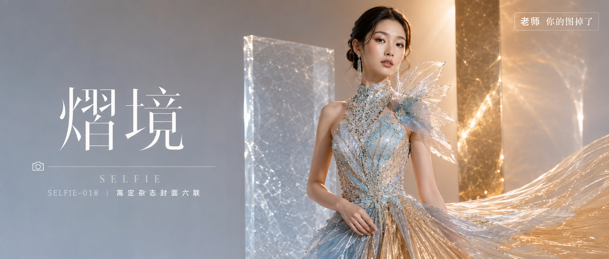

# SELFIE-018-高定杂志封面六联 封面

## 封面提示词

竖版2:3，高端国际时尚杂志封面，融合冰川蓝水晶与香槟金光影的双色高级定制主题，真实写实影棚摄影。画面主体是一位24岁漂亮亚洲女性，真实自然的东亚面孔，柔和鹅蛋脸，五官精致清秀，面部干净，眼神明亮自信真实，皮肤白皙透亮，呈自然柔和的暖白肤色，保留细腻皮肤纹理和自然光泽，健康自然肤色，颧骨与锁骨带细腻金色高光。黑棕色长发梳成低位光滑盘发，耳侧留有两缕柔软弧形碎发，佩戴细长银色水晶耳坠。清透妆容，冷调灰蓝眼影过渡到暖金色眼尾、银白眼角高光、水润裸粉唇，冷暖双色在脸部形成柔和过渡。她穿一件冰川蓝渐变香槟金的雕塑感高定礼服，上身高领无袖结构，胸衣覆盖细密透明水晶与金色亮片交织的刺绣；左肩延伸出一片不规则透明硬纱，右下方裙摆由浅冰蓝欧根纱过渡到香槟金褶纱，形成冷暖交融的巨大廓形，服装内衬完整、不透视、不暴露。人物为正脸转向镜头三分之二侧身站姿，面部占画面上半部分明显比例，五官精致自然、面部立体清晰、皮肤光泽细腻、眼神有神灵动、妆感干净清透，右手轻扶腰部，姿态冷静自信，侧逆光打亮颧骨。背景为极简浅冰灰到暖香槟渐变影棚，后方设置两块半透明磨砂亚克力板和一道狭长金色反光面，冷暖光带在背景交汇，形成现代梦境建筑感。大型柔光箱从左前上方照射，右后方加入暖金色轮廓光，水晶、金线和透明薄纱出现细小锐利高光。全画幅相机，85mm镜头，f/4，眼平机位，人物面部与礼服主要结构清晰锐利，背景平滑柔化，构图黄金比例，前景虚化背景，色调统一精致，视觉冲击力强，电影感光影，2.35:1 电影横构图。

【文字排版-必须完整保留，不得省略或简化任何一项】画面左侧垂直居中偏下叠加文字排版：超大号衬线字体米白色主文案「熠境」，主文案正下方一条细横线左端带📷图标横线中央有透明英文水印 SELFIE，横线下方等宽白色字体副文案「SELFIE-018 ｜ 高定杂志封面六联」；右上角浅色半透明圆角底衬配小号文字「老师 你的图掉了」（署名文字，必须出现，不可省略）；无整体蒙层，文字直接压图。【文字排版结束】

避免复刻香槟色蓬松公主裙，避免相同侧身双手交叠姿势，避免真实杂志品牌名称，避免文字乱码、错误拼写、字母重叠，避免 AI 美女脸、网红感、塑料皮肤、过度精修、暗沉肤色、明显痘印、明显皱纹、斑点、面部变形、手指畸形、多余肢体、腰部过细、服装透视、低俗暴露、廉价塑料质感、背景杂乱、婚礼现场、花墙、动漫感、3D渲染感、水印、二维码、Logo错误、纯背影、纯远景看不清表情。

## 封面图片

