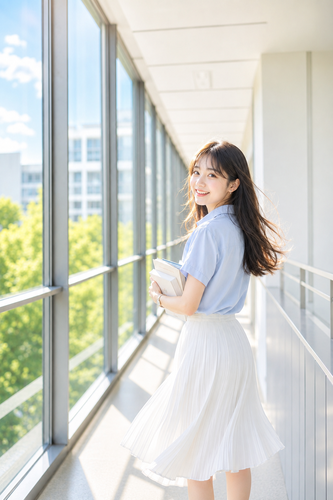
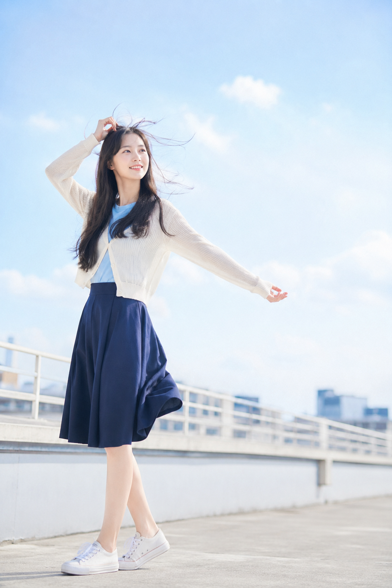
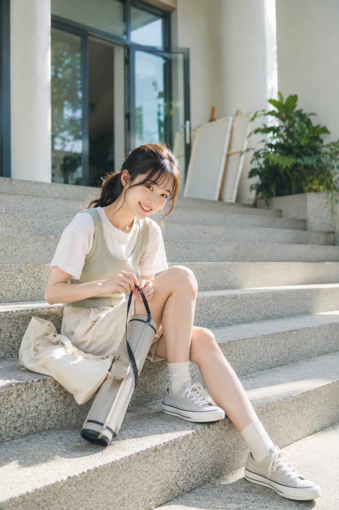
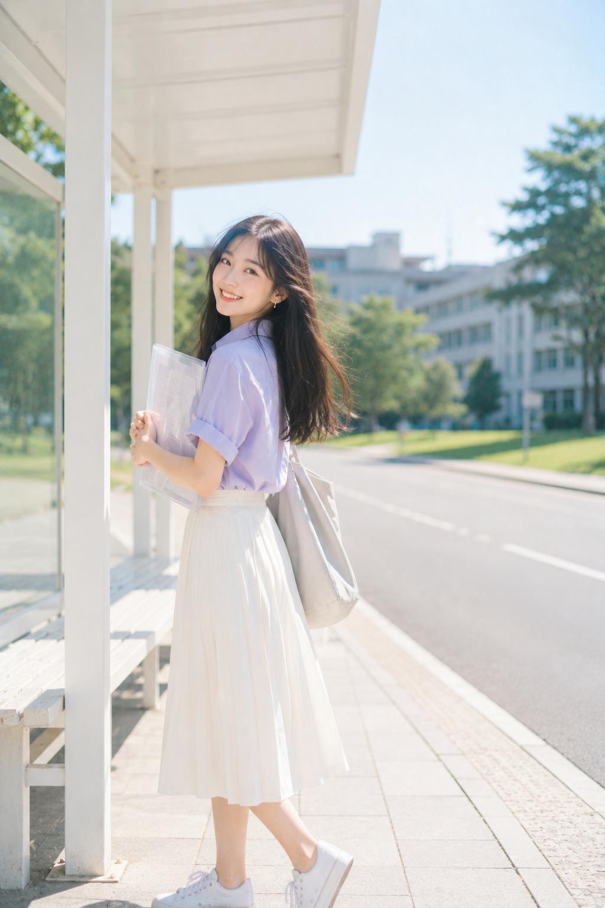
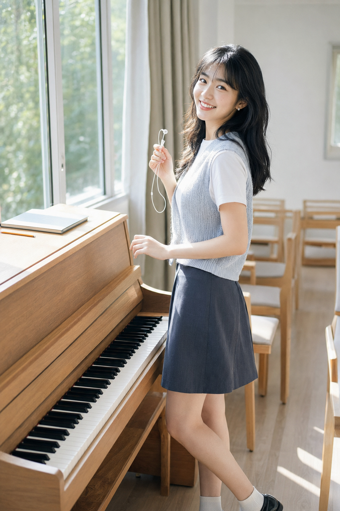

# 不用回学校，AI 把校园青春感六个瞬间都拍全了

<table style="width:100%; border-collapse:collapse; margin:0;"><tr>
<td style="width:50%; padding:0 4px 0 0;"></td>
<td style="width:50%; padding:0 0 0 4px;"></td>
</tr></table>

图友们大家好，今天这一期主题是校园青春感——不是滤镜堆出来的"网红校服风"，而是那种玻璃连廊里小跑几步的回望、天台上迎风张开手臂的一瞬、图书馆窗边惊喜的抬眼，明快、鲜活、蓬勃。

这类主题最容易翻车的地方，反而不是"好不好看"，而是怎么把"青春"和"未成年感/制服感/低俗感"精确地分开。这次设计的 6 个场景，每一条提示词末尾都刻意堆了一长串负向约束，专门用来卡住这条线——这也是今天想重点聊的设计思路。

正文完整放第一版「玻璃长廊」的提示词原文，你可以直接复制去改场景；其余 5 版，把设计思路拆开讲，方便你按需替换成自己想要的校园场景。

---

**01｜玻璃长廊 · 抱书回望 —— 完整范本**

选它做正文范本，是因为这版最能体现这次的核心调整：把"缓慢行走后自然转头"改成"轻快小跑几步后自然转头回望"，加上灿烂笑容和大幅飞扬的发丝裙摆，同一个场景瞬间从"安静写真"变成了"活力瞬间"。

竖版 2:3 明媚活力校园人像摄影，一位 21 岁成年亚洲女生站在现代教学楼的玻璃连廊中，黑棕色长发自然披肩，发尾带轻微柔软弧度，中分空气感刘海，五官清秀灵动，健康白皙肤色，保留细腻自然皮肤纹理，淡粉色眼妆与裸粉唇色，眼神明亮有神、笑意盈盈，面部干净，笑容灿烂真实，气质青春朝气、活力满满。她穿浅雾蓝色短袖衬衫，领口整洁，下身搭配白色高腰过膝百褶裙，佩戴小巧银色耳钉和细窄腕表，服装清爽得体，不透、不紧身。女生怀中抱着两本浅色封面的书，沿连廊轻快小跑几步后自然转头回望镜头，笑容明快，身体保持前行方向，裙摆与发丝被微风大幅带起飞扬，动作轻盈鲜活、朝气蓬勃。场景为明亮通透的校园玻璃连廊，一侧是通透落地窗，另一侧是白色墙面与浅灰金属栏杆，窗外可见明媚绿色树冠、白色教学楼和晴朗蓝天。人物位于画面右侧黄金分割位置，左侧保留连续窗框、暖阳光斑和纵深透视，取景从头部到小腿，平视机位，走廊线条自然汇聚至远处，形成明快而有活力的空间纵深。使用 70–85mm 人像镜头，f/2.0 浅景深，人物眼睛、脸部、发丝和衣料纹理清晰，远处走廊柔和虚化。清晨明亮自然光从左侧窗户洒入，在发丝、肩部和裙摆边缘形成灿烂金白色轮廓光，面部有明亮均匀的侧前方补光。整体采用亮白、天蓝、暖阳金和鼠尾草绿配色，高明度、清透明快、轻微高光泛光与空气感柔焦，画面如青春校园电影剧照与活力四射的韩系校园写真融合，明媚、鲜活、蓬勃、自然。避免原图同款白衬衫加深色领带、避免蕾丝蛋糕短裙、避免手放锁骨姿势；避免未成年外观、幼态化、过度性感、短裙走光、透视衣物、夸张摆拍；避免网红脸、浓妆、塑料皮肤、过度磨皮、面部变形、左右眼不一致；避免手指畸形、肢体比例错误、背景人群、杂乱标识、乱码文字、校徽、Logo、水印、过曝死白、强烈暖黄色调、HDR、动漫感和明显 AI 痕迹。

拆开看，这条提示词里真正在"提活力感"的是三处：动作词从"缓慢行走"改成"轻快小跑几步"，配合"裙摆与发丝被微风大幅带起飞扬"，画面立刻有了动势；其次是表情词直接写"笑容灿烂真实""笑意盈盈"，而不是含糊的"表情自然"，AI 对具体情绪词的响应比模糊形容词稳定得多；最后是光线从冷白低饱和调整为"亮白、天蓝、暖阳金"，暖色调的加入天然会让画面更明媚，青春感很大程度上是"光"给的，不只是靠人物表情。

---

**02｜校园天台 · 迎风整理发丝 —— 用"踮脚+张手"动作放大活力**

天台是这六个场景里唯一有真实风险联想的地点，安全边界依然要卡死——"站在天台围栏前方的安全区域"放在正向描述最前面，配合负向约束双重锁定。在这个前提下，把姿态从"整理发丝"升级成"踮起脚尖、一只手扬起、一只手像拥抱阳光一样张开"，整个人的身体线条从"站定"变成"跃动"，配合大幅飞扬的发丝，天台瞬间从"安静眺望"变成了"迎风奔跑前的一瞬"。

**03｜艺术楼阶梯 · 低头系画筒 —— 用"未完成动作"替代摆拍**

这版想解决的问题依然是"人像照太容易看起来是在等镜头"，解法不变：让人物的注意力放在画筒的细带上，而不是镜头上。这次调整的是动作的"手感"——从"动作自然细致"改成"灵巧地整理""轻快活泼"，抬眼时配上笑容而不是单纯的"略微抬眼"，同一个抓拍瞬间，情绪浓度完全不同。

**04｜图书馆窗边 · 翻页抬眼 —— 用"意外的惊喜感"打破安静基调**

图书馆场景最容易显得过于安静克制，这版把"自然抬眼望向镜头"改成"惊喜地抬眼，嘴角上扬带着灿烂笑容"，一个情绪反应词就能让"知性"和"活力"不冲突——安静的场景 + 一瞬间的惊喜表情，比全程板着脸的"知性人设"更有代入感。

**05｜校园巴士站 · 手持透明文件夹 —— 用回头动作制造"被抓拍"错觉**

这版的核心变量依然是"像等待校车时被同行朋友抓拍"这句场景动机描述——写清楚"谁在拍、为什么拍"，比堆砌姿势词更能让画面显得真实自然。这次额外加了"笑着回头""神情灿烂放松"，让"被抓拍"的瞬间从"淡然"变成"开心被抓包"，代入感更强。

**06｜音乐教室 · 窗边收起耳机 —— 用小道具带出叙事感**

最后这版依然保留前 5 版都没有的元素：一副刚摘下的有线耳机。这个小动作自带"上一秒还在听什么"的联想空间，这次把"轻扶钢琴边缘"改成"身体轻快转向窗外，笑着侧过脸"，配合钢琴和明亮窗光，青春电影感从"安静克制"变成了"轻快雀跃"。

---

六个场景放在一起看，这次改写真正在动的其实是三类词：动作词（小跑/踮脚/灵巧）、情绪词（笑意盈盈/惊喜/灿烂）、光线词（暖阳金/明亮/灿烂高光），场景、构图、服装几乎没变，光是把这三类词从"克制"换成"鲜活"，同一批场景的气质就从"安静写真"变成了"活力四射的校园瞬间"。这也是判断一版提示词"够不够有精神头"最快的自查方法：挑出这三类词看一遍，就知道问题出在哪。

跟 AI 交互时还有一个通用经验：笑容和活力感必须写具体，"表情自然"这种模糊词 AI 很容易理解成"面无表情"——换成"笑容灿烂真实""笑意盈盈""惊喜地抬眼"这类具体情绪描述，生成结果的稳定性会明显更高，同时正向描述里依然要主动写"不透、不紧身""安全区域"这类边界词，负向约束是兜底，正向的边界描述才是主控。

不同模型的适配上，GPT Image 对复杂场景的空间透视还原最稳，千问对冷色调的层次把控更细腻，豆包出图速度快、适合先跑草稿定构图再精修。

---

存下这套校园场景库，觉得有用的话点个赞和在看，评论区告诉我你还想看哪个校园角落——操场跑道？天台顶楼？还是宿舍楼下？下一期安排。

---

## 往期回顾

- SELFIE-018 高定杂志封面六联
- SELFIE-017 高定瑜伽杂志写真
- SELFIE-016 奶油系拼贴写真

#GPTImage2 #千问 #豆包 #生图提示词 #Prompt #女友感自拍 #校园青春
