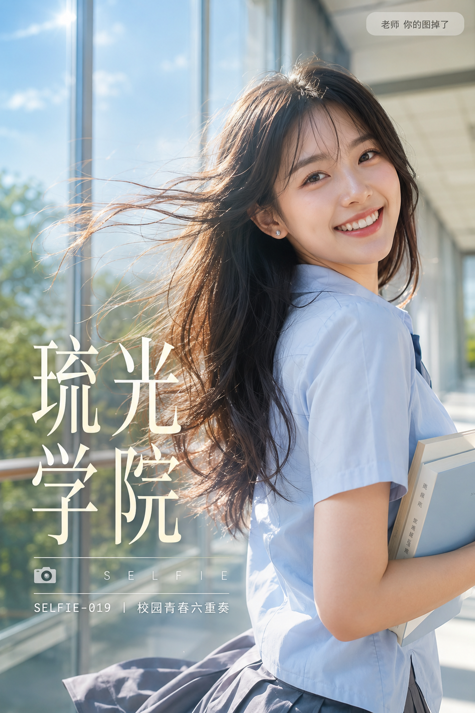

# SELFIE-019-校园青春六重奏 封面

## 封面提示词

竖版2:3，高端青春校园主题杂志封面，真实写实人像摄影，融合玻璃通透质感与明媚晨光。画面主体是一位22岁漂亮亚洲女生，真实自然的东亚面孔，柔和鹅蛋脸，五官自然清秀，面部干净，眼神明亮真实、笑意盈盈，健康白皙肤色，保留细腻自然皮肤纹理和自然光泽，不惨白、不塑料，气质青春洋溢、活力四射。黑棕色长发自然披肩，发尾带轻微柔软弧度，中分空气感刘海，耳侧佩戴小巧银色耳钉。清透淡妆，淡粉色眼妆与裸粉唇色，笑容灿烂真实。她穿浅雾蓝色短袖衬衫，领口整洁，怀中抱着两本浅色封面的书。人物采用正脸转向镜头的三分之二侧身站姿，面部占画面上半部分明显比例，五官精致自然、皮肤光泽细腻、眼神有神灵动，身体轻快前倾像刚跑动回头一样，发丝和裙摆被微风大幅带起飞扬，姿态鲜活灵动、充满少女活力与朝气。背景为明亮通透的校园玻璃连廊，一侧是落地窗，窗外可见明媚绿色树冠和晴朗蓝天，光线通透明快。侧逆光从左后方照射，在发丝、肩部边缘形成灿烂金白色轮廓光，柔光箱式补光打亮面部，颧骨与鼻梁带自然高光。全画幅相机，85mm镜头，f/2.0，人物面部与发丝清晰锐利，背景平滑柔化，构图黄金比例，前景虚化背景，色调统一精致，视觉冲击力强，电影感光影，2.35:1 电影横构图，亮白、天蓝、暖阳金和鼠尾草绿配色，高级清透且明快鲜活的质感。

【文字排版-必须完整保留，不得省略或简化任何一项】画面左侧垂直居中偏下叠加文字排版：超大号衬线字体米白色主文案「琉光学院」，主文案正下方一条细横线左端带📷图标横线中央有透明英文水印 SELFIE，横线下方等宽白色字体副文案「SELFIE-019 ｜ 校园青春六重奏」；右上角浅色半透明圆角底衬配小号文字「老师 你的图掉了」（署名文字，必须出现，不可省略）；无整体蒙层，文字直接压图。【文字排版结束】

避免未成年外观、幼态化、过度性感、短裙走光、透视衣物、夸张摆拍；避免手指畸形、肢体比例错误、背景人群、杂乱标识、乱码文字、校徽、Logo错误、水印重叠、过曝死白、强烈暖黄色调、HDR、动漫感；避免 AI 美女脸、网红感、过度精修、塑料皮肤、暗沉肤色、明显痘印、明显皱纹、斑点、面部变形、纯背影、纯远景看不清表情。

## 封面图片

