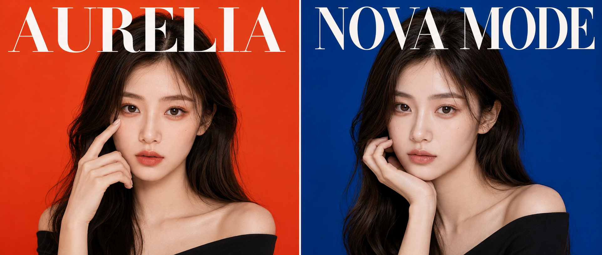
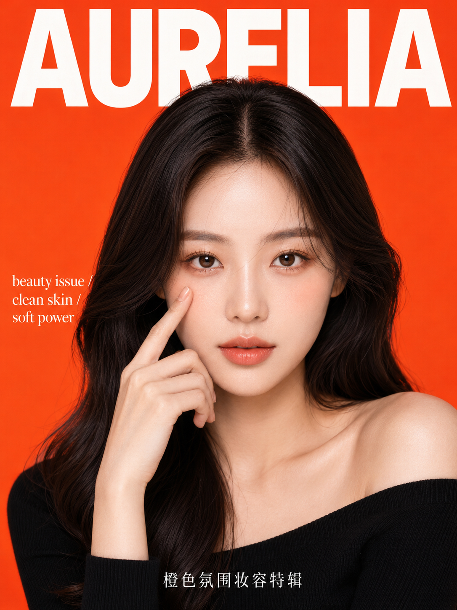
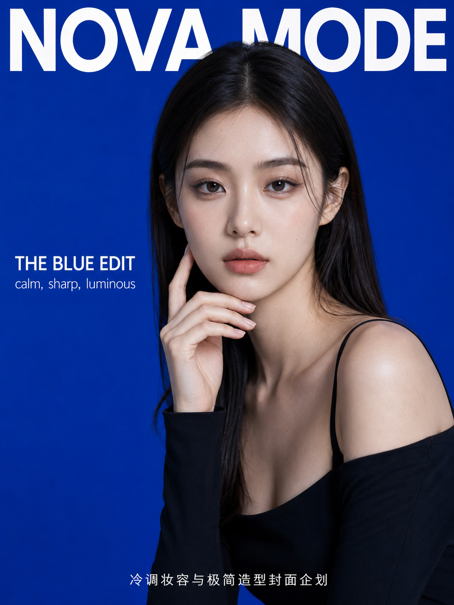
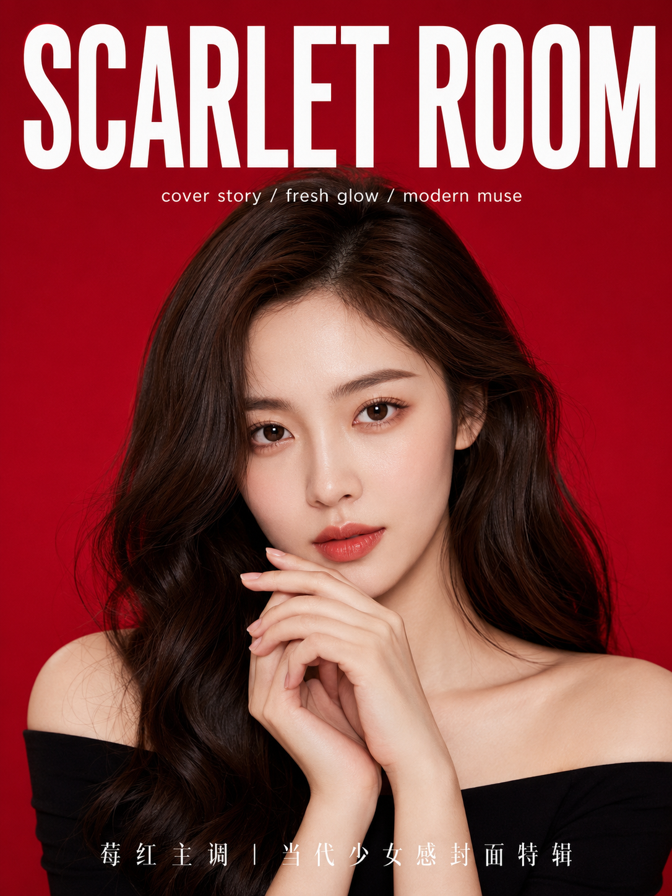
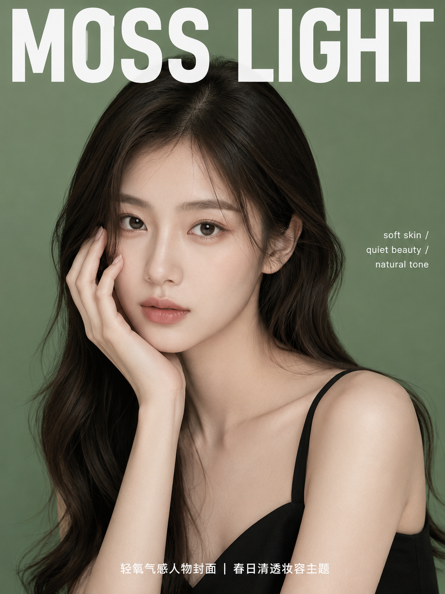
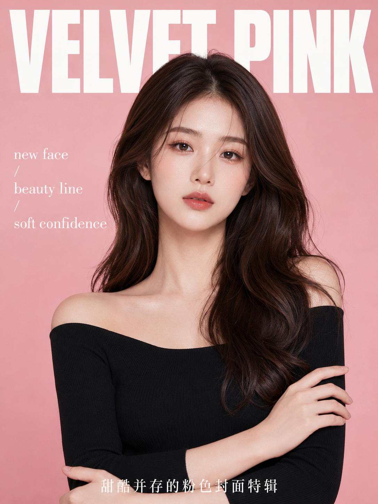
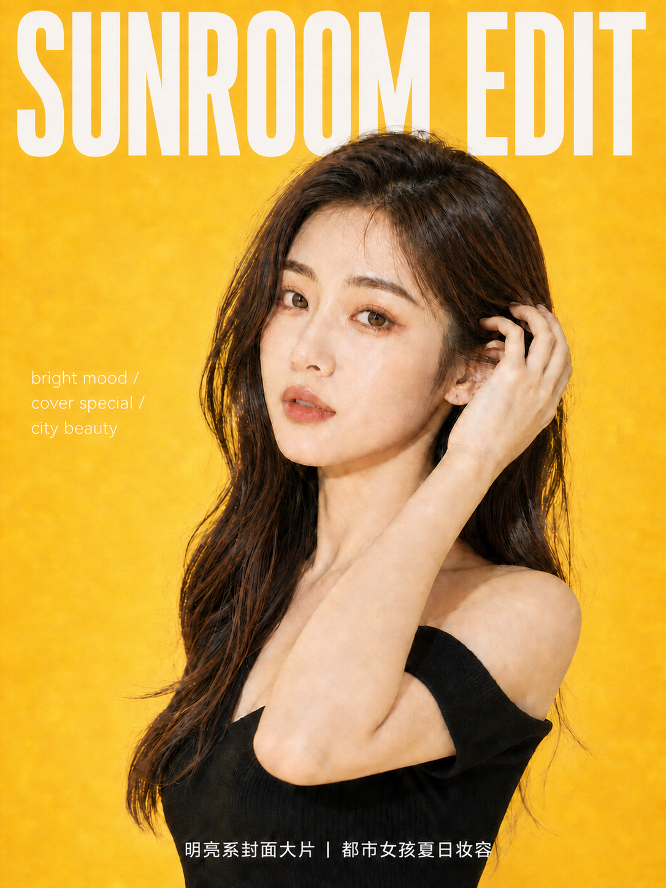

# 一张脸切换 6 种高级色域，AI 做出了整套美妆女刊封面

先看顶部横向两宫格：左边橙红热烈，右边钴蓝冷静。同一类棚拍人像，只要改变色域、手势和刊头层级，就能从一张普通的美妆照，变成六种性格完全不同的封面。

**本期实验：** 人物都使用黑色极简上衣、85mm 人像镜头和纯色棚拍背景，将变量集中在背景颜色、妆容色调、手部动作与版式节奏上。

**测试结论：** 背景色决定第一印象，手势决定人物的性格，刊头决定它像照片还是封面。

---

**#01 ｜ 橙红·指尖点脸**

橙红是六组里最能抢住视线的颜色。食指轻点苹果肌，会把视线从大面积色块引回眼神和妆面，很适合做彩妆首页。这一张放出完整原版，其他 case 只讲设计思路。

竖版 3:4，高级时尚美妆杂志封面，韩系商业棚拍人像，极简纯色背景，背景为高饱和橙红色，画面干净利落、明亮通透、时尚感强。主体是一位 22 岁左右亚洲女生，真实自然的东亚面孔，柔和鹅蛋脸，五官精致清秀，面部干净，眼神平静自信，直视镜头，皮肤白皙通透但保留自然纹理，不过度磨皮。深棕色长卷发，自然中分，发丝柔顺有光泽，披散在肩前。妆容为精致韩系淡妆，暖棕色眼妆，细长睫毛，淡珊瑚色腮红，裸橘粉唇色，整体高级克制。穿黑色一字肩针织上衣，修身剪裁，露出肩颈与锁骨，一侧肩部自然下滑。人物为胸像近景构图，位于画面中央，一只手抬起，食指轻轻点在眼下苹果肌位置，姿态优雅克制，另一只手不出镜。85mm 人像镜头，平视机位，商业影棚柔光布光，面部受光均匀，眼神光清晰，细节锐利。顶部加入超大白色英文刊头，使用超粗几何无衬线字体，字距紧凑，横向铺满画面，上方文案为 “AURELIA”。中部偏左加入小号排版文案：“beauty issue / clean skin / soft power”。底部加入一行简洁副标题：“橙色氛围妆容特辑”。整体像高端彩妆广告与潮流杂志封面结合的视觉效果。画面中不要右下角水印，不要品牌图案，不要二维码，不要多余 logo，不要乱码文字。

> 核心变量：高饱和暖色 + 指尖视线引导 + 超粗白色刊头。

---

**#02 ｜ 钴蓝·手托下巴**

钴蓝与黑色服装构成冷静、锋利的大色块。托下巴不是为了卖萌，而是用手指线条加强下颌轮廓。冷色封面的关键是眼神要亮，否则画面容易显得沉。

> 核心变量：冷蓝色域 + 下颌线引导 + 加宽无衬线字。

---

**#03 ｜ 莓红·双手轻叠**

莓红比正红少一点攻击性，却比粉色更有成熟度。双手靠近下巴会让画面更精致，但也是最容易出现关节错位的一组，所以要明确写出“轻轻交叠”和“五指完整”。

> 核心变量：莓果色调 + 柔雾妆感 + 手部交叠层次。

---

**#04 ｜ 鼠尾草绿·侧手贴脸**

鼠尾草绿的优势不在“鲜”，而在于它能把皮肤显得清透。手掌贴脸为平整背景增加一条斜向轮廓，让安静的画面不至于平。这组应减少高对比阴影，保留氧气感。

> 核心变量：低饱和绿 + 轻阴影 + 右侧留白排版。

---

**#05 ｜ 奶油粉·双臂交叉**

奶油粉与黑色是最容易出现“甜酷”反差的一组。双臂交叉能增加稳定感，避免粉色落入幼龄化。排版上使用粗重白字，也是在给柔和背景加一层结构。

> 核心变量：粉黑撞色 + 封闭式动作 + 粗重刊头。

---

**#06 ｜ 暖黄·回眸扶发**

暖黄是六张里动态感最强的收尾。身体侧转、脸回到镜头，再加上轻扶耳侧发丝，会产生封面快照般的瞬间感。黄色容易影响肤色，因此妆容使用暖杏和珊瑚色，比强行做白更自然。

> 核心变量：高明度暖黄 + 回眸动势 + 夏日珊瑚色妆面。

---

**六种色域怎么选？**

| 色域 | 第一感受 | 更适合的内容 |
| --- | --- | --- |
| 橙红 / 暖黄 | 明亮、活力、抢眼 | 新品首发、夏日彩妆 |
| 钴蓝 / 莓红 | 冷锐、浓郁、时髦 | 封面故事、品牌主视觉 |
| 鼠尾草绿 / 奶油粉 | 轻盈、亲和、清透 | 护肤、春日主题、少女系专题 |

**和 AI 交互时，我会按这个顺序校准：**

1. 先锁定人脸、发型、服装和 85mm 棚拍柔光，不要一开始就同时修所有细节。
2. 再单独检查手部，把“好看的手”改成具体的手指位置、掌心方向和与脸的距离。
3. 最后才校对刊头、副标和留白。人物、手势和文字一次全改，最容易让稳定的脸也跟着漂移。

这组的通用方法，就是“固定人物与黑色造型，只换色域、手势和刊头”。想换成自己的主题，可以优先替换背景颜色与刊头，保留镜头、光线和人物质感描述，成片会稳得多。

---

如果你想把自己的照片做成某一种颜色的杂志封面，可以先收藏这期，再在评论区留下你最想试的背景色。关注后续系列，下一期继续拆更容易出片的人像写法。

---

## 往期回顾

- SELFIE-019 校园青春六重奏
- SELFIE-018 高定杂志封面六联
- SELFIE-017 高定瑜伽杂志写真

#GPTImage2 #千问 #豆包 #生图提示词 #Prompt #女友感自拍 #美妆杂志封面
