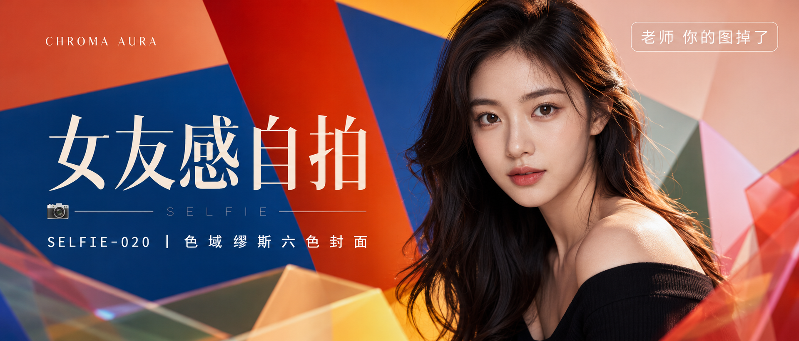

# SELFIE-020-色域缪斯六色封面 封面

## 封面提示词

一张极具点击欲的高端彩妆杂志横版封面，视觉概念名为“CHROMA AURA｜色域缪斯”。画面右侧为一位 23 岁亚洲女生的正脸与 3/4 侧脸之间的近景半身像，面部占画面高度三分之一以上，五官精致自然，面部立体清晰，皮肤光泽细腻且保留自然纹理，眼神有神灵动并直视镜头，嘴唇自然闭合，妆感干净清透，深棕色长卷发，黑色一字肩上衣，姿态自然松弛。背景由高饱和橙红、钴蓝、莓果红、鼠尾草绿、奶油粉、暖黄六色几何色域以透视层叠方式向人物汇聚，橙蓝强对比作主视觉，其余四色作次级色带，前景有一层轻微虚化的透明彩色几何片，形成明确的前中后景视觉层次。柔光环绕面部，侧逆光打亮颧骨与发丝轮廓，电影感光影，高清锐利，色彩层次丰富，视觉冲击力强，构图黄金比例，色调统一精致，画面有张力，商业海报级完成度，2.35:1 电影横构图。手指数量正确，排版文字完整可读，避免侧脸比例过大、眼睛半闭、嘴巴微张、二维码、多余 logo、乱码文字，避免 AI 美女脸、网红感、过度精修、塑料皮肤、暗沉肤色、明显痘印、明显皱纹、斑点、面部变形。

【文字排版-必须完整保留，不得省略或简化任何一项】画面左侧垂直居中偏下叠加文字排版：超大号衬线字体米白色主文案「女友感自拍」，主文案正下方一条细横线左端带📷横线中央有透明英文水印 SELFIE，横线下方等宽白色字体副文案「SELFIE-020 ｜ 色域缪斯六色封面」；左上方增加小号高级英文概念名「CHROMA AURA」作为视觉层级；右上角浅色半透明圆角底衬配小号文字「老师 你的图掉了」（署名文字，必须出现，不可省略）；无整体蒙层，文字直接压图。【文字排版结束】

## 封面图片

