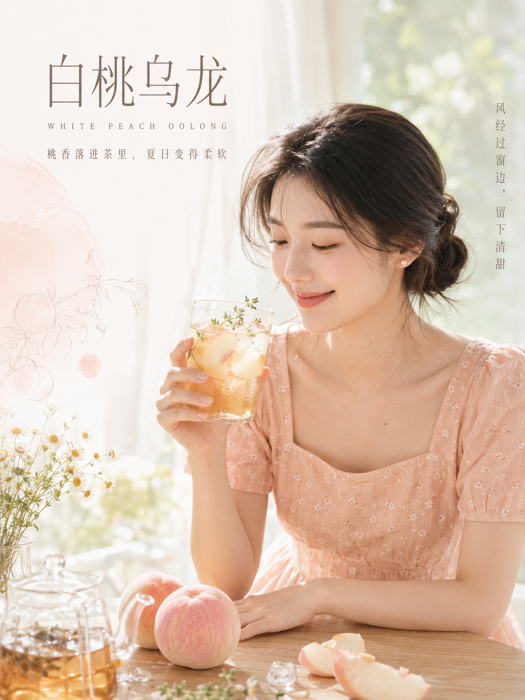
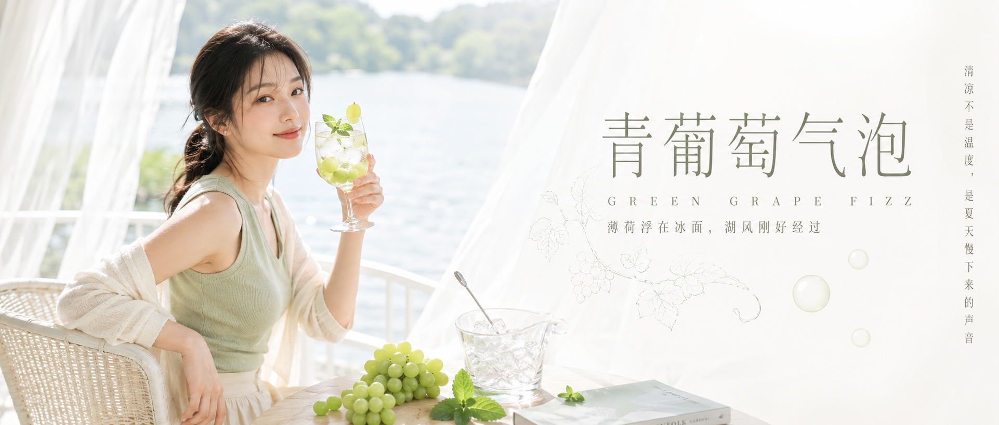
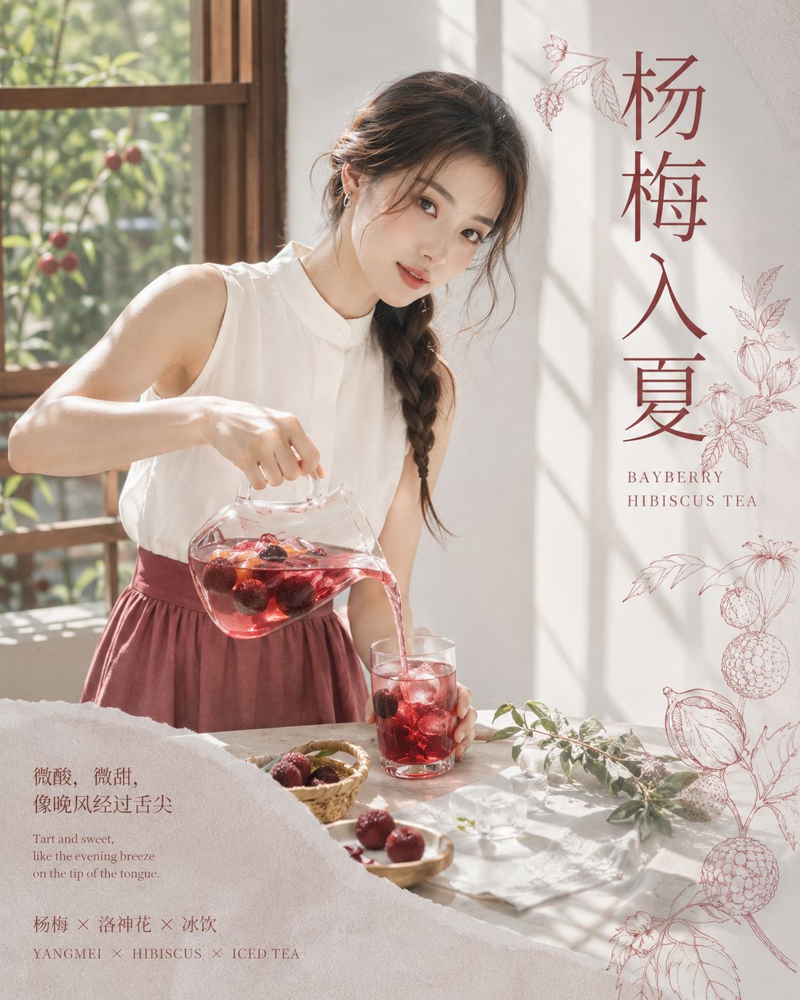
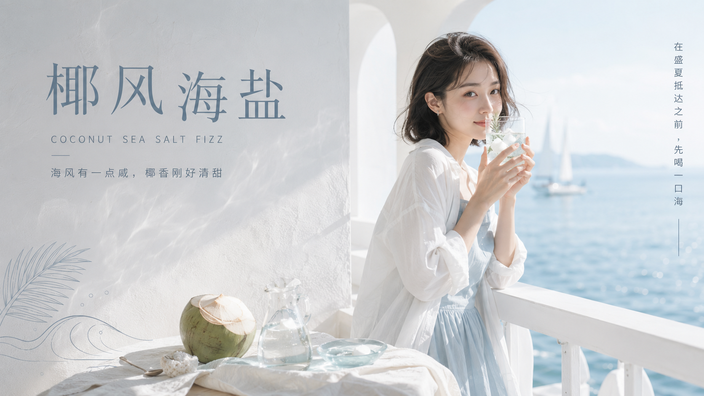
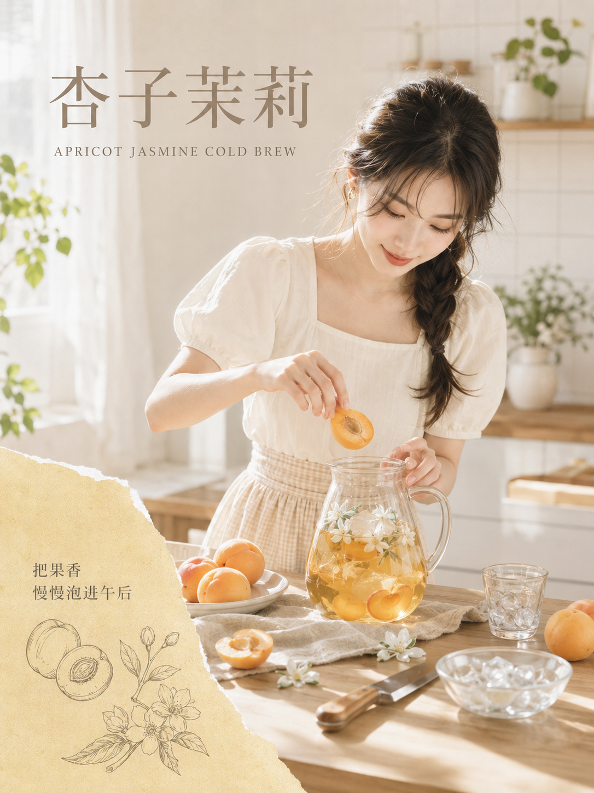
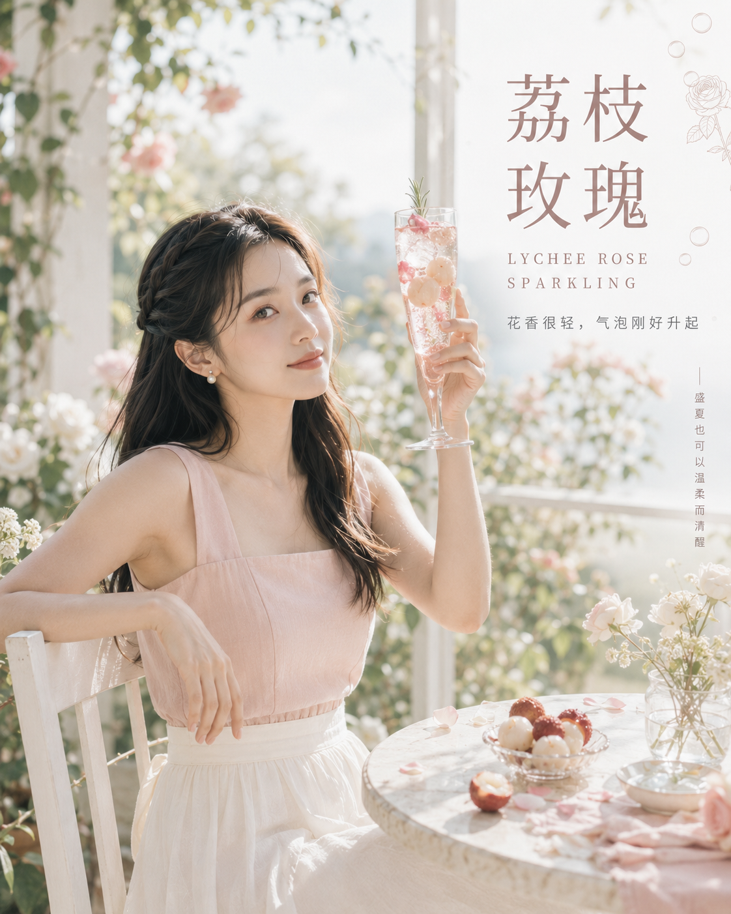

六杯夏日饮品，用托杯、转身、倒饮、闻香、入壶与对光六个自然动作，拍出清透女友感杂志海报。核心写法是先定动作动机，再控制饮品透明度、侧逆光与文字留白。

提示词：24岁自然清秀亚洲女生，真实商业摄影，夏日果香饮品，玻璃杯冷凝水珠，柔和侧逆光，低饱和高级配色，人物与文字错位留白，杂志封面排版。

#GPTImage2 #千问 #生图提示词 #Prompt #女友感自拍 #夏日饮品海报

