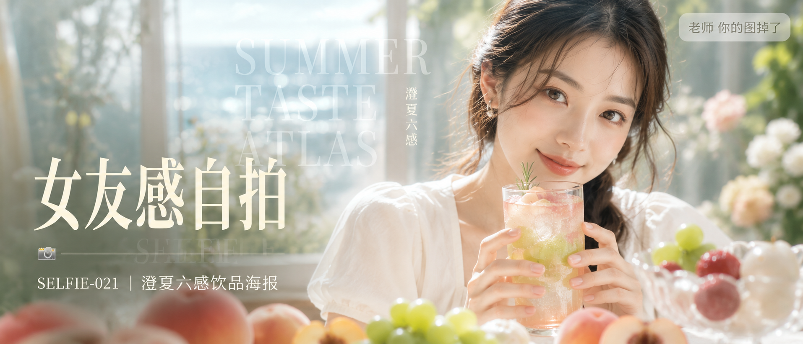

# SELFIE-021-澄夏六感饮品海报 封面

## 封面提示词

高端夏日饮品人像商业封面，视觉概念名“澄夏六感”。一位24岁漂亮亚洲女生以正脸偏3/4角度占据画面右侧近景，面部占画面高度三分之一以上，五官精致自然、面部立体清晰、眼神有神灵动、妆感干净清透、皮肤光泽细腻、轮廓清晰上镜。她穿剪裁端正的奶油白短袖上衣，双手自然捧着一只晶莹玻璃杯，杯中从白桃蜜粉渐变到青葡萄薄荷绿，冰块、细密气泡与冷凝水珠清晰可见；前景以失焦白桃、青葡萄、杨梅和荔枝形成柔和色彩层次，背景是玻璃花房与浅海蓝光影的抽象融合，侧逆光打亮颧骨和杯沿，柔光环绕面部，明亮暖白、蜜桃粉、鼠尾草绿与少量莓红形成高级冷暖对比。画面中景以超大半透明衬线英文“SUMMER TASTE ATLAS”和细字中文“澄夏六感”形成纵深排版，文字不遮挡脸部；真实商业摄影，不是插画，电影感光影、高清锐利、色彩层次丰富、视觉冲击力强、构图黄金比例、前景虚化背景、色调统一精致、画面有张力，2.35:1电影横构图。避免纯侧脸、纯背影、远景小人物、眼睛半闭、嘴巴微张、服装暴露、玻璃杯变形、水果错误、液体浑浊、背景杂乱、整体蒙层、廉价影楼感、卡通感、3D渲染感、二维码、平台水印；避免 AI 美女脸、网红感、过度精修、塑料皮肤、暗沉肤色、明显痘印、明显皱纹、斑点、面部变形。

【文字排版-必须完整保留，不得省略或简化任何一项】画面左侧垂直居中偏下叠加文字排版：超大号衬线字体米白色主文案「女友感自拍」，主文案正下方一条细横线左端带📷横线中央有透明英文水印 SELFIE，横线下方等宽白色字体副文案「SELFIE-021 ｜ 澄夏六感饮品海报」；右上角浅色半透明圆角底衬配小号文字「老师 你的图掉了」（署名文字，必须出现，不可省略）；无整体蒙层，文字直接压图。【文字排版结束】

## 封面图片

